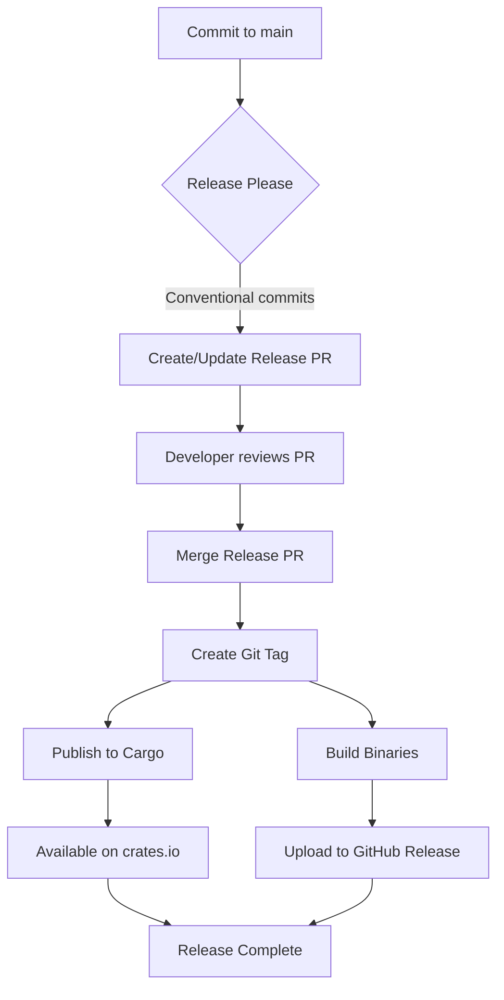

# Release Process Documentation

This document describes the **fully automated release process** for Workspace Tools CLI (`workspace`) using **Release Please**.

## Overview

The release process is 100% automatic using conventional commits and Google's Release Please:

1. Developer commits with conventional commit messages (`feat:`, `fix:`, etc.)
2. Merge to `main` branch
3. Release Please analyzes commits and creates a **Release PR**
4. Review and merge the Release PR
5. Tag is automatically created
6. Cargo crates are published to crates.io
7. Binaries are built for all platforms
8. GitHub Release is updated with binaries

**Zero manual commands!** 🎉

## Workflow Architecture

```
Developer commits with conventional messages
              ↓
        Merge to main
              ↓
   Release Please creates PR
   "chore(main): release X.Y.Z"
              ↓
      Review & Merge PR
              ↓
    ┌─────────┴──────────┐
    ↓                    ↓
Tag Created        Release Created
    ↓                    ↓
    ├→ Publish Cargo → crates.io
    └→ Build Binaries → GitHub Release
```

## Prerequisites

### Repository Secrets

1. **`GITHUB_TOKEN`** (automatic)
   - Automatically provided by GitHub Actions
   - Needs `contents: write` and `pull-requests: write`

2. **`CARGO_REGISTRY_TOKEN`** (required for crates.io)
   - Personal access token from crates.io
   - Get from: https://crates.io/me
   - Navigate to: Settings → Secrets → Actions
   - Name: `CARGO_REGISTRY_TOKEN`
   - Value: Your crates.io API token

### Repository Permissions

Ensure GitHub Actions has permissions:
- Settings → Actions → General → Workflow permissions
- Select: "Read and write permissions"
- Check: "Allow GitHub Actions to create and approve pull requests"

## Supported Platforms

Every release includes binaries for:
- **Linux x86_64 (GNU)** - `x86_64-unknown-linux-gnu`
- **Linux x86_64 (MUSL)** - `x86_64-unknown-linux-musl` (static binary)
- **macOS x86_64 (Intel)** - `x86_64-apple-darwin`
- **macOS ARM64 (Apple Silicon)** - `aarch64-apple-darwin`
- **Windows x86_64** - `x86_64-pc-windows-msvc`

## Release Process (Automatic)

### Step 1: Use Conventional Commits

When making changes, use conventional commit format:

```bash
# Feature (minor version bump)
git commit -m "feat: add new changeset command"
git commit -m "feat(cli): implement interactive prompts"

# Bug fix (patch version bump)
git commit -m "fix: resolve version calculation bug"
git commit -m "fix(pkg): correct dependency resolution"

# Breaking change (major version bump)
git commit -m "feat!: redesign CLI interface"
git commit -m "fix!: change config file format"
# Or with BREAKING CHANGE in body:
git commit -m "feat: new API" -m "BREAKING CHANGE: old API removed"

# Other types (no version bump)
git commit -m "docs: update README"
git commit -m "chore: update dependencies"
git commit -m "test: add integration tests"
git commit -m "refactor: simplify code structure"
```

**Commit Types**:
- `feat:` - New feature (minor bump)
- `fix:` - Bug fix (patch bump)
- `feat!:` or `fix!:` - Breaking change (major bump)
- `docs:` - Documentation only
- `chore:` - Maintenance tasks
- `test:` - Tests
- `refactor:` - Code refactoring
- `perf:` - Performance improvements
- `ci:` - CI/CD changes
- `build:` - Build system changes

### Step 2: Create Pull Request

```bash
git checkout -b feat/my-feature
# Make changes...
git commit -m "feat: implement my feature"
git push origin feat/my-feature
# Create PR on GitHub
```

### Step 3: Merge to Main

When your PR is approved:
- Merge to `main` (use "Squash and merge" or "Rebase and merge")
- Ensure commit message follows conventional format

### Step 4: Release Please Creates PR

After merging, Release Please automatically:
- Analyzes all commits since last release
- Calculates next version (semver)
- Updates `CHANGELOG.md`
- Updates `Cargo.toml` versions
- Creates a PR titled `chore(main): release X.Y.Z`

**Example Release PR**:
```
Title: chore(main): release 1.2.0

Changes:
- Updates version in all Cargo.toml files
- Updates CHANGELOG.md with commit summaries
- Creates release notes
```

### Step 5: Review and Merge Release PR

1. Review the Release PR:
   - Check version number is correct
   - Review CHANGELOG entries
   - Verify Cargo.toml updates

2. Merge the Release PR:
   - No additional changes needed
   - Just merge it!

### Step 6: Automatic Publishing

When the Release PR is merged:

1. **Tag Created** - `vX.Y.Z` tag is automatically created

2. **Cargo Publishing** (parallel):
   - Publishes `sublime_standard_tools`
   - Waits 30s for propagation
   - Publishes `sublime_git_tools`
   - Waits 30s
   - Publishes `sublime_pkg_tools`
   - Waits 30s
   - Publishes `sublime_cli_tools`

3. **Binary Builds** (parallel):
   - Builds for 5 platforms simultaneously
   - Creates archives (`.tar.gz` / `.zip`)
   - Generates SHA256 checksums
   - Uploads to GitHub Release

### Step 7: Release is Live! 🚀

Your release is now available:
- **GitHub Releases**: With binaries and checksums
- **crates.io**: `cargo install sublime_cli_tools`
- **Installation script**: Auto-downloads latest version

**Total time**: ~20-25 minutes from merge to complete

## Developer Workflow Examples

### Feature Development

```bash
git checkout -b feat/version-command
# Implement feature...
git commit -m "feat(cli): add version command with build info"
git push origin feat/version-command
# Create PR → Review → Merge
# Release Please will include in next release
```

### Bug Fix

```bash
git checkout -b fix/config-validation
# Fix bug...
git commit -m "fix(config): validate environment names"
git push origin fix/config-validation
# Create PR → Review → Merge
# Patch release will be created
```

### Breaking Change

```bash
git checkout -b feat/new-api
# Implement breaking change...
git commit -m "feat(api)!: redesign configuration format" -m "BREAKING CHANGE: Config files must be migrated to new format"
git push origin feat/new-api
# Create PR → Review → Merge
# Major version bump will occur
```

### Multiple Changes

You can merge multiple PRs before a release:

```bash
# Merge feature PR 1
# Merge bug fix PR 2
# Merge docs PR 3
# Release Please accumulates all changes
# Next Release PR will include everything
```

## Release Please Configuration

Release Please is configured in `.github/workflows/release-please.yml`:

```yaml
release-type: rust          # Uses Rust/Cargo conventions
package-name: workspace      # Package name
include-component-in-tag: false  # Tags are just vX.Y.Z, not package-name@vX.Y.Z
```

**Changelog Sections**:
- Features
- Bug Fixes
- Performance Improvements
- Documentation
- Code Refactoring
- Tests
- Build System
- Continuous Integration
- Miscellaneous

## Binary Optimization

All binaries are optimized using:

```toml
[profile.release]
codegen-units = 1    # Maximum optimization
debug = false        # No debug info
lto = "fat"          # Link-time optimization
opt-level = 3        # Maximum performance
strip = "symbols"    # Strip debug symbols
```

Additional steps:
- Unix binaries stripped with `strip` command
- Archives compressed (gzip/deflate)
- MUSL builds are fully static

## Monitoring Releases

### GitHub Actions

Monitor workflows:
1. Go to **Actions** tab
2. Check "Release Please" workflow for release PRs
3. Check "Publishing to Cargo" for crates.io
4. Check "Build and Release Binaries" for binary builds

### Release PR

Release PRs show:
- New version number
- All changes since last release
- Updated CHANGELOG
- Modified files (Cargo.toml files)

### GitHub Releases

Each release includes:
- Auto-generated release notes
- Platform-specific binaries
- SHA256 checksums
- Installation instructions

## Troubleshooting

### No Release PR Created

**Possible causes**:
1. No conventional commits since last release
2. Only non-versioning commits (docs, chore, etc.)
3. Release Please workflow not running

**Solution**:
- Check commit messages follow conventional format
- Ensure at least one `feat:` or `fix:` commit exists
- Check GitHub Actions logs

### Release PR Not Updating Versions

**Possible causes**:
1. Previous Release PR still open
2. Workspace configuration issues

**Solution**:
- Close or merge existing Release PRs first
- Check Cargo.toml workspace configuration

### Cargo Publishing Failed

**Possible causes**:
1. `CARGO_REGISTRY_TOKEN` not set or invalid
2. Version already published
3. Compilation error

**Solution**:
- Verify token in repository secrets
- Check crates.io for existing versions
- Review build logs

### Binary Build Failed

**Possible causes**:
1. Compilation error on specific platform
2. Tests failing
3. Dependency issues

**Solution**:
- Check platform-specific build logs
- Verify cross-compilation setup
- Test locally with `cargo build --target <target>`

## Manual Overrides

### Manually Trigger Binary Build

If binary build fails, manually trigger:

1. Go to **Actions** → "Build and Release Binaries"
2. Click "Run workflow"
3. Enter tag: `v1.2.3`
4. Click "Run workflow"

### Force a Release

To force a specific version:

1. Manually update `Cargo.toml` versions
2. Commit with: `chore: release X.Y.Z`
3. Manually create and push tag:
   ```bash
   git tag -a v1.2.3 -m "Release 1.2.3"
   git push origin v1.2.3
   ```

**Note**: This bypasses Release Please and should be used rarely.

## Version Strategy

Release Please follows **Semantic Versioning** (SemVer):

- **Major** (X.0.0): Breaking changes (`feat!:`, `fix!:`, `BREAKING CHANGE`)
- **Minor** (0.X.0): New features (`feat:`)
- **Patch** (0.0.X): Bug fixes (`fix:`)

**Pre-1.0 Behavior**:
- Breaking changes bump minor version (0.X.0)
- Features bump minor version (0.X.0)
- Fixes bump patch version (0.0.X)

**Post-1.0 Behavior**:
- Breaking changes bump major version (X.0.0)
- Features bump minor version (0.X.0)
- Fixes bump patch version (0.0.X)

## Best Practices

### Commit Messages

✅ **Good**:
```
feat(cli): add config validation
fix(pkg): resolve dependency loop
docs: update installation guide
```

❌ **Bad**:
```
update code
fixes
wip
```

### Release PR Review

Check before merging:
- ✅ Version number makes sense
- ✅ CHANGELOG entries are accurate
- ✅ All Cargo.toml files updated
- ✅ No unrelated changes

### Breaking Changes

Always document breaking changes:
```
feat(api)!: redesign configuration

BREAKING CHANGE: Configuration files must migrate from TOML to JSON format.
Migration guide: docs/migration-v2.md
```

## Rollback Procedure

If a release has critical issues:

### 1. Yank from crates.io

```bash
cargo yank --vers 1.2.3 sublime_cli_tools
```

### 2. Mark GitHub Release as Pre-release

- Go to release page
- Edit release
- Check "This is a pre-release"

### 3. Create Hotfix

```bash
git checkout -b fix/critical-bug
# Fix the issue...
git commit -m "fix: resolve critical issue"
# Merge → New patch release created automatically
```

### 4. Delete Bad Tag (Optional)

```bash
git tag -d v1.2.3
git push origin :refs/tags/v1.2.3
```

## CI/CD Pipeline



## Additional Resources

- [Conventional Commits](https://www.conventionalcommits.org/)
- [Release Please Documentation](https://github.com/googleapis/release-please)
- [Semantic Versioning](https://semver.org/)
- [crates.io Publishing Guide](https://doc.rust-lang.org/cargo/reference/publishing.html)

## Support

For issues with the release process:

1. Check this documentation
2. Review GitHub Actions logs
3. Check existing issues: https://github.com/websublime/workspace-tools/issues
4. Create new issue with:
   - Workflow run URL
   - Error messages
   - Steps to reproduce
