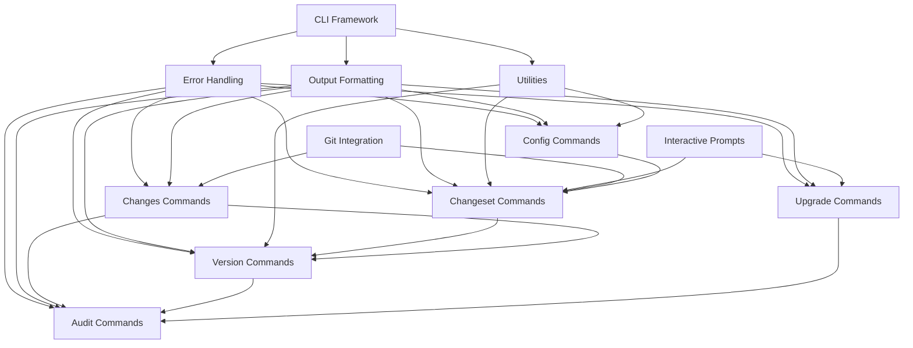

# Workspace Node Tools CLI - Implementation Plan

**Status**: 📋 Ready for Implementation  
**Version**: 1.0  
**Based on**: PRD.md v1.0  
**Last Updated**: 2024-01-15

> **📝 Note:** This is a historical planning document. The installation scripts mentioned (install.sh, install-dev.sh, uninstall.sh) have been replaced by **cargo-dist** automated installers. See the main [README.md](../../README.md) for current installation instructions.

---

## Table of Contents

1. [Executive Summary](#executive-summary)
2. [Priority Analysis](#priority-analysis)
3. [Dependency Graph](#dependency-graph)
4. [Implementation Phases](#implementation-phases)
5. [Module Structure](#module-structure)
6. [Quality Standards](#quality-standards)
7. [Testing Strategy](#testing-strategy)
8. [Documentation Requirements](#documentation-requirements)
9. [Milestones & Timeline](#milestones--timeline)
10. [Risk Assessment](#risk-assessment)
11. [Development Workflow](#development-workflow)
12. [CI/CD Pipeline](#cicd-pipeline)
13. [Success Metrics](#success-metrics)

---

## Executive Summary

### Project Overview

`workspace` (Workspace Node Tools) is a comprehensive CLI tool for managing Node.js monorepos with changeset-based versioning. The implementation is divided into **5 major phases** across **10 core modules**, following strict quality standards (100% test coverage, 100% clippy compliance, 100% documentation).

### Key Success Criteria

- ✅ All modules pass clippy without warnings
- ✅ 100% test coverage (unit + integration + E2E)
- ✅ 100% API documentation with examples
- ✅ Zero `unwrap()`, `expect()`, `todo!()`, `panic!()`, `unimplemented!()`
- ✅ All errors implement `AsRef<str>`
- ✅ Internal visibility uses `pub(crate)` consistently
- ✅ Command execution < 100ms for most operations
- ✅ Git hooks execute < 500ms
- ✅ Cross-platform compatibility (macOS, Linux, Windows)

### Estimated Timeline

- **Phase 1**: 2-3 weeks (Foundation & Core Commands)
- **Phase 2**: 3-4 weeks (Changeset Management)
- **Phase 3**: 2-3 weeks (Version Management & Upgrades)
- **Phase 4**: 2-3 weeks (Audit & Advanced Features)
- **Phase 5**: 1-2 weeks (Distribution & Polish)
- **Total**: 10-15 weeks

---

## Priority Analysis

### Critical Path (Must Have - Phase 1 & 2)

1. **CLI Framework** - Argument parsing and command dispatch
2. **Error Handling** - User-friendly error messages
3. **Configuration Commands** - `init`, `config`
4. **Output Formatting** - JSON, Table, Progress indicators
5. **Changeset Commands** - Core workflow (`add`, `list`, `show`)

### High Priority (Phase 2 & 3)

6. **Version Commands** - `bump` with various modes
7. **Changes Analysis** - `changes` command
8. **Upgrade Commands** - Dependency management
9. **Git Integration** - Branch detection, commit tracking

### Medium Priority (Phase 3 & 4)

10. **Audit Commands** - Health checks and reporting
11. **Interactive Prompts** - Enhanced UX
12. **Color Output** - Terminal theming
13. **Shell Completions** - Bash, Zsh, Fish

### Low Priority (Phase 4 & 5)

14. **Installation Scripts** - Curl-based installer
15. **Self-Update** - Automatic version updates
16. **CI/CD Integration** - GitHub Actions examples

### Priority Rationale

```
CLI Framework + Error Handling (P0)
    ↓
Config Commands (init, config) (P1)
    ↓
Output Formatting (P1)
    ↓
Changeset Commands (add, list, show, update) (P1-P2)
    ↓
Version Commands (bump, preview) (P2)
    ↓
Changes + Upgrades (P2-P3)
    ↓
Audit + Interactive Features (P3)
    ↓
Distribution + Self-Update (P4)
```

**Why this order:**
- **CLI Framework first**: Foundation for all commands
- **Error handling early**: Critical for user experience
- **Config commands**: Users need to initialize projects
- **Output formatting**: Required by all commands
- **Changesets**: Core workflow that unlocks versioning
- **Version management**: Completes the release workflow
- **Upgrades & Audit**: Enhancement features
- **Distribution**: Final polish for public release

---

## Dependency Graph

### Module Dependencies



### External Dependencies

```
workspace (CLI)
    ↓
├─ sublime-package-tools (core logic)
├─ sublime-standard-tools (filesystem, config)
├─ sublime-git-tools (git operations)
├─ clap (CLI framework)
├─ dialoguer (interactive prompts)
├─ indicatif (progress bars)
├─ comfy-table (table rendering)
├─ crossterm (terminal control)
├─ console (styling)
└─ tokio, serde, anyhow, tracing (standard)
```

---

## Implementation Phases

## Phase 1: Foundation & Core Commands (Weeks 1-3)

### Objective
Establish CLI framework, error handling, and basic configuration commands.

### Deliverables

#### 1.1 Project Setup & Structure

**Tasks:**
- [ ] Initialize CLI crate structure
- [ ] Configure `Cargo.toml` with all dependencies
- [ ] Setup `main.rs` with basic CLI structure
- [ ] Create module structure following patterns
- [ ] Configure clippy rules and lint settings

**Files to create:**
```
crates/cli/
├── Cargo.toml
├── build.rs                     # Build-time shell completion generation
├── src/
│   ├── main.rs                  # Entry point with async runtime
│   ├── cli/
│   │   ├── mod.rs              # CLI definition and parsing
│   │   ├── commands.rs         # Command enum
│   │   ├── args.rs             # Global arguments
│   │   └── parser.rs           # Argument parsing logic
│   ├── error/
│   │   └── mod.rs              # CLI error types
│   ├── output/
│   │   └── mod.rs              # Output formatting (export only)
│   └── utils/
│       └── mod.rs              # Shared utilities
```

**Quality Gates:**
- ✅ Project compiles with all dependencies
- ✅ Clippy passes without warnings
- ✅ Basic CLI structure in place

#### 1.2 Error Handling Module

**Tasks:**
- [ ] Define `CliError` enum wrapping library errors
- [ ] Implement user-friendly error messages
- [ ] Create error context builders
- [ ] Implement `AsRef<str>` for all errors
- [ ] Add exit code mapping
- [ ] Create error formatting utilities

**Files:**
```
src/error/
├── mod.rs                       # CliError enum and conversions
├── display.rs                   # User-friendly error display
├── exit_codes.rs                # Exit code constants
└── tests.rs                     # Error tests
```

**Error Types:**
```rust
pub enum CliError {
    Configuration(String),
    Validation(String),
    Execution(String),
    Git(String),
    Package(String),
    Io(String),
    Network(String),
    User(String),                // User-caused errors (e.g., invalid input)
}

impl CliError {
    pub fn exit_code(&self) -> i32 { ... }
    pub fn user_message(&self) -> String { ... }
}
```

**Quality Gates:**
- ✅ All error variants have clear messages
- ✅ Exit codes follow sysexits standards
- ✅ Error context includes helpful suggestions
- ✅ 100% test coverage

#### 1.3 Output Formatting & Logging Module

**Tasks:**
- [ ] Create `OutputFormat` enum (Human, Json, JsonCompact)
- [ ] Implement table rendering with `comfy-table`
- [ ] Create JSON serialization utilities
- [ ] Implement progress bars with `indicatif`
- [ ] Create color/style helpers with `console`
- [ ] Add logging integration with `tracing`
- [ ] Implement global options context (root, log-level, format, no-color)
- [ ] Create logging macros/helpers for consistent logging across commands

**Files:**
```
src/output/
├── mod.rs                       # OutputFormat and main interface
├── table.rs                     # Table rendering utilities
├── json.rs                      # JSON output formatting
├── progress.rs                  # Progress indicators
├── style.rs                     # Color and styling
├── logger.rs                    # Logging setup and macros
├── context.rs                   # Global options context
└── tests.rs                     # Output tests
```

**Key Components:**
```rust
pub enum OutputFormat {
    Human,      // Text with colors and tables
    Json,       // Pretty-printed JSON
    JsonCompact, // Compact JSON (for audit)
    Quiet,      // Minimal output
}

pub struct Output {
    format: OutputFormat,
    writer: Box<dyn Write>,
}

impl Output {
    pub fn success(&self, message: &str) -> Result<()>;
    pub fn error(&self, message: &str) -> Result<()>;
    pub fn warning(&self, message: &str) -> Result<()>;
    pub fn info(&self, message: &str) -> Result<()>;
    pub fn table(&self, data: TableData) -> Result<()>;
    
    // Core JSON output method - ALL commands must use this
    pub fn json<T: Serialize>(&self, data: &T) -> Result<()> {
        match self.format {
            OutputFormat::Json => {
                let json = serde_json::to_string_pretty(data)
                    .map_err(|e| CliError::Serialization(e.to_string()))?;
                writeln!(self.writer, "{}", json)?;
            }
            OutputFormat::JsonCompact => {
                let json = serde_json::to_string(data)
                    .map_err(|e| CliError::Serialization(e.to_string()))?;
                writeln!(self.writer, "{}", json)?;
            }
            _ => {
                // In non-JSON modes, output methods handle formatting
            }
        }
        Ok(())
    }
}

// Standard JSON response structure for ALL commands
#[derive(Serialize)]
pub struct JsonResponse<T> {
    pub success: bool,
    #[serde(skip_serializing_if = "Option::is_none")]
    pub data: Option<T>,
    #[serde(skip_serializing_if = "Option::is_none")]
    pub error: Option<String>,
}

impl<T> JsonResponse<T> {
    pub fn success(data: T) -> Self {
        Self { success: true, data: Some(data), error: None }
    }
    
    pub fn error(message: String) -> Self {
        Self { success: false, data: None, error: Some(message) }
    }
}
```

**JSON Output Implementation Rules:**

1. **All commands MUST support `--format json`**:
   - Check `output.format` at the start of command execution
   - If JSON mode, collect data and output at the end via `output.json()`
   - Never mix text output with JSON output

2. **JSON Structure Consistency**:
   - Always include `success: bool` field
   - Include `data` field for successful operations
   - Include `error` field for failures
   - Use consistent field naming (camelCase)

3. **Command-Specific JSON Output**:
   ```rust
   // Example for bump command
   if matches!(output.format(), OutputFormat::Json | OutputFormat::JsonCompact) {
       let response = BumpJsonResponse {
           success: true,
           strategy: strategy.to_string(),
           packages: packages_data,
           changesets: changesets_data,
           summary: summary_data,
       };
       return output.json(&response);
   }
   ```

4. **Error Handling in JSON Mode**:
   ```rust
   if let Err(e) = operation() {
       if matches!(output.format(), OutputFormat::Json | OutputFormat::JsonCompact) {
           let error_response = JsonResponse::<()>::error(e.to_string());
           output.json(&error_response)?;
           return Err(e);
       }
       // Regular error handling for text mode
   }
   ```

**Quality Gates:**
- ✅ All output modes work correctly
- ✅ Tables render properly in all terminal sizes
- ✅ JSON output is valid and parseable
- ✅ JSON output is complete (no missing data)
- ✅ No logs or text mixed with JSON output
- ✅ Consistent JSON structure across all commands
- ✅ Progress bars update smoothly (disabled in JSON mode)
- ✅ Colors respect NO_COLOR environment variable
- ✅ All 17+ commands listed in F-071 support JSON output
- ✅ Logging works correctly at all levels
- ✅ Logs go to stderr, output goes to stdout (separate streams)
- ✅ Logging and format are completely independent
- ✅ JSON output works with any log level (including silent)
- ✅ No logs mixed with JSON output

#### 1.4 Logging Implementation

**Critical Principle:** Logging and Output Format are **COMPLETELY INDEPENDENT**:
- `--log-level` controls **stderr** (logs)
- `--format` controls **stdout** (final output)
- They work together but don't affect each other
- You can have: JSON + no logs, JSON + debug logs, text + no logs, etc.

**Global Context Structure:**

```rust
pub struct GlobalContext {
    pub root: PathBuf,
    pub log_level: LogLevel,    // Controls stderr (logs)
    pub format: OutputFormat,    // Controls stdout (output)
    pub no_color: bool,
    pub config_path: Option<PathBuf>,
}

impl GlobalContext {
    pub fn from_args(args: &Cli) -> Self {
        Self {
            root: args.root.clone().unwrap_or_else(|| env::current_dir().unwrap()),
            log_level: args.log_level,
            format: args.format,
            no_color: args.no_color || env::var("NO_COLOR").is_ok(),
            config_path: args.config.clone(),
        }
    }
}
```

**Logging Macros (wrapping tracing):**

```rust
// src/output/logger.rs

// Initialize logging based on global context
// IMPORTANT: This only affects stderr - stdout is controlled by OutputFormat
pub fn init_logging(level: LogLevel, no_color: bool) -> Result<()> {
    use tracing_subscriber::FmtSubscriber;
    
    let subscriber = FmtSubscriber::builder()
        .with_max_level(level.to_tracing_level())
        .with_ansi(!no_color)
        .with_writer(std::io::stderr) // ALWAYS stderr, never stdout
        .finish();
    
    tracing::subscriber::set_global_default(subscriber)
        .map_err(|e| CliError::Logging(e.to_string()))?;
    
    Ok(())
}

// Convenience macros for commands
#[macro_export]
macro_rules! log_info {
    ($($arg:tt)*) => {
        tracing::info!($($arg)*)
    };
}

#[macro_export]
macro_rules! log_debug {
    ($($arg:tt)*) => {
        tracing::debug!($($arg)*)
    };
}

#[macro_export]
macro_rules! log_trace {
    ($($arg:tt)*) => {
        tracing::trace!($($arg)*)
    };
}
```

**Command Implementation Pattern with Logging:**

```rust
pub async fn execute_bump(
    args: BumpArgs,
    ctx: &GlobalContext,
    output: &Output,
) -> Result<()> {
    log_info!("Starting version bump");
    log_debug!("Working directory: {:?}", ctx.root);
    
    // 1. Load configuration
    log_info!("Loading configuration...");
    log_debug!("Config path: {:?}", ctx.config_path);
    let config = PackageToolsConfig::load(&ctx.root).await?;
    log_debug!("Strategy: {:?}", config.version.strategy);
    
    // 2. Load changesets
    log_info!("Loading active changesets...");
    let changesets = changeset_manager.list_pending().await?;
    log_info!("Found {} active changesets", changesets.len());
    log_trace!("Changesets: {:?}", changesets);
    
    if changesets.is_empty() {
        log_warn!("No active changesets found");
        output.warning("No active changesets. No version bumps will be performed.")?;
        return Ok(());
    }
    
    // 3. Resolve versions
    log_info!("Resolving versions...");
    for cs in &changesets {
        log_debug!("Processing changeset: {}", cs.branch);
        log_trace!("Changeset packages: {:?}", cs.packages);
    }
    
    let resolution = version_resolver.resolve_versions(&changesets).await?;
    log_info!("Resolved {} package updates", resolution.updates.len());
    
    for update in &resolution.updates {
        log_debug!(
            "Package {}: {} -> {}",
            update.name,
            update.current_version,
            update.next_version
        );
    }
    
    // 4. Output results
    // Note: Format is independent of logging!
    // Logs went to stderr, output goes to stdout
    if matches!(ctx.format, OutputFormat::Json | OutputFormat::JsonCompact) {
        log_trace!("Preparing JSON output");
        let response = prepare_json_response(&resolution);
        return output.json(&response); // Goes to stdout, logs already in stderr
    }
    
    log_trace!("Preparing text output");
    display_bump_preview(&resolution, output)?; // Goes to stdout
    
    log_info!("Version bump completed successfully");
    Ok(())
}
```

**Examples of Independence:**

```rust
// Example 1: JSON output with NO logs
// CLI: workspace --format json --log-level silent bump --dry-run
// stdout: {"success": true, ...}
// stderr: (nothing)

// Example 2: JSON output WITH debug logs
// CLI: workspace --format json --log-level debug bump --dry-run
// stdout: {"success": true, ...}
// stderr: DEBUG: Loading config...
//         DEBUG: Found 2 changesets...

// Example 3: Text output with NO logs
// CLI: workspace --format text --log-level silent bump --dry-run
// stdout: Version Bump Preview...
// stderr: (nothing)

// The command doesn't care - it logs AND outputs independently!
```

**Logging Guidelines for Each Command:**

1. **Info Level Logs** (Default user experience):
   - Starting operation
   - Major steps completion
   - Counts and summaries
   - Final result
   ```rust
   log_info!("Loading changesets...");
   log_info!("Found {} changesets", count);
   log_info!("Updating package.json files...");
   log_info!("Done!");
   ```

2. **Debug Level Logs** (Troubleshooting):
   - Configuration values
   - File paths
   - Intermediate calculations
   - Decision points
   ```rust
   log_debug!("Config path: {:?}", path);
   log_debug!("Strategy: independent");
   log_debug!("Calculated version: {}", version);
   ```

3. **Trace Level Logs** (Deep debugging):
   - Function entry/exit
   - Loop iterations
   - Data structure contents
   - API calls and responses
   ```rust
   log_trace!("Entering function");
   log_trace!("Processing package: {:?}", pkg);
   log_trace!("Registry response: {:?}", response);
   ```

4. **Warning Logs** (Non-critical issues):
   ```rust
   log_warn!("Package '{}' has major version update", pkg);
   log_warn!("No changeset found for current branch");
   ```

5. **Error Logs** (Critical issues):
   ```rust
   log_error!("Failed to read package.json: {}", err);
   log_error!("Git operation failed: {}", err);
   ```

**Example: Full Command with Proper Logging:**

```rust
pub async fn execute_upgrade_check(
    args: UpgradeCheckArgs,
    ctx: &GlobalContext,
    output: &Output,
) -> Result<()> {
    log_info!("Checking for dependency upgrades");
    
    // Load config
    log_debug!("Loading configuration from {:?}", ctx.root);
    let config = load_config(&ctx.root).await?;
    log_trace!("Config loaded: {:?}", config);
    
    // Scan packages
    log_info!("Scanning workspace packages...");
    let packages = scan_packages(&ctx.root).await?;
    log_info!("Found {} packages to check", packages.len());
    
    for pkg in &packages {
        log_debug!("Checking package: {}", pkg.name);
        log_trace!("Package path: {:?}", pkg.path);
    }
    
    // Query registry
    log_info!("Querying npm registry for updates...");
    let mut upgrades = Vec::new();
    
    for pkg in &packages {
        log_debug!("Querying dependencies for {}", pkg.name);
        
        for (dep_name, current_version) in &pkg.dependencies {
            log_trace!("Checking {}: {}", dep_name, current_version);
            
            match registry.get_latest(dep_name).await {
                Ok(latest) => {
                    log_trace!("Latest version of {}: {}", dep_name, latest);
                    
                    if latest > current_version {
                        log_debug!("Update available: {} {} -> {}", 
                            dep_name, current_version, latest);
                        upgrades.push(Upgrade { ... });
                    }
                }
                Err(e) => {
                    log_warn!("Failed to check {}: {}", dep_name, e);
                }
            }
        }
    }
    
    log_info!("Found {} available upgrades", upgrades.len());
    
    // Output
    if matches!(ctx.format, OutputFormat::Json | OutputFormat::JsonCompact) {
        log_trace!("Generating JSON output");
        let json = UpgradeCheckResponse {
            success: true,
            upgrades,
            summary: Summary { ... },
        };
        return output.json(&json);
    }
    
    log_trace!("Generating text output");
    display_upgrades_table(&upgrades, output)?;
    
    log_info!("Upgrade check completed");
    Ok(())
}
```

**Quality Gates:**
- ✅ Every command implements proper logging at all levels
- ✅ Logs go to stderr (never stdout)
- ✅ Output goes to stdout (never stderr)
- ✅ JSON output works with any log level (including silent)
- ✅ Logging and format are completely independent
- ✅ JSON output is never mixed with logs
- ✅ Log messages are clear and contextual
- ✅ Consistent logging patterns across all commands

#### 1.5 CLI Framework

**Tasks:**
- [ ] Define main `Cli` struct with clap
- [ ] Create `Commands` enum for all subcommands
- [ ] Implement global arguments (root, log-level, format, no-color, config)
- [ ] Create GlobalContext from CLI args
- [ ] Initialize logging based on global options
- [ ] Create command dispatcher that passes GlobalContext to all commands
- [ ] Add version and help commands
- [ ] Implement shell completion generation

**Files:**
```
src/cli/
├── mod.rs                       # Cli struct and main parsing
├── commands.rs                  # Commands enum
├── args.rs                      # Global arguments
├── dispatch.rs                  # Command dispatcher
├── completions.rs               # Shell completion generation
└── tests.rs                     # CLI parsing tests
```

**CLI Structure:**
```rust
#[derive(Parser)]
#[command(name = "workspace")]
#[command(version = env!("CARGO_PKG_VERSION"))]
#[command(about = "Workspace Node Tools - Changeset-based version management")]
pub struct Cli {
    #[command(subcommand)]
    pub command: Commands,
    
    #[arg(global = true, short, long, action = clap::ArgAction::Count)]
    pub verbose: u8,
    
    #[arg(global = true, long, value_enum, default_value = "human")]
    pub format: OutputFormat,
    
    #[arg(global = true, long)]
    pub no_color: bool,
    
    #[arg(global = true, long)]
    pub cwd: Option<PathBuf>,
}

#[derive(Subcommand)]
pub enum Commands {
    Init(InitArgs),
    Config(ConfigArgs),
    Changeset(ChangesetArgs),
    Bump(BumpArgs),
    Upgrade(UpgradeArgs),
    Audit(AuditArgs),
    Changes(ChangesArgs),
    Version(VersionArgs),
    #[command(subcommand)]
    Help { command: Option<String> },
}

pub enum LogLevel {
    Silent,
    Error,
    Warn,
    Info,
    Debug,
    Trace,
}

impl LogLevel {
    pub fn to_tracing_level(&self) -> tracing::Level {
        match self {
            LogLevel::Silent => tracing::Level::ERROR, // Will be filtered out
            LogLevel::Error => tracing::Level::ERROR,
            LogLevel::Warn => tracing::Level::WARN,
            LogLevel::Info => tracing::Level::INFO,
            LogLevel::Debug => tracing::Level::DEBUG,
            LogLevel::Trace => tracing::Level::TRACE,
        }
    }
}
```

**Quality Gates:**
- ✅ All commands parse correctly
- ✅ Help text is comprehensive
- ✅ Shell completions generate for bash, zsh, fish
- ✅ Global arguments work across all commands

#### 1.6 Main Entry Point with Global Options

**Key Implementation Points:**
1. Parse CLI args
2. Create GlobalContext (contains all global options)
3. Initialize logging (affects stderr only)
4. Create Output handler (affects stdout only)
5. Logging and Output work independently

**Implementation:**

```rust
// src/main.rs

async fn main() -> Result<()> {
    // Parse CLI arguments
    let cli = Cli::parse();
    
    // Create global context from args
    let ctx = GlobalContext::from_args(&cli);
    
    // Initialize logging (BEFORE any operations)
    // This ONLY affects stderr - stdout is controlled by Output
    init_logging(ctx.log_level, ctx.no_color)?;
    
    log_debug!("CLI initialized with context: {:?}", ctx);
    log_trace!("Command: {:?}", cli.command);
    
    // Change to root directory if specified
    if let Some(root) = &ctx.root {
        log_debug!("Changing directory to: {:?}", root);
        std::env::set_current_dir(root)
            .map_err(|e| CliError::Io(format!("Failed to change directory: {}", e)))?;
    }
    
    // Create output handler
    // This ONLY affects stdout - stderr is controlled by logging
    let output = Output::new(ctx.format, ctx.no_color);
    
    // Now both systems are ready and independent:
    // - Logging writes to stderr based on ctx.log_level
    // - Output writes to stdout based on ctx.format
    // They never interfere with each other!
    
    // Dispatch to command (passing context)
    let result = match cli.command {
        Commands::Init(args) => execute_init(args, &ctx, &output).await,
        Commands::Config(args) => execute_config(args, &ctx, &output).await,
        Commands::Changeset(args) => execute_changeset(args, &ctx, &output).await,
        Commands::Bump(args) => execute_bump(args, &ctx, &output).await,
        Commands::Upgrade(args) => execute_upgrade(args, &ctx, &output).await,
        Commands::Audit(args) => execute_audit(args, &ctx, &output).await,
        Commands::Changes(args) => execute_changes(args, &ctx, &output).await,
        Commands::Version(args) => execute_version(args, &ctx, &output).await,
        Commands::Help { command } => execute_help(command, &output),
    };
    
    // Handle result
    match result {
        Ok(()) => {
            log_info!("Command completed successfully");
            Ok(())
        }
        Err(e) => {
            log_error!("Command failed: {}", e);
            
            // Output error in appropriate format (to stdout)
            // Note: Error logs already went to stderr via log_error! above
            if matches!(ctx.format, OutputFormat::Json | OutputFormat::JsonCompact) {
                let error_response = JsonResponse::<()>::error(e.to_string());
                output.json(&error_response)?; // stdout
            } else {
                output.error(&e.to_string())?; // stdout
            }
            
            Err(e)
        }
    }
}
```

**Quality Gates:**
- ✅ Global context properly initialized
- ✅ Logging initialized before any operations (stderr only)
- ✅ Output handler created (stdout only)
- ✅ Logging and output are completely independent
- ✅ Working directory changed before command execution
- ✅ All commands receive GlobalContext
- ✅ Errors handled consistently across formats
- ✅ Stream separation maintained (stderr for logs, stdout for output)

#### 1.7 Configuration Commands (`init`, `config`)

**Tasks:**
- [ ] Implement `workspace init` command
- [ ] Create interactive prompts for initialization
- [ ] Implement `workspace config show` command
- [ ] Implement `workspace config validate` command
- [ ] Add configuration templates
- [ ] Create validation feedback

**Files:**
```
src/commands/
├── mod.rs                       # Command exports
├── init.rs                      # Init command
└── config.rs                    # Config command
```

**Command Implementations:**
```rust
pub async fn execute_init(
    args: InitArgs,
    ctx: &GlobalContext,
    output: &Output,
) -> Result<()> {
    log_info!("Initializing project configuration");
    log_debug!("Working directory: {:?}", ctx.root);
    
    // Detect project type
    log_info!("Detecting project type...");
    let project_type = detect_project_type(&ctx.root).await?;
    log_info!("Detected: {:?}", project_type);
    
    // Interactive or non-interactive
    if args.non_interactive {
        log_debug!("Non-interactive mode");
    } else {
        log_debug!("Interactive mode - prompting user");
    }</parameter>

<old_text line=474>
pub async fn execute_config(args: ConfigArgs, output: &Output) -> Result<()> {
    // 1. Check if already initialized
    // 2. Prompt for configuration options
    // 3. Detect workspace structure
    // 4. Create .changesets directory and .workspace-backups directory
    // 5. Generate repo.config.toml
    // 6. Initialize git integration
    // 7. Create example changeset
    // 8. Display success message
}

pub async fn execute_config(args: ConfigArgs, output: &Output) -> Result<()> {
    match args.subcommand {
        ConfigSubcommand::Show => { /* Display current config */ },
        ConfigSubcommand::Validate => { /* Validate and report */ },
    }
}
```

**Quality Gates:**
- ✅ Init command creates valid configuration
- ✅ Interactive prompts have sensible defaults
- ✅ Config validation provides actionable feedback
- ✅ E2E tests verify entire init flow

### Phase 1 Exit Criteria
- ✅ CLI framework compiles and runs
- ✅ Init and config commands work end-to-end
- ✅ Error handling provides helpful messages
- ✅ Output formatting works in all modes
- ✅ Clippy passes without warnings
- ✅ 100% test coverage on Phase 1 modules

---

## Phase 2: Changeset Management (Weeks 4-7)

### Objective
Implement comprehensive changeset commands for the core workflow.

### Deliverables

#### 2.1 Changeset Add Command

**Tasks:**
- [ ] Implement `workspace changeset add` command
- [ ] Create interactive prompt flow
- [ ] Support multiple packages selection
- [ ] Implement version bump selection
- [ ] Add commit message integration
- [ ] Create changeset file generation

**Files:**
```
src/commands/
├── changeset/
│   ├── mod.rs                   # Changeset subcommand router
│   ├── add.rs                   # Add command
│   ├── list.rs                  # List command
│   ├── show.rs                  # Show command
│   ├── update.rs                # Update command
│   ├── edit.rs                  # Edit command
│   ├── remove.rs                # Remove command
│   └── history.rs               # History command
```

**Interactive Flow:**
```rust
pub async fn execute_changeset_add(
    args: ChangesetAddArgs,
    output: &Output,
) -> Result<()> {
    // 1. Load workspace configuration
    // 2. Detect affected packages from git changes
    // 3. Prompt for packages (if not specified)
    // 4. Prompt for bump type (patch, minor, major)
    // 5. Prompt for summary
    // 6. Optional: detect related commits
    // 7. Generate changeset ID
    // 8. Create changeset file
    // 9. Display success and next steps
}
```

**Quality Gates:**
- ✅ Interactive prompts are intuitive
- ✅ Non-interactive mode works with flags
- ✅ Changeset files are valid YAML
- ✅ Git integration detects affected packages

#### 2.2 Changeset List Command

**Tasks:**
- [ ] Implement `workspace changeset list` command
- [ ] Support filtering by branch
- [ ] Support filtering by package
- [ ] Support sorting options
- [ ] Create table output format
- [ ] Create JSON output format

**Implementation:**
```rust
pub async fn execute_changeset_list(
    args: ChangesetListArgs,
    output: &Output,
) -> Result<()> {
    // 1. Load workspace configuration
    // 2. Scan .changesets directory
    // 3. Apply filters (branch, package, etc.)
    // 4. Sort by specified criteria
    // 5. Format as table or JSON
    // 6. Display results
}
```

**Quality Gates:**
- ✅ All filters work correctly
- ✅ Table output is readable
- ✅ JSON output is complete
- ✅ Performance < 100ms for 1000 changesets

#### 2.3 Changeset Show Command

**Tasks:**
- [ ] Implement `workspace changeset show` command
- [ ] Display full changeset details
- [ ] Show related commits
- [ ] Display affected packages
- [ ] Format for readability

**Quality Gates:**
- ✅ All changeset fields displayed
- ✅ Output is well-formatted
- ✅ Works with both IDs and file paths

#### 2.4 Changeset Update Command

**Tasks:**
- [ ] Implement `workspace changeset update [id]` command with optional ID parameter
- [ ] Detect current branch when ID not provided
- [ ] Search for changeset matching branch name
- [ ] Log clear error when no changeset found for branch
- [ ] Allow adding commits
- [ ] Allow modifying bump types
- [ ] Allow updating summary
- [ ] Track modification history

**Quality Gates:**
- ✅ Works without ID (auto-detects branch)
- ✅ Works with explicit ID or branch name
- ✅ Clear error message when no changeset found
- ✅ Updates preserve changeset integrity
- ✅ Modification history is tracked
- ✅ Validation prevents invalid states

#### 2.5 Changeset Edit Command

**Tasks:**
- [ ] Implement `workspace changeset edit` command
- [ ] Open changeset in $EDITOR
- [ ] Validate after edit
- [ ] Handle concurrent modifications

**Quality Gates:**
- ✅ Editor detection works on all platforms
- ✅ Validation catches errors
- ✅ Graceful handling of invalid edits

#### 2.6 Changeset Remove Command

**Tasks:**
- [ ] Implement `workspace changeset remove` command
- [ ] Add confirmation prompts
- [ ] Support multiple removals
- [ ] Create archive before removal

**Quality Gates:**
- ✅ Confirmation prevents accidents
- ✅ Archive allows recovery
- ✅ Batch operations work correctly

#### 2.7 Changeset History Command

**Tasks:**
- [ ] Implement `workspace changeset history` command
- [ ] Show changeset timeline
- [ ] Display modifications
- [ ] Show related releases

**Quality Gates:**
- ✅ Timeline is accurate
- ✅ All modifications tracked
- ✅ Performance acceptable for large histories

### Phase 2 Exit Criteria
- ✅ All changeset commands work end-to-end
- ✅ Interactive prompts are polished
- ✅ Git integration is reliable
- ✅ Performance meets requirements
- ✅ Clippy passes without warnings
- ✅ 100% test coverage on changeset commands

---

## Phase 2.5: Repository Clone Feature (Week 7.5)

### Objective
Implement repository cloning with automatic workspace setup to improve developer onboarding.

### Deliverables

#### 2.5.1 Core Clone Implementation

**Tasks:**
- [ ] Create `src/commands/clone.rs` module structure
- [ ] Define CloneArgs struct with all arguments
- [ ] Implement execute_clone function skeleton
- [ ] Add Clone command to Commands enum
- [ ] Add dispatch handler for clone command
- [ ] Implement basic error types for clone operations

**Files:**
```
src/commands/
└── clone.rs                     # Clone command implementation
```

**Command Structure:**
```rust
#[derive(Debug, Args)]
pub struct CloneArgs {
    /// Repository URL to clone from
    #[arg(value_name = "URL")]
    pub url: String,

    /// Destination path (optional, defaults to repo name)
    #[arg(value_name = "DESTINATION")]
    pub destination: Option<PathBuf>,

    // Init-related flags (used if no config found)
    // These override workspace config if specified
    
    /// Changeset path (overrides workspace config, defaults to ".changesets")
    #[arg(long, value_name = "PATH")]
    pub changeset_path: Option<String>,

    /// Available environments (overrides workspace config)
    #[arg(long, value_delimiter = ',')]
    pub environments: Option<Vec<String>>,

    /// Default environments (overrides workspace config)
    #[arg(long, value_delimiter = ',')]
    pub default_env: Option<Vec<String>>,

    /// Versioning strategy (overrides workspace config: "independent" or "unified")
    #[arg(long)]
    pub strategy: Option<String>,

    /// Registry URL (overrides workspace config, defaults to "https://registry.npmjs.org")
    #[arg(long, value_name = "URL")]
    pub registry: Option<String>,

    /// Config format (overrides workspace config: "toml", "yaml", or "json")
    #[arg(long)]
    pub config_format: Option<String>,

    /// Skip interactive prompts
    #[arg(long)]
    pub non_interactive: bool,

    /// Skip configuration validation
    #[arg(long)]
    pub skip_validation: bool,

    /// Overwrite destination if it exists
    #[arg(long)]
    pub force: bool,

    /// Create a shallow clone with specified depth
    #[arg(long)]
    pub depth: Option<u32>,
}
```

**Quality Gates:**
- ✅ Command structure compiles
- ✅ Arguments parse correctly
- ✅ Help text is comprehensive
- ✅ Clippy passes without warnings

#### 2.5.2 Git Clone Integration with Progress

**Tasks:**
- [ ] Implement git clone using sublime_git_tools
- [ ] Add progress callback using RemoteCallbacks
- [ ] Use existing output::progress::ProgressBar module for visual feedback
- [ ] Handle destination path logic (default to repo name)
- [ ] Implement force flag (remove existing destination)
- [ ] Implement depth flag (shallow clone)
- [ ] Handle clone errors (network, auth, disk space)
- [ ] Write unit tests for clone logic

**Implementation:**
```rust
use sublime_pkg_tools::config::{load_config_from_file, PackageToolsConfig};
use sublime_git_tools::Repo;
use sublime_standard_tools::filesystem::FileSystemManager;

pub async fn execute_clone(
    args: &CloneArgs,
    _root: &Path,
    format: OutputFormat,
) -> Result<()> {
    let fs = FileSystemManager::new();
    
    // 1. Determine destination (use repo name if not provided)
    let destination = determine_destination(&args.url, &args.destination)?;
    
    // 2. Check destination doesn't exist (unless --force)
    if fs.exists(&destination).await && !args.force {
        return Err(CliError::validation(format!(
            "Destination already exists: {}. Use --force to overwrite.",
            destination.display()
        )));
    }
    
    // 3. Remove destination if --force
    if fs.exists(&destination).await && args.force {
        fs.remove_dir_all(&destination).await?;
    }
    
    // 4. Clone with progress bar
    let _repo = clone_with_progress(&args.url, &destination, args.depth, format)?;
    
    // 5. Detect and validate/init (continues in deliverable 2.5.3 and 2.5.4)
    // See deliverable 2.5.4 for complete implementation
    
    Ok(())
}

fn clone_with_progress(
    url: &str,
    destination: &Path,
    depth: Option<u32>,
    format: OutputFormat,
) -> Result<Repo> {
    use crate::output::progress::ProgressBar;
    
    // Create progress bar using existing module
    // Automatically suppressed in JSON mode, non-TTY, or quiet mode
    let progress = ProgressBar::new_with_format(100, format);
    
    // Setup RemoteCallbacks
    let mut callbacks = RemoteCallbacks::new();
    callbacks.transfer_progress(|stats| {
        // Update progress bar with current status
        let total = stats.total_objects();
        let received = stats.received_objects();
        
        if total > 0 {
            let percentage = (received * 100) / total;
            progress.set_position(percentage);
            progress.set_message(format!(
                "Receiving objects: {}% ({}/{})",
                percentage,
                received,
                total
            ));
        }
        
        true
    });
    
    // Perform clone
    let repo = if let Some(depth) = depth {
        // Shallow clone
        Repo::clone_with_options(url, destination, depth, callbacks)?
    } else {
        // Full clone
        Repo::clone(url, destination.to_str().unwrap_or(""))?
    };
    
    // Finish progress bar with success message
    progress.finish_with_message("✓ Clone complete");
    
    Ok(repo)
}
```

**Quality Gates:**
- ✅ Clone works with HTTPS URLs
- ✅ Clone works with SSH URLs
- ✅ Progress bar updates correctly
- ✅ Destination defaults to repo name
- ✅ Force flag works correctly
- ✅ Depth flag creates shallow clone
- ✅ Error handling is comprehensive
- ✅ Performance < 5% overhead vs raw git clone

#### 2.5.3 Configuration Detection and Validation

**Tasks:**
- [ ] Implement config file detection (yaml/json/toml)
- [ ] Implement workspace structure validation
- [ ] Create ValidationResult and ValidationCheck types
- [ ] Validate config file can be parsed
- [ ] Validate .changesets/ directory exists
- [ ] Validate .changesets/history/ directory exists
- [ ] Validate .workspace-backups/ directory exists
- [ ] Validate .gitignore entries
- [ ] Generate validation report with suggestions
- [ ] Write comprehensive validation tests

**Implementation:**
```rust
use sublime_pkg_tools::config::{load_config_from_file, PackageToolsConfig};
use sublime_standard_tools::config::Configurable;

/// Detects if workspace configuration exists in the cloned repository.
///
/// Uses `sublime_pkg_tools::config::load_config_from_file` to check for configuration.
async fn detect_workspace_config(root: &Path) -> Result<Option<PackageToolsConfig>> {
    // Try to load configuration from standard locations
    // load_config_from_file looks for: package-tools.toml, .sublime/package-tools.toml
    match load_config_from_file(root.join("package-tools.toml")).await {
        Ok(config) => Ok(Some(config)),
        Err(_) => {
            // Try alternate location
            match load_config_from_file(root.join(".sublime/package-tools.toml")).await {
                Ok(config) => Ok(Some(config)),
                Err(_) => Ok(None),
            }
        }
    }
}

/// Validates workspace configuration using built-in validation.
///
/// Uses the `Configurable::validate()` method from the loaded configuration.
async fn validate_workspace(root: &Path) -> Result<ValidationResult> {
    let mut checks = Vec::new();
    let fs = FileSystemManager::new();
    
    // Check 1: Load and validate configuration
    let config_result = detect_workspace_config(root).await?;
    
    let (config_check, config_opt) = match config_result {
        Some(config) => {
            // Config loaded, now validate it
            match config.validate() {
                Ok(()) => (
                    ValidationCheck {
                        name: "Configuration file".to_string(),
                        passed: true,
                        error: None,
                        suggestion: None,
                    },
                    Some(config),
                ),
                Err(e) => (
                    ValidationCheck {
                        name: "Configuration validation".to_string(),
                        passed: false,
                        error: Some(format!("Validation failed: {}", e)),
                        suggestion: Some("Fix configuration errors or run 'workspace init --force'".to_string()),
                    },
                    Some(config),
                ),
            }
        }
        None => (
            ValidationCheck {
                name: "Configuration file".to_string(),
                passed: false,
                error: Some("Configuration file not found".to_string()),
                suggestion: Some("Run 'workspace init' to create configuration".to_string()),
            },
            None,
        ),
    };
    checks.push(config_check);
    
    // Check 2: Changeset directory
    let changeset_path = config_opt
        .as_ref()
        .map(|c| &c.changeset.path)
        .unwrap_or(&".changesets".to_string());
    
    let changeset_dir = root.join(changeset_path);
    checks.push(ValidationCheck {
        name: "Changeset directory".to_string(),
        passed: fs.exists(&changeset_dir).await,
        error: if !fs.exists(&changeset_dir).await {
            Some(format!("Directory '{}' does not exist", changeset_path))
        } else {
            None
        },
        suggestion: Some("Run 'workspace init --force' to create directory".to_string()),
    });
    
    // Check 3: History directory
    let history_path = config_opt
        .as_ref()
        .map(|c| &c.changeset.history_path)
        .unwrap_or(&".changesets/history".to_string());
    
    let history_dir = root.join(history_path);
    checks.push(ValidationCheck {
        name: "History directory".to_string(),
        passed: fs.exists(&history_dir).await,
        error: if !fs.exists(&history_dir).await {
            Some(format!("Directory '{}' does not exist", history_path))
        } else {
            None
        },
        suggestion: Some("Run 'workspace init --force' to create directory".to_string()),
    });
    
    // Check 4: Backup directory
    let backup_path = config_opt
        .as_ref()
        .map(|c| &c.upgrade.backup.path)
        .unwrap_or(&".workspace-backups".to_string());
    
    let backup_dir = root.join(backup_path);
    checks.push(ValidationCheck {
        name: "Backup directory".to_string(),
        passed: fs.exists(&backup_dir).await,
        error: if !fs.exists(&backup_dir).await {
            Some(format!("Directory '{}' does not exist", backup_path))
        } else {
            None
        },
        suggestion: Some("Run 'workspace init --force' to create directory".to_string()),
    });
    
    // Check 5: .gitignore entries
    let gitignore_path = root.join(".gitignore");
    let gitignore_check = if fs.exists(&gitignore_path).await {
        let content = fs.read_to_string(&gitignore_path).await?;
        let has_changesets = content.contains(changeset_path);
        let has_backups = content.contains(backup_path);
        
        ValidationCheck {
            name: ".gitignore entries".to_string(),
            passed: has_changesets && has_backups,
            error: if !has_changesets || !has_backups {
                Some("Missing .gitignore entries for workspace directories".to_string())
            } else {
                None
            },
            suggestion: Some("Run 'workspace init --force' to update .gitignore".to_string()),
        }
    } else {
        ValidationCheck {
            name: ".gitignore file".to_string(),
            passed: false,
            error: Some(".gitignore file does not exist".to_string()),
            suggestion: Some("Create .gitignore with workspace directories".to_string()),
        }
    };
    checks.push(gitignore_check);
    
    let is_valid = checks.iter().all(|c| c.passed);
    let strategy = config_opt.map(|c| c.version.strategy);
    
    Ok(ValidationResult {
        is_valid,
        strategy,
        checks,
    })
}

#[derive(Debug)]
struct ValidationResult {
    is_valid: bool,
    strategy: Option<VersioningStrategy>,
    checks: Vec<ValidationCheck>,
}

#[derive(Debug)]
struct ValidationCheck {
    name: String,
    passed: bool,
    error: Option<String>,
    suggestion: Option<String>,
}
```

**Quality Gates:**
- ✅ Detects all config formats correctly
- ✅ Validation runs all required checks
- ✅ Validation reports are clear
- ✅ Suggestions are actionable
- ✅ Performance < 50ms for validation
- ✅ 100% test coverage

#### 2.5.4 Init Integration and Output

**Tasks:**
- [ ] Implement conversion from CloneArgs to InitArgs
- [ ] Call execute_init when no config detected
- [ ] Handle init success/failure
- [ ] Implement output formatting (text and JSON)
- [ ] Create CloneResponse struct for JSON output
- [ ] Implement success messages with next steps
- [ ] Implement error messages with suggestions
- [ ] Write integration tests for full clone flow

**Implementation:**
```rust
pub async fn execute_clone(
    args: &CloneArgs,
    _root: &Path,
    format: OutputFormat,
) -> Result<()> {
    // ... (clone phase from 2.5.2) ...
    
    // Detection phase - returns Some(config) if found, None otherwise
    let config_opt = detect_workspace_config(&destination).await?;
    
    if config_opt.is_none() {
        // No config - run init with merged settings
        output_init_starting(format)?;
        
        // Convert CloneArgs to InitArgs with defaults
        let init_args = convert_to_init_args(args, None);
        execute_init(&init_args, &destination, format).await?;
        
        output_clone_complete_with_init(&destination, format)?;
        
    } else {
        // Config exists - validate (unless --skip-validation)
        if !args.skip_validation {
            output_validation_starting(format)?;
            
            let validation = validate_workspace(&destination).await?;
            
            if validation.is_valid {
                output_validation_success(&validation, &destination, format)?;
            } else {
                output_validation_errors(&validation, &destination, format)?;
                return Err(CliError::validation(
                    "Workspace configuration is invalid"
                ));
            }
        }
        
        output_clone_complete(&destination, format)?;
    }
    
    Ok(())
}

/// Converts CloneArgs to InitArgs with configuration merge logic.
///
/// Merge priority: CLI args > workspace config > defaults
///
/// This ensures that:
/// - CLI arguments always take precedence
/// - Workspace configuration is used if no CLI arg provided
/// - Sensible defaults are used as fallback
fn convert_to_init_args(
    args: &CloneArgs, 
    workspace_config: Option<&PackageToolsConfig>
) -> InitArgs {
    // Merge changeset_path: CLI > workspace > default
    let changeset_path = args.changeset_path
        .clone()
        .or_else(|| {
            workspace_config.map(|c| c.changeset.path.clone())
        })
        .unwrap_or_else(|| ".changesets".to_string());
    
    // Merge environments: CLI > workspace > default
    let environments = args.environments
        .clone()
        .or_else(|| {
            workspace_config.map(|c| c.changeset.available_environments.clone())
        });
    
    // Merge default_env: CLI > workspace > default
    let default_env = args.default_env
        .clone()
        .or_else(|| {
            workspace_config.map(|c| c.changeset.default_environments.clone())
        });
    
    // Merge strategy: CLI > workspace > default
    let strategy = args.strategy
        .clone()
        .or_else(|| {
            workspace_config.map(|c| {
                match c.version.strategy {
                    VersioningStrategy::Independent => "independent".to_string(),
                    VersioningStrategy::Unified => "unified".to_string(),
                }
            })
        });
    
    // Merge registry: CLI > workspace > default
    let registry = args.registry
        .clone()
        .or_else(|| {
            workspace_config.map(|c| c.upgrade.registry.default_registry.clone())
        })
        .unwrap_or_else(|| "https://registry.npmjs.org".to_string());
    
    // Merge config_format: CLI > workspace > None (let init choose)
    let config_format = args.config_format.clone();
    
    InitArgs {
        changeset_path: PathBuf::from(changeset_path),
        environments,
        default_env,
        strategy,
        registry,
        config_format,
        force: false,  // Never force during clone
        non_interactive: args.non_interactive,
    }
}
```

**Quality Gates:**
- ✅ Init integration works seamlessly
- ✅ Output messages are clear and helpful
- ✅ JSON output includes all information
- ✅ Error messages suggest fixes
- ✅ All output modes tested
- ✅ Integration tests pass

### Configuration Architecture

The clone command implements a three-tier configuration merge strategy that leverages existing crates:

#### 1. Configuration Sources (Priority Order)
1. **CLI Arguments** (Highest): Explicit user input via command flags
2. **Workspace Config**: Loaded from cloned repository using `sublime_pkg_tools::config::load_config_from_file()`
3. **Defaults** (Lowest): Hardcoded sensible defaults

#### 2. Existing Crate Integration

**Detection:**
- Uses `sublime_pkg_tools::config::load_config_from_file()` instead of custom detection
- Returns `Result<PackageToolsConfig>` with all configuration loaded
- Supports standard locations: `package-tools.toml`, `.sublime/package-tools.toml`

**Validation:**
- Uses `sublime_standard_tools::config::Configurable::validate()` trait method
- Validates loaded configuration automatically
- No need for custom validation logic for config structure

**Configuration Structure:**
```rust
PackageToolsConfig {
    changeset: ChangesetConfig {
        path: String,                    // e.g., ".changesets"
        history_path: String,            // e.g., ".changesets/history"
        available_environments: Vec<String>,
        default_environments: Vec<String>,
    },
    version: VersionConfig {
        strategy: VersioningStrategy,    // Independent or Unified
        default_bump: VersionBump,
        snapshot_format: String,
    },
    upgrade: UpgradeConfig {
        registry: RegistryConfig {
            default_registry: String,    // e.g., "https://registry.npmjs.org"
            ...
        },
        backup: BackupConfig {
            path: String,                // e.g., ".workspace-backups"
            ...
        },
        ...
    },
    ...
}
```

#### 3. Merge Implementation Example

```rust
// CLI args > workspace config > defaults
let changeset_path = args.changeset_path
    .as_deref()                          // CLI argument (Option<String>)
    .or_else(|| {
        workspace_config.map(|c| c.changeset.path.as_str())  // Workspace config
    })
    .unwrap_or(".changesets");           // Default fallback
```

This approach:
- ✅ Reuses existing, well-tested configuration infrastructure
- ✅ Avoids code duplication
- ✅ Maintains consistency across all commands
- ✅ Supports environment variable overrides via `SUBLIME_PKG_*` prefix
- ✅ Provides clear precedence rules

### Phase 2.5 Exit Criteria
- ✅ Clone command works end-to-end
- ✅ Progress bar displays during clone
- ✅ Config detection uses existing `load_config_from_file()`
- ✅ Validation uses existing `config.validate()` method
- ✅ Configuration merge follows CLI > workspace > defaults priority
- ✅ Init runs automatically when needed
- ✅ Force and depth flags work
- ✅ All output modes work correctly
- ✅ Clippy passes without warnings
- ✅ 100% test coverage on clone module
- ✅ Works on Windows, Linux, and macOS
- ✅ Documentation complete

---

## Phase 3: Version Management & Upgrades (Weeks 8-11)

### Objective
Implement version bumping, dependency upgrades, and release workflows.

### Version Bump Behavior Clarification

**Critical Implementation Guidance:**

The version bump behavior varies based on project type and versioning strategy. This must be correctly implemented:

#### 1. Single Repository (Single Package)
- Only one package exists in the project
- Version bump applies to that single package
- Changesets specify which commits are included in the version bump
- **Implementation**: Check if `packages.len() == 1` in workspace
- **Result**: One version, one tag (e.g., `v1.2.0` or `my-package@1.2.0`)

#### 2. Monorepo with Independent Strategy (`VersioningStrategy::Independent`)
- Each package maintains its own independent version
- **Only packages listed in `changeset.packages: Vec<String>` receive version bumps**
- Packages not in any active changeset remain at their current version
- Dependency propagation: If package A depends on workspace package B, and B gets bumped:
  - A's dependency reference is updated in package.json
  - A's version only bumps if A is also in a changeset OR if configured to auto-propagate
- **Implementation**: 
  - Filter packages by `changeset.packages`
  - Use `VersionResolver::resolve_versions(&changeset)` which respects the packages list
  - Only create tags for bumped packages
- **Result**: Multiple versions, one tag per bumped package (e.g., `@org/pkg-a@1.2.0`, `@org/pkg-b@2.0.0`)

#### 3. Monorepo with Unified Strategy (`VersioningStrategy::Unified`)
- All workspace packages share the same version number
- When ANY package listed in changesets requires a bump, ALL workspace packages receive the same version bump
- The highest bump type from all changesets is applied (major > minor > patch)
- All packages move to the new unified version, regardless of whether they had code changes
- **Implementation**:
  - Collect all changesets
  - Determine highest bump type
  - Apply same version to ALL workspace packages
  - Create one tag per package or one monorepo tag (configurable)
- **Result**: One unified version applied to all packages

#### Key API Usage

```rust
// Load configuration to get strategy
let config = PackageToolsConfig::load(&workspace_root).await?;
let strategy = config.version.strategy; // Independent or Unified

// Load changesets - these contain packages: Vec<String>
let changesets = changeset_manager.list_pending().await?;

// The VersionResolver respects the changeset.packages field
let resolver = VersionResolver::new(workspace_root.clone(), config).await?;

for changeset in changesets {
    // changeset.packages contains the affected packages
    // resolve_versions() will only bump these packages (Independent)
    // or all packages if strategy is Unified
    let resolution = resolver.resolve_versions(&changeset).await?;
    
    // resolution.updates contains PackageUpdate for each affected package
    for update in &resolution.updates {
        // update.name, update.current_version, update.next_version
        // Only packages that will actually bump are in this list
    }
}
```

#### Testing Requirements

Tests MUST cover:
- ✅ Single repo bumps only package
- ✅ Independent strategy bumps only changeset packages
- ✅ Unified strategy bumps all packages
- ✅ Packages not in changeset remain unchanged (Independent)
- ✅ Dependency propagation updates references
- ✅ Highest bump type wins (Unified)

---

### Deliverables

#### 3.1 Bump Command

**Tasks:**
- [ ] Implement `workspace bump` command
- [ ] Add preview mode (--dry-run)
- [ ] Implement execution mode (--execute)
- [ ] Add git integration (--git-commit, --git-tag, --git-push)
- [ ] Support snapshot versions
- [ ] Implement dependency version propagation
- [ ] Create version bump reports

**Files:**
```
src/commands/
├── bump/
│   ├── mod.rs                   # Bump command router
│   ├── execute.rs               # Main bump execution
│   ├── preview.rs               # Preview mode
│   ├── git_integration.rs       # Git operations
│   └── report.rs                # Bump report generation
```

**Implementation:**
```rust
pub async fn execute_bump(args: BumpArgs, output: &Output) -> Result<()> {
    // 1. Load configuration
    let config = PackageToolsConfig::load(&args.workspace_root).await?;
    let strategy = config.version.strategy;
    
    // 2. Load all active changesets
    let changeset_manager = ChangesetManager::new(
        args.workspace_root.clone(),
        fs.clone(),
        config.clone(),
    ).await?;
    let changesets = changeset_manager.list_pending().await?;
    
    if changesets.is_empty() {
        output.warning("No active changesets found. No version bumps will be performed.")?;
        return Ok(());
    }
    
    // 3. Initialize version resolver
    let version_resolver = VersionResolver::new(
        args.workspace_root.clone(),
        config.clone(),
    ).await?;
    
    // 4. Resolve versions for all changesets
    let mut all_updates = Vec::new();
    for changeset in &changesets {
        // This respects strategy and changeset.packages
        let resolution = version_resolver.resolve_versions(changeset).await?;
        all_updates.extend(resolution.updates);
    }
    
    // 5. Filter updates based on strategy
    let packages_to_bump = match strategy {
        VersioningStrategy::Independent => {
            // Only packages in changesets
            all_updates.iter()
                .filter(|u| changesets.iter().any(|cs| cs.packages.contains(&u.name)))
                .collect::<Vec<_>>()
        }
        VersioningStrategy::Unified => {
            // All workspace packages
            all_updates.clone()
        }
    };
    
    // 6. Preview mode: display changes and exit
    if args.dry_run {
        display_bump_preview(&packages_to_bump, &changesets, strategy, output)?;
        return Ok(());
    }
    
    // 7. Execute mode: apply changes
    if !args.execute {
        return Err(CliError::Validation(
            "Must specify --execute or --dry-run".to_string()
        ));
    }
    
    // 8. Apply version updates
    let apply_result = version_resolver.apply_versions(&changesets, false).await?;
    
    // 9. Update changelogs (if enabled)
    if !args.no_changelog {
        let changelog_gen = ChangelogGenerator::new(
            args.workspace_root.clone(),
            git_repo,
            fs.clone(),
            config.clone(),
        ).await?;
        
        for changeset in &changesets {
            changelog_gen.generate_for_changeset(changeset).await?;
        }
    }
    
    // 10. Archive changesets (if enabled)
    if !args.no_archive {
        for changeset in changesets {
            changeset_manager.archive(&changeset).await?;
        }
    }
    
    // 11. Git operations (if enabled)
    if args.git_commit {
        git_repo.commit("chore: bump versions")?;
    }
    if args.git_tag {
        for update in &apply_result.resolution.updates {
            let tag = format!("{}@{}", update.name, update.next_version);
            git_repo.create_tag(&tag)?;
        }
    }
    if args.git_push {
        git_repo.push_tags()?;
    }
    
    // 12. Display success report
    display_bump_result(&apply_result, output)?;
    
    Ok(())
}

fn display_bump_preview(
    packages: &[&PackageUpdate],
    changesets: &[Changeset],
    strategy: VersioningStrategy,
    output: &Output,
) -> Result<()> {
    output.section("Version Bump Preview")?;
    output.info(&format!("Strategy: {:?}", strategy))?;
    output.newline()?;
    
    match strategy {
        VersioningStrategy::Independent => {
            output.subsection("Packages to bump (from changesets):")?;
            for pkg in packages {
                output.item(&format!(
                    "{}: {} → {} ({}, {})",
                    pkg.name,
                    pkg.current_version,
                    pkg.next_version,
                    pkg.bump,
                    if changesets.iter().any(|cs| cs.packages.contains(&pkg.name)) {
                        "direct change"
                    } else {
                        "dependency propagation"
                    }
                ))?;
            }
        }
        VersioningStrategy::Unified => {
            output.subsection(&format!("All packages will be bumped to: {}", packages[0].next_version))?;
            for pkg in packages {
                output.item(&format!(
                    "{}: {} → {}",
                    pkg.name,
                    pkg.current_version,
                    pkg.next_version,
                ))?;
            }
        }
    }
    
    output.newline()?;
    output.subsection("Changesets to process:")?;
    for cs in changesets {
        output.item(&format!(
            "✓ {} ({}, {} commits, packages: {})",
            cs.branch,
            cs.bump,
            cs.commits.len(),
            cs.packages.join(", ")
        ))?;
    }
    
    Ok(())
}
```

**Practical Test Examples:**

```rust
#[tokio::test]
async fn test_bump_single_repo() {
    // Setup: Single package project
    let workspace = setup_single_package("my-pkg", "1.0.0").await;
    let changeset = create_changeset("main", VersionBump::Minor, vec!["my-pkg"]);
    
    // Execute bump
    let result = execute_bump(BumpArgs { dry_run: false, execute: true, .. }).await?;
    
    // Assert: Only one package bumped
    assert_eq!(result.packages_updated, 1);
    assert_eq!(get_version("my-pkg").await?, "1.1.0");
}

#[tokio::test]
async fn test_bump_independent_only_changeset_packages() {
    // Setup: Monorepo with independent strategy
    let workspace = setup_monorepo(VersioningStrategy::Independent).await;
    create_package("@org/core", "1.0.0").await;
    create_package("@org/utils", "2.0.0").await;
    create_package("@org/cli", "0.5.0").await;
    
    // Changeset only affects @org/core
    let changeset = create_changeset("feature/api", VersionBump::Minor, vec!["@org/core"]);
    
    // Execute bump
    let result = execute_bump(BumpArgs { dry_run: false, execute: true, .. }).await?;
    
    // Assert: Only @org/core bumped
    assert_eq!(get_version("@org/core").await?, "1.1.0");
    assert_eq!(get_version("@org/utils").await?, "2.0.0"); // unchanged
    assert_eq!(get_version("@org/cli").await?, "0.5.0"); // unchanged
    assert_eq!(result.packages_updated, 1);
}

#[tokio::test]
async fn test_bump_unified_all_packages() {
    // Setup: Monorepo with unified strategy
    let workspace = setup_monorepo(VersioningStrategy::Unified).await;
    create_package("@org/core", "1.0.0").await;
    create_package("@org/utils", "1.0.0").await;
    create_package("@org/cli", "1.0.0").await;
    
    // Changeset only mentions @org/core
    let changeset = create_changeset("feature/api", VersionBump::Minor, vec!["@org/core"]);
    
    // Execute bump
    let result = execute_bump(BumpArgs { dry_run: false, execute: true, .. }).await?;
    
    // Assert: ALL packages bumped to same version
    assert_eq!(get_version("@org/core").await?, "1.1.0");
    assert_eq!(get_version("@org/utils").await?, "1.1.0");
    assert_eq!(get_version("@org/cli").await?, "1.1.0");
    assert_eq!(result.packages_updated, 3);
}

#[tokio::test]
async fn test_bump_unified_highest_bump_wins() {
    // Setup: Monorepo with unified strategy
    let workspace = setup_monorepo(VersioningStrategy::Unified).await;
    create_package("@org/core", "1.0.0").await;
    create_package("@org/utils", "1.0.0").await;
    
    // Multiple changesets with different bumps
    create_changeset("feature/api", VersionBump::Minor, vec!["@org/core"]);
    create_changeset("breaking/change", VersionBump::Major, vec!["@org/utils"]);
    
    // Execute bump
    let result = execute_bump(BumpArgs { dry_run: false, execute: true, .. }).await?;
    
    // Assert: Major wins, all packages go to 2.0.0
    assert_eq!(get_version("@org/core").await?, "2.0.0");
    assert_eq!(get_version("@org/utils").await?, "2.0.0");
}

#[tokio::test]
async fn test_bump_preview_shows_unchanged_packages() {
    // Setup: Independent strategy with selective changes
    let workspace = setup_monorepo(VersioningStrategy::Independent).await;
    create_package("@org/core", "1.0.0").await;
    create_package("@org/cli", "0.5.0").await;
    
    let changeset = create_changeset("feature/api", VersionBump::Minor, vec!["@org/core"]);
    
    // Execute preview
    let preview = execute_bump(BumpArgs { dry_run: true, .. }).await?;
    
    // Assert: Preview shows both bumped and unchanged
    assert!(preview.contains("@org/core: 1.0.0 → 1.1.0"));
    assert!(preview.contains("@org/cli: 0.5.0 (no changeset)"));
}
```

**Quality Gates:**
- ✅ Preview mode shows all changes accurately
- ✅ Execute mode updates all files correctly
- ✅ Git operations are atomic
- ✅ Rollback works on failures
- ✅ Performance < 1s for 100 packages
- ✅ All strategy scenarios tested
- ✅ Edge cases covered (empty changesets, multiple changesets)

#### 3.2 Changes Command

**Tasks:**
- [ ] Implement `workspace changes` command
- [ ] Support working directory analysis
- [ ] Support commit range analysis
- [ ] Detect affected packages
- [ ] Show dependency impact

**Files:**
```
src/commands/
└── changes.rs                   # Changes analysis command
```

**Implementation:**
```rust
pub async fn execute_changes(
    args: ChangesArgs,
    output: &Output,
) -> Result<()> {
    // 1. Load workspace configuration
    // 2. Analyze changes (working dir or commit range)
    // 3. Detect affected packages
    // 4. Calculate dependency impact
    // 5. Format and display results
}
```

**Quality Gates:**
- ✅ Accurately detects affected packages
- ✅ Dependency impact is correct
- ✅ Works with large changesets
- ✅ Performance < 500ms

#### 3.3 Upgrade Commands

**Tasks:**
- [ ] Implement `workspace upgrade check` command
- [ ] Implement `workspace upgrade apply` command
- [ ] Implement `workspace upgrade rollback` command
- [ ] Add filtering by dependency type
- [ ] Support ignore patterns
- [ ] Create upgrade reports

**Files:**
```
src/commands/
├── upgrade/
│   ├── mod.rs                   # Upgrade subcommand router
│   ├── check.rs                 # Check for upgrades
│   ├── apply.rs                 # Apply upgrades
│   └── rollback.rs              # Rollback last upgrade
```

**Implementation:**
```rust
pub async fn execute_upgrade_check(
    args: UpgradeCheckArgs,
    output: &Output,
) -> Result<()> {
    // 1. Load configuration
    // 2. Detect available upgrades
    // 3. Filter by criteria
    // 4. Categorize by type
    // 5. Display upgrade report
}

pub async fn execute_upgrade_apply(
    args: UpgradeApplyArgs,
    output: &Output,
) -> Result<()> {
    // 1. Check for upgrades
    // 2. Create backup
    // 3. Apply upgrades
    // 4. Optionally create changeset
    // 5. Display results
}
```

**Quality Gates:**
- ✅ Upgrade detection is accurate
- ✅ Apply safely updates all packages
- ✅ Rollback restores previous state
- ✅ Backup system is reliable

### Phase 3 Exit Criteria
- ✅ Bump command completes full release workflow
- ✅ Changes command accurately detects impact
- ✅ Upgrade commands work reliably
- ✅ Git integration is solid
- ✅ Performance meets requirements
- ✅ Clippy passes without warnings
- ✅ 100% test coverage

---

## Phase 4: Audit & Advanced Features (Weeks 12-14)

### Objective
Implement audit system, health checks, and advanced interactive features.

### Deliverables

#### 4.1 Audit Command

**Tasks:**
- [ ] Implement `workspace audit` command
- [ ] Add comprehensive audit checks
- [ ] Add upgrade audit
- [ ] Add dependency audit
- [ ] Add version consistency audit
- [ ] Add breaking changes audit
- [ ] Calculate health scores
- [ ] Create detailed reports

**Files:**
```
src/commands/
├── audit/
│   ├── mod.rs                   # Audit command router
│   ├── comprehensive.rs         # Full audit
│   ├── upgrades.rs              # Upgrade audit
│   ├── dependencies.rs          # Dependency audit
│   ├── versions.rs              # Version consistency audit
│   ├── breaking.rs              # Breaking changes audit
│   └── report.rs                # Report generation
```

**Implementation:**
```rust
pub async fn execute_audit(args: AuditArgs, output: &Output) -> Result<()> {
    // 1. Load configuration
    // 2. Run selected audit checks
    // 3. Calculate health scores
    // 4. Generate report
    // 5. Display results with recommendations
}
```

**Quality Gates:**
- ✅ All audit checks are comprehensive
- ✅ Health scores are meaningful
- ✅ Reports provide actionable insights
- ✅ Performance < 2s for 100 packages

#### 4.2 Interactive Enhancements

**Tasks:**
- [ ] Enhance prompts with better UX
- [ ] Add multi-select for packages
- [ ] Add fuzzy search for packages
- [ ] Implement confirmation dialogs
- [ ] Add progress indicators for long operations

**Files:**
```
src/interactive/
├── mod.rs                       # Interactive utilities
├── prompts.rs                   # Custom prompts
├── select.rs                    # Multi-select helpers
└── confirm.rs                   # Confirmation dialogs
```

**Quality Gates:**
- ✅ Prompts are intuitive and fast
- ✅ Multi-select works smoothly
- ✅ Fuzzy search is responsive
- ✅ Works in all terminal types

#### 4.3 Advanced Output

**Tasks:**
- [ ] Implement diff visualization
- [ ] Add syntax highlighting for changesets
- [ ] Create summary reports
- [ ] Add export options (HTML, Markdown)

**Files:**
```
src/output/
├── diff.rs                      # Diff visualization
├── highlight.rs                 # Syntax highlighting
└── export.rs                    # Export formats
```

**Quality Gates:**
- ✅ Diffs are clear and readable
- ✅ Highlighting improves comprehension
- ✅ Exports are well-formatted

### Phase 4 Exit Criteria
- ✅ Audit system provides comprehensive insights
- ✅ Interactive features enhance UX
- ✅ Output is polished and professional
- ✅ Clippy passes without warnings
- ✅ 100% test coverage

---

## Phase 5: Distribution & Polish (Weeks 15-16)

### Objective
Finalize distribution, installation, and production readiness.

### Deliverables

#### 5.1 Installation Script

**Tasks:**
- [ ] Create curl-based installation script
- [ ] Support multiple platforms (macOS, Linux, Windows)
- [ ] Implement version detection
- [ ] Add checksum verification
- [ ] Create uninstall script

**Files:**
```
install.sh                       # Installation script
scripts/
├── install-dev.sh              # Development installation
└── uninstall.sh                # Uninstall script
```

**Implementation:**
```bash
#!/bin/sh
# Install script for workspace
# Usage: curl -fsSL https://workspace.dev/install.sh | sh

set -e

# Detect platform
# Download appropriate binary
# Verify checksum
# Install to /usr/local/bin or ~/.local/bin
# Setup shell completions
# Display success message
```

**Quality Gates:**
- ✅ Works on all supported platforms
- ✅ Handles errors gracefully
- ✅ Verifies integrity
- ✅ Provides clear feedback

#### 5.2 Build Configuration

**Tasks:**
- [ ] Optimize release builds
- [ ] Configure cross-compilation
- [ ] Setup binary stripping
- [ ] Create static binaries where possible

**Cargo.toml:**
```toml
[profile.release]
opt-level = "z"
lto = true
codegen-units = 1
strip = true
panic = "abort"
```

**Quality Gates:**
- ✅ Binary size < 10MB
- ✅ Startup time < 50ms
- ✅ Works on target platforms

#### 5.3 CI/CD Pipeline

**Tasks:**
- [ ] Create GitHub Actions workflows
- [ ] Setup automated testing
- [ ] Configure release automation
- [ ] Setup binary distribution
- [ ] Create Homebrew formula

**Files:**
```
.github/
└── workflows/
    ├── ci.yml                   # Continuous integration
    ├── release.yml              # Release automation
    └── install-test.yml         # Installation testing
```

**Quality Gates:**
- ✅ CI runs on all platforms
- ✅ Releases are automated
- ✅ Installation works end-to-end

#### 5.4 Documentation

**Tasks:**
- [ ] Create comprehensive README
- [ ] Write user guide
- [ ] Create command reference
- [ ] Add examples and tutorials
- [ ] Write migration guide

**Files:**
```
docs/
├── README.md
├── GUIDE.md                     # User guide
├── COMMANDS.md                  # Command reference
├── EXAMPLES.md                  # Examples
└── MIGRATION.md                 # Migration guide
```

**Quality Gates:**
- ✅ Documentation is complete
- ✅ Examples are tested
- ✅ Migration guide is clear

#### 5.5 Self-Update Mechanism

**Tasks:**
- [ ] Implement `workspace upgrade-self` command
- [ ] Check for new versions
- [ ] Download and verify new binary
- [ ] Replace current binary
- [ ] Handle permissions correctly

**Files:**
```
src/commands/
└── upgrade_self.rs              # Self-update command
```

**Quality Gates:**
- ✅ Works on all platforms
- ✅ Handles permissions correctly
- ✅ Provides rollback on failure

### Phase 5 Exit Criteria
- ✅ Installation works on all platforms
- ✅ CI/CD pipeline is complete
- ✅ Documentation is comprehensive
- ✅ Self-update works reliably
- ✅ Production ready for v0.1.0 release

---

## Module Structure

### File Organization

```
crates/cli/
├── Cargo.toml
├── build.rs
├── README.md
├── PRD.md
├── PLAN.md
├── src/
│   ├── main.rs                  # Entry point
│   ├── lib.rs                   # Library interface (for testing)
│   ├── cli/
│   │   ├── mod.rs              # CLI framework
│   │   ├── commands.rs         # Commands enum
│   │   ├── args.rs             # Global arguments
│   │   ├── dispatch.rs         # Command dispatcher
│   │   ├── completions.rs      # Shell completions
│   │   └── tests.rs
│   ├── commands/
│   │   ├── mod.rs              # Command exports
│   │   ├── init.rs
│   │   ├── config.rs
│   │   ├── changeset/
│   │   │   ├── mod.rs
│   │   │   ├── add.rs
│   │   │   ├── list.rs
│   │   │   ├── show.rs
│   │   │   ├── update.rs
│   │   │   ├── edit.rs
│   │   │   ├── remove.rs
│   │   │   └── history.rs
│   │   ├── bump/
│   │   │   ├── mod.rs
│   │   │   ├── execute.rs
│   │   │   ├── preview.rs
│   │   │   ├── git_integration.rs
│   │   │   └── report.rs
│   │   ├── upgrade/
│   │   │   ├── mod.rs
│   │   │   ├── check.rs
│   │   │   ├── apply.rs
│   │   │   └── rollback.rs
│   │   ├── audit/
│   │   │   ├── mod.rs
│   │   │   ├── comprehensive.rs
│   │   │   ├── upgrades.rs
│   │   │   ├── dependencies.rs
│   │   │   ├── versions.rs
│   │   │   ├── breaking.rs
│   │   │   └── report.rs
│   │   ├── changes.rs
│   │   └── upgrade_self.rs
│   ├── error/
│   │   ├── mod.rs
│   │   ├── display.rs
│   │   ├── exit_codes.rs
│   │   └── tests.rs
│   ├── output/
│   │   ├── mod.rs
│   │   ├── table.rs
│   │   ├── json.rs
│   │   ├── progress.rs
│   │   ├── style.rs
│   │   ├── logger.rs
│   │   ├── diff.rs
│   │   ├── highlight.rs
│   │   ├── export.rs
│   │   └── tests.rs
│   ├── interactive/
│   │   ├── mod.rs
│   │   ├── prompts.rs
│   │   ├── select.rs
│   │   └── confirm.rs
│   └── utils/
│       ├── mod.rs
│       ├── platform.rs
│       ├── editor.rs
│       └── terminal.rs
├── tests/
│   ├── integration/
│   │   ├── mod.rs
│   │   ├── init_test.rs
│   │   ├── changeset_test.rs
│   │   ├── bump_test.rs
│   │   ├── upgrade_test.rs
│   │   └── audit_test.rs
│   ├── e2e/
│   │   ├── mod.rs
│   │   ├── full_workflow_test.rs
│   │   └── git_integration_test.rs
│   └── fixtures/
│       ├── sample_monorepo/
│       └── test_configs/
├── install.sh
└── scripts/
    ├── install-dev.sh
    └── uninstall.sh
```

### Visibility Rules

```rust
// Public API - CLI commands interface
pub async fn execute_command(cmd: Commands, output: &Output) -> Result<()> { ... }

// Internal to crate - shared between command modules
pub(crate) struct CommandContext { ... }
pub(crate) fn validate_workspace() -> Result<()> { ... }

// Private to module
struct InternalState { ... }
fn helper_function() -> Result<()> { ... }
```

### main.rs Pattern

```rust
//! # Workspace Node Tools CLI
//!
//! ## What
//! Command-line interface for managing Node.js monorepos with changeset-based versioning.
//!
//! ## How
//! Built with clap for argument parsing, integrates sublime-package-tools for core logic,
//! and provides interactive prompts and formatted output.
//!
//! ## Why
//! To provide a fast, reliable, and user-friendly CLI for modern monorepo workflows.

use anyhow::Result;
use clap::Parser;
use tracing_subscriber::EnvFilter;

mod cli;
mod commands;
mod error;
mod interactive;
mod output;
mod utils;

#[tokio::main]
async fn main() -> Result<()> {
    // Initialize logging
    let filter = EnvFilter::from_default_env();
    tracing_subscriber::fmt()
        .with_env_filter(filter)
        .with_target(false)
        .init();

    // Parse CLI arguments
    let cli = cli::Cli::parse();

    // Setup output handler
    let output = output::Output::new(cli.format, cli.no_color);

    // Dispatch command
    match cli::dispatch(cli.command, &output).await {
        Ok(()) => Ok(()),
        Err(e) => {
            output.error(&e.to_string());
            std::process::exit(e.exit_code());
        }
    }
}
```

---

## Quality Standards

### Clippy Rules (Mandatory)

```rust
#![warn(missing_docs)]
#![warn(rustdoc::missing_crate_level_docs)]
#![deny(unused_must_use)]
#![deny(clippy::unwrap_used)]
#![deny(clippy::expect_used)]
#![deny(clippy::todo)]
#![deny(clippy::unimplemented)]
#![deny(clippy::panic)]
```

### Code Quality Checklist

For every module/file:

- [ ] Module-level documentation (What, How, Why)
- [ ] All public functions documented with examples
- [ ] All command functions have comprehensive docs
- [ ] Error messages are user-friendly
- [ ] Help text is clear and comprehensive
- [ ] No `unwrap()` or `expect()` calls
- [ ] No `todo!()`, `unimplemented!()`, `panic!()`
- [ ] All `Result` types used correctly
- [ ] Errors provide helpful suggestions
- [ ] Internal types use `pub(crate)`
- [ ] Tests in separate files/modules
- [ ] Integration tests cover main workflows
- [ ] E2E tests verify complete user scenarios

### Error Handling Pattern

```rust
/// CLI-specific error type
#[derive(Debug, thiserror::Error)]
pub enum CliError {
    #[error("Configuration error: {0}")]
    Configuration(String),
    
    #[error("Validation failed: {0}")]
    Validation(String),
    
    #[error("Execution failed: {0}")]
    Execution(String),
    
    #[error("Git error: {0}")]
    Git(#[from] sublime_git_tools::Error),
    
    #[error("Package error: {0}")]
    Package(#[from] sublime_package_tools::Error),
}

impl CliError {
    pub fn exit_code(&self) -> i32 {
        match self {
            CliError::Configuration(_) => 78,  // EX_CONFIG
            CliError::Validation(_) => 65,     // EX_DATAERR
            CliError::Execution(_) => 70,      // EX_SOFTWARE
            CliError::Git(_) => 70,
            CliError::Package(_) => 70,
        }
    }
    
    pub fn user_message(&self) -> String {
        match self {
            CliError::Configuration(msg) => {
                format!("Configuration error: {}\n\nTry running 'workspace config validate' for more details.", msg)
            }
            CliError::Validation(msg) => {
                format!("Validation failed: {}\n\nPlease check your input and try again.", msg)
            }
            _ => self.to_string(),
        }
    }
}

impl AsRef<str> for CliError {
    fn as_ref(&self) -> &str {
        match self {
            CliError::Configuration(_) => "CliError::Configuration",
            CliError::Validation(_) => "CliError::Validation",
            CliError::Execution(_) => "CliError::Execution",
            CliError::Git(_) => "CliError::Git",
            CliError::Package(_) => "CliError::Package",
        }
    }
}
```

### Documentation Pattern

```rust
/// Execute the changeset add command
///
/// Creates a new changeset for tracking version bumps across packages.
/// This command can run interactively (prompting for input) or non-interactively
/// (using provided arguments).
///
/// # Arguments
///
/// * `args` - Command arguments parsed from CLI
/// * `output` - Output handler for displaying results
///
/// # Returns
///
/// Returns `Ok(())` on success, or an error if:
/// - Workspace is not initialized
/// - Git repository is not found
/// - No packages are affected
/// - User cancels operation
///
/// # Examples
///
/// ```no_run
/// use workspace::commands::changeset::add::execute;
/// use workspace::output::Output;
///
/// # async fn example() -> anyhow::Result<()> {
/// let args = ChangesetAddArgs {
///     packages: vec!["@example/package".to_string()],
///     bump: Some(BumpType::Minor),
///     message: Some("Add new feature".to_string()),
///     ..Default::default()
/// };
/// let output = Output::new(OutputFormat::Human, false);
///
/// execute(args, &output).await?;
/// # Ok(())
/// # }
/// ```
///
/// # Interactive Mode
///
/// When run without arguments, the command will:
/// 1. Detect affected packages from git changes
/// 2. Prompt for package selection
/// 3. Prompt for bump type (patch, minor, major)
/// 4. Prompt for changeset summary
/// 5. Create and save the changeset file
pub async fn execute(args: ChangesetAddArgs, output: &Output) -> Result<()> {
    // Implementation
}
```

---

## Testing Strategy

### Test Organization

```
src/
├── commands/
│   └── changeset/
│       ├── add.rs
│       └── tests/
│           ├── mod.rs
│           ├── unit_tests.rs
│           └── integration_tests.rs
tests/
├── integration/                 # Integration tests
│   ├── mod.rs
│   ├── init_test.rs
│   └── changeset_test.rs
├── e2e/                        # End-to-end tests
│   ├── mod.rs
│   ├── full_workflow_test.rs
│   └── git_integration_test.rs
└── fixtures/                   # Test fixtures
    ├── sample_monorepo/
    └── test_configs/
```

### Test Categories

#### Unit Tests
```rust
#[cfg(test)]
mod tests {
    use super::*;

    #[test]
    fn test_parse_bump_type() {
        let result = BumpType::from_str("patch");
        assert!(result.is_ok());
        assert_eq!(result.unwrap(), BumpType::Patch);
    }

    #[tokio::test]
    async fn test_validate_packages() {
        let packages = vec!["@example/pkg".to_string()];
        let result = validate_packages(&packages).await;
        assert!(result.is_ok());
    }
}
```

#### Integration Tests
```rust
#[tokio::test]
async fn test_init_command_creates_config() {
    let temp_dir = TempDir::new().unwrap();
    let args = InitArgs {
        path: temp_dir.path().to_path_buf(),
        force: false,
    };
    let output = Output::new(OutputFormat::Quiet, true);

    execute_init(args, &output).await.unwrap();

    assert!(temp_dir.path().join(".changesets").exists());
    assert!(temp_dir.path().join("repo.config.toml").exists());
}
```

#### E2E Tests
```rust
#[tokio::test]
async fn test_full_release_workflow() {
    // 1. Setup test repository
    let repo = setup_test_repo().await;
    
    // 2. Initialize workspace
    run_command(&["init"]).await.unwrap();
    
    // 3. Create changeset
    run_command(&["changeset", "add", "--packages", "pkg1", "--bump", "minor"]).await.unwrap();
    
    // 4. Bump versions
    let result = run_command(&["bump", "--execute"]).await.unwrap();
    
    // 5. Verify results
    assert!(result.contains("pkg1"));
    assert!(repo.path().join("packages/pkg1/package.json").exists());
    
    // Cleanup
    cleanup_test_repo(repo).await;
}
```

### Test Coverage Requirements

**100% coverage on:**
- All command execution paths
- All error handling paths
- All user input validation
- All output formatting
- All configuration parsing

**Tools:**
```bash
cargo tarpaulin --out Html --output-dir coverage/ --all-features --workspace
```

### Mock Implementations

```rust
pub(crate) struct MockOutput {
    messages: Arc<Mutex<Vec<String>>>,
}

impl MockOutput {
    pub fn new() -> Self {
        Self {
            messages: Arc::new(Mutex::new(Vec::new())),
        }
    }
    
    pub fn get_messages(&self) -> Vec<String> {
        self.messages.lock().unwrap().clone()
    }
}

pub(crate) struct MockGit {
    commits: Vec<Commit>,
    branches: Vec<String>,
}

pub(crate) struct MockFileSystem {
    files: HashMap<PathBuf, String>,
}
```

---

## Documentation Requirements

### CLI Help Text (100%)

Every command must have:
- Brief description (one line)
- Detailed description
- Usage examples
- Argument descriptions
- Flag descriptions
- Exit code documentation

### API Documentation (100%)

All public functions must have:
- What: Brief description
- How: Detailed implementation notes
- Arguments: All parameters documented
- Returns: Return value documented
- Errors: All error cases documented
- Examples: At least one working example
- Related: Links to related functions/types

### User Documentation

Required documentation:
- README.md - Project overview and quick start
- GUIDE.md - Comprehensive user guide
- COMMANDS.md - Command reference
- EXAMPLES.md - Real-world examples
- MIGRATION.md - Migration guide from other tools

### Internal Documentation

```rust
//! # Module Name
//!
//! ## What
//! This module handles changeset creation and management.
//!
//! ## How
//! It provides an interactive prompt flow for creating changesets,
//! validates user input, and persists changesets to the filesystem.
//!
//! ## Why
//! Changesets are the core of the version management workflow,
//! requiring a dedicated module for maintainability.
```

---

## Milestones & Timeline

### Milestone 1: Foundation Complete (End of Week 3)

**Deliverables:**
- ✅ CLI framework functional
- ✅ Error handling complete
- ✅ Output formatting working
- ✅ Init and config commands working
- ✅ Basic tests passing

**Acceptance Criteria:**
- Can run `workspace init` successfully
- Can run `workspace config show`
- Error messages are helpful
- Output works in all modes

### Milestone 2: Changeset Management Complete (End of Week 7)

**Deliverables:**
- ✅ All changeset commands working
- ✅ Interactive prompts polished
- ✅ Git integration solid
- ✅ Comprehensive tests

**Acceptance Criteria:**
- Complete changeset workflow works
- Performance < 100ms for most operations
- E2E tests pass
- User feedback is positive

### Milestone 3: Version Management Complete (End of Week 11)

**Deliverables:**
- ✅ Bump command fully functional
- ✅ Changes command working
- ✅ Upgrade commands working
- ✅ Git operations atomic

**Acceptance Criteria:**
- Can complete full release workflow
- Git integration is reliable
- Rollback works correctly
- Performance meets requirements

### Milestone 4: Audit & Polish Complete (End of Week 14)

**Deliverables:**
- ✅ Audit system comprehensive
- ✅ Interactive features polished
- ✅ Output professional quality
- ✅ All tests passing

**Acceptance Criteria:**
- Audit provides actionable insights
- UX is intuitive and fast
- Documentation is complete
- Ready for beta release

### Milestone 5: Production Ready (End of Week 16)

**Deliverables:**
- ✅ Installation scripts working
- ✅ CI/CD pipeline complete
- ✅ Documentation comprehensive
- ✅ Self-update working
- ✅ v0.1.0 released

**Acceptance Criteria:**
- Works on all platforms
- Installation is smooth
- Documentation is clear
- Ready for public release

---

## Risk Assessment

### High Risk Items

#### 1. Cross-Platform Compatibility
**Risk**: CLI might not work consistently across macOS, Linux, and Windows

**Mitigation:**
- Test on all platforms early and often
- Use cross-platform libraries (crossterm, console)
- Setup CI to run tests on all platforms
- Document platform-specific issues

**Contingency:**
- Focus on macOS/Linux first
- Add Windows support in later phase

#### 2. Git Integration Reliability
**Risk**: Git operations might fail or leave repository in inconsistent state

**Mitigation:**
- Make all git operations atomic
- Implement comprehensive rollback
- Test extensively with different git states
- Use sublime-git-tools which is battle-tested

**Contingency:**
- Provide manual recovery instructions
- Add force flags for edge cases

#### 3. Performance in Large Monorepos
**Risk**: CLI might be slow with 100+ packages

**Mitigation:**
- Profile early and often
- Use async operations where possible
- Cache parsed data
- Implement parallel processing

**Contingency:**
- Add performance options (--fast, --parallel)
- Document performance expectations

#### 4. Terminal Compatibility
**Risk**: Output formatting might break in some terminals

**Mitigation:**
- Test in multiple terminal emulators
- Use battle-tested libraries (crossterm)
- Respect NO_COLOR environment variable
- Provide fallback modes

**Contingency:**
- Add --simple flag for basic output
- Document supported terminals

### Medium Risk Items

#### 1. Interactive Prompt UX
**Risk**: Prompts might be confusing or slow

**Mitigation:**
- User testing early in development
- Iterate based on feedback
- Provide non-interactive alternatives
- Add comprehensive help text

#### 2. Installation Complexity
**Risk**: Users might struggle to install

**Mitigation:**
- Test installation on clean systems
- Provide multiple installation methods
- Create detailed installation docs
- Add troubleshooting guide

#### 3. Documentation Maintenance
**Risk**: Documentation might become outdated

**Mitigation:**
- Generate docs from code where possible
- Include docs in PR reviews
- Setup doc testing
- Regular doc audits

### Low Risk Items

#### 1. Shell Completion Generation
**Risk**: Completions might not work in all shells

**Mitigation:**
- Use clap's built-in completion generation
- Test in common shells
- Provide manual installation instructions

#### 2. Self-Update Mechanism
**Risk**: Self-update might fail on some systems

**Mitigation:**
- Make self-update optional
- Provide alternative update methods
- Handle permissions carefully
- Test thoroughly

---

## Development Workflow

### Daily Workflow

```bash
# 1. Pull latest changes
git pull origin main

# 2. Create feature branch
git checkout -b feat/changeset-add-command

# 3. Implement feature
# - Write tests first (TDD)
# - Implement functionality
# - Document code

# 4. Run checks
cargo fmt
cargo clippy --all-targets --all-features -- -D warnings
cargo test --all-features
cargo doc --no-deps

# 5. Commit changes
git add .
git commit -m "feat(changeset): implement add command"

# 6. Push and create PR
git push origin feat/changeset-add-command
gh pr create --title "feat(changeset): implement add command"
```

### PR Requirements

Before merging, PRs must:
- [ ] Pass all CI checks
- [ ] Have 100% test coverage
- [ ] Pass clippy without warnings
- [ ] Have comprehensive documentation
- [ ] Include examples if adding new commands
- [ ] Update CHANGELOG.md
- [ ] Be reviewed by at least one maintainer

### Conventional Commit Format

```
<type>(<scope>): <description>

[optional body]

[optional footer]
```

**Types:**
- `feat`: New feature
- `fix`: Bug fix
- `docs`: Documentation changes
- `style`: Code style changes (formatting)
- `refactor`: Code refactoring
- `perf`: Performance improvements
- `test`: Test additions or changes
- `chore`: Build process or tooling changes

**Scopes:**
- `cli`: CLI framework
- `changeset`: Changeset commands
- `bump`: Version bump commands
- `upgrade`: Upgrade commands
- `audit`: Audit commands
- `output`: Output formatting
- `error`: Error handling
- `docs`: Documentation

**Examples:**
```
feat(changeset): implement interactive add command

Add interactive prompt flow for creating changesets with
package selection, bump type, and summary input.

Closes #42

fix(output): handle wide unicode characters in tables

Tables were incorrectly calculating column widths when
displaying unicode characters. Fixed by using unicode-width
crate for accurate width calculation.

Fixes #73
```

---

## CI/CD Pipeline

### GitHub Actions Workflows

#### CI Workflow

```yaml
name: CI

on:
  push:
    branches: [main]
  pull_request:
    branches: [main]

jobs:
  test:
    name: Test
    runs-on: ${{ matrix.os }}
    strategy:
      matrix:
        os: [ubuntu-latest, macos-latest, windows-latest]
        rust: [stable]
    steps:
      - uses: actions/checkout@v4
      
      - name: Install Rust
        uses: actions-rs/toolchain@v1
        with:
          toolchain: ${{ matrix.rust }}
          profile: minimal
          override: true
          components: rustfmt, clippy
      
      - name: Cache cargo registry
        uses: actions/cache@v3
        with:
          path: ~/.cargo/registry
          key: ${{ runner.os }}-cargo-registry-${{ hashFiles('**/Cargo.lock') }}
      
      - name: Cache cargo index
        uses: actions/cache@v3
        with:
          path: ~/.cargo/git
          key: ${{ runner.os }}-cargo-index-${{ hashFiles('**/Cargo.lock') }}
      
      - name: Cache target directory
        uses: actions/cache@v3
        with:
          path: target
          key: ${{ runner.os }}-cargo-build-target-${{ hashFiles('**/Cargo.lock') }}
      
      - name: Check formatting
        run: cargo fmt --check
      
      - name: Run clippy
        run: cargo clippy --all-targets --all-features -- -D warnings
      
      - name: Run tests
        run: cargo test --all-features --workspace
      
      - name: Check documentation
        run: cargo doc --no-deps --all-features

  coverage:
    name: Code Coverage
    runs-on: ubuntu-latest
    steps:
      - uses: actions/checkout@v4
      
      - name: Install Rust
        uses: actions-rs/toolchain@v1
        with:
          toolchain: stable
          override: true
      
      - name: Install tarpaulin
        run: cargo install cargo-tarpaulin
      
      - name: Generate coverage
        run: cargo tarpaulin --out Xml --all-features --workspace
      
      - name: Upload coverage to Codecov
        uses: codecov/codecov-action@v3
        with:
          files: ./cobertura.xml
          fail_ci_if_error: true
      
      - name: Check 100% coverage
        run: |
          COVERAGE=$(cargo tarpaulin --out Json --all-features --workspace | jq '.files | map(.covered / .coverable) | add / length * 100')
          if (( $(echo "$COVERAGE < 100" | bc -l) )); then
            echo "Coverage is below 100%: $COVERAGE%"
            exit 1
          fi
```

#### Release Workflow

```yaml
name: Release

on:
  push:
    tags:
      - 'v*'

jobs:
  build:
    name: Build ${{ matrix.target }}
    runs-on: ${{ matrix.os }}
    strategy:
      matrix:
        include:
          - os: ubuntu-latest
            target: x86_64-unknown-linux-gnu
          - os: ubuntu-latest
            target: x86_64-unknown-linux-musl
          - os: macos-latest
            target: x86_64-apple-darwin
          - os: macos-latest
            target: aarch64-apple-darwin
          - os: windows-latest
            target: x86_64-pc-windows-msvc
    steps:
      - uses: actions/checkout@v4
      
      - name: Install Rust
        uses: actions-rs/toolchain@v1
        with:
          toolchain: stable
          target: ${{ matrix.target }}
          override: true
      
      - name: Build release binary
        run: cargo build --release --target ${{ matrix.target }}
      
      - name: Strip binary (Linux/macOS)
        if: matrix.os != 'windows-latest'
        run: strip target/${{ matrix.target }}/release/workspace
      
      - name: Create archive
        shell: bash
        run: |
          VERSION=${GITHUB_REF#refs/tags/v}
          ARCHIVE="workspace-$VERSION-${{ matrix.target }}"
          
          if [ "${{ matrix.os }}" = "windows-latest" ]; then
            cp target/${{ matrix.target }}/release/workspace.exe .
            7z a "$ARCHIVE.zip" workspace.exe
          else
            cp target/${{ matrix.target }}/release/workspace .
            tar czf "$ARCHIVE.tar.gz" workspace
          fi
      
      - name: Generate checksum
        shell: bash
        run: |
          if [ "${{ matrix.os }}" = "windows-latest" ]; then
            shasum -a 256 *.zip > checksums.txt
          else
            shasum -a 256 *.tar.gz > checksums.txt
          fi
      
      - name: Upload artifacts
        uses: actions/upload-artifact@v3
        with:
          name: binaries
          path: |
            *.tar.gz
            *.zip
            checksums.txt

  release:
    name: Create Release
    needs: build
    runs-on: ubuntu-latest
    steps:
      - uses: actions/checkout@v4
      
      - name: Download artifacts
        uses: actions/download-artifact@v3
        with:
          name: binaries
      
      - name: Create Release
        uses: softprops/action-gh-release@v1
        with:
          files: |
            *.tar.gz
            *.zip
            checksums.txt
          draft: false
          prerelease: false
        env:
          GITHUB_TOKEN: ${{ secrets.GITHUB_TOKEN }}

  publish:
    name: Publish to crates.io
    needs: release
    runs-on: ubuntu-latest
    steps:
      - uses: actions/checkout@v4
      
      - name: Install Rust
        uses: actions-rs/toolchain@v1
        with:
          toolchain: stable
          override: true
      
      - name: Publish
        run: cargo publish --token ${{ secrets.CARGO_TOKEN }}
```

---

## Success Metrics

### Code Metrics

- ✅ **Test Coverage**: 100%
- ✅ **Clippy Compliance**: 100% (no warnings)
- ✅ **Documentation Coverage**: 100%
- ✅ **Binary Size**: < 10MB
- ✅ **Startup Time**: < 50ms

### Performance Metrics

- ✅ **Init command**: < 500ms
- ✅ **Config commands**: < 100ms
- ✅ **Changeset add**: < 200ms (interactive), < 100ms (non-interactive)
- ✅ **Changeset list**: < 100ms (100 changesets)
- ✅ **Bump preview**: < 1s (100 packages)
- ✅ **Bump execute**: < 2s (100 packages)
- ✅ **Upgrade check**: < 2s (100 packages)
- ✅ **Audit**: < 3s (100 packages)
- ✅ **Git hooks**: < 500ms

### Quality Metrics

- ✅ **Bug Reports**: < 5 per month (after v1.0)
- ✅ **CI Success Rate**: > 99%
- ✅ **Install Success Rate**: > 95%
- ✅ **User Satisfaction**: > 4.5/5 (GitHub stars ratio)

### Adoption Metrics

- ✅ **Downloads**: 1000+ in first month
- ✅ **GitHub Stars**: 100+ in first month
- ✅ **Active Projects**: 50+ in first quarter
- ✅ **Contributors**: 5+ in first quarter

---

## Appendix A: Exit Codes

Following sysexits.h standard:

```rust
pub mod exit_codes {
    pub const OK: i32 = 0;           // Successful termination
    pub const USAGE: i32 = 64;       // Command line usage error
    pub const DATAERR: i32 = 65;     // Data format error
    pub const NOINPUT: i32 = 66;     // Cannot open input
    pub const NOUSER: i32 = 67;      // Addressee unknown
    pub const NOHOST: i32 = 68;      // Host name unknown
    pub const UNAVAILABLE: i32 = 69; // Service unavailable
    pub const SOFTWARE: i32 = 70;    // Internal software error
    pub const OSERR: i32 = 71;       // System error
    pub const OSFILE: i32 = 72;      // Critical OS file missing
    pub const CANTCREAT: i32 = 73;   // Can't create output file
    pub const IOERR: i32 = 74;       // Input/output error
    pub const TEMPFAIL: i32 = 75;    // Temp failure; user is invited to retry
    pub const PROTOCOL: i32 = 76;    // Remote error in protocol
    pub const NOPERM: i32 = 77;      // Permission denied
    pub const CONFIG: i32 = 78;      // Configuration error
}
```

---

## Appendix B: Command Quick Reference

```bash
# Initialization
workspace init                         # Initialize workspace
workspace init --force                 # Force re-initialization

# Configuration
workspace config show                  # Display configuration
workspace config validate              # Validate configuration

# Changesets
workspace changeset add                # Add changeset (interactive)
workspace changeset add -p pkg1 -b minor  # Add changeset (non-interactive)
workspace changeset list               # List all changesets
workspace changeset list --branch main # List changesets for branch
workspace changeset show