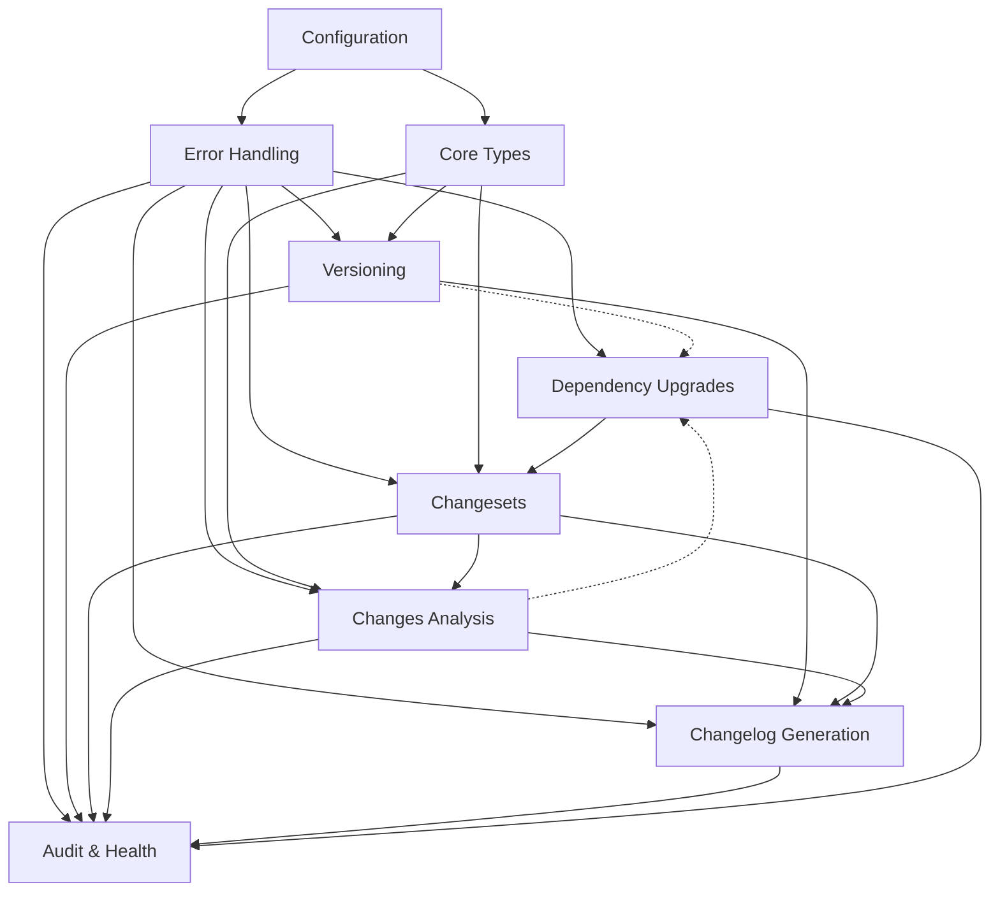

# sublime_pkg_tools - Implementation Plan

**Status**: 📋 Ready for Implementation  
**Version**: 1.0  
**Based on**: CONCEPT.md v1.0  
**Last Updated**: 2024-01-15

---

## Table of Contents

1. [Executive Summary](#executive-summary)
2. [Priority Analysis](#priority-analysis)
3. [Dependency Graph](#dependency-graph)
4. [Implementation Phases](#implementation-phases)
5. [Module Structure](#module-structure)
6. [Quality Standards](#quality-standards)
7. [Testing Strategy](#testing-strategy)
8. [Documentation Requirements](#documentation-requirements)
9. [Milestones & Timeline](#milestones--timeline)
10. [Risk Assessment](#risk-assessment)

---

## Executive Summary

### Project Overview

`sublime_pkg_tools` is a comprehensive library for changeset-based package version management in Node.js projects. The implementation is divided into **4 major phases** across **6 core modules**, following strict quality standards (100% test coverage, 100% clippy compliance, 100% documentation).

### Key Success Criteria

- ✅ All modules pass clippy without warnings
- ✅ 100% test coverage (unit + integration)
- ✅ 100% API documentation with examples
- ✅ Zero `unwrap()`, `expect()`, `todo!()`, `panic!()`, `unimplemented!()`
- ✅ All errors implement `AsRef<str>`
- ✅ Internal visibility uses `pub(crate)` consistently
- ✅ Follows patterns from `sublime_standard_tools`

### Estimated Timeline

- **Phase 1**: 2-3 weeks (Foundation)
- **Phase 2**: 3-4 weeks (Core Functionality)
- **Phase 3**: 2-3 weeks (Advanced Features)
- **Phase 4**: 1-2 weeks (Integration & Polish)
- **Total**: 8-12 weeks

---

## Priority Analysis

### Critical Path (Must Have - Phase 1 & 2)

1. **Configuration System** - Foundation for all modules
2. **Error Handling** - Required by everything
3. **Core Types** - Data structures used across modules
4. **Versioning** - Core business logic
5. **Changesets** - Core workflow management

### High Priority (Phase 2 & 3)

6. **Changes Analysis** - Required for intelligent versioning
7. **Dependency Graph** - Required for propagation
8. **Changelog Generation** - Release workflow completion

### Medium Priority (Phase 3 & 4)

9. **Dependency Upgrades** - Enhancement feature
10. **Audit** - Aggregation and reporting

### Priority Rationale

```
Configuration & Errors (P0)
    ↓
Core Types & Version Resolution (P1)
    ↓
Changesets + Changes Analysis (P1-P2)
    ↓
Changelog Generation (P2)
    ↓
Upgrades + Audit (P3)
```

**Why this order:**
- **Config first**: Everything needs configuration
- **Errors early**: Required by all modules for proper error handling
- **Types & Versioning**: Core business logic that others depend on
- **Changesets**: Central to the workflow
- **Changes**: Provides intelligence for versioning decisions
- **Changelog**: Completes the release workflow
- **Upgrades & Audit**: Enhancement features that aggregate others

---

## Dependency Graph

### Module Dependencies



### External Dependencies

```
sublime_pkg_tools
    ↓
├─ sublime_standard_tools (filesystem, monorepo, config)
├─ sublime_git_tools (git operations)
├─ package-json (parsing)
├─ semver (version comparison)
├─ regex (conventional commits)
└─ tokio, serde, chrono, thiserror (standard)
```

---

## Implementation Phases

## Phase 1: Foundation (Weeks 1-3)

### Objective
Establish the foundational infrastructure that all other modules depend on.

### Deliverables

#### 1.1 Project Setup & Structure
- [ ] Initialize crate structure following `sublime_standard_tools` patterns
- [ ] Configure `Cargo.toml` with dependencies
- [ ] Setup `lib.rs` with crate-level documentation and clippy rules
- [ ] Create `mod.rs` files for each module (export-only, no implementation)

**Files to create:**
```
crates/pkg/
├── Cargo.toml
├── src/
│   ├── lib.rs                    # Crate root with version()
│   ├── config/
│   │   └── mod.rs               # Export only
│   ├── error/
│   │   └── mod.rs               # Export only
│   └── types/
│       └── mod.rs               # Export only
```

#### 1.2 Error Handling Module
- [ ] Define `Error` enum with all error variants
- [ ] Implement `AsRef<str>` for all error types
- [ ] Create domain-specific error types:
  - [ ] `ConfigError`
  - [ ] `VersionError`
  - [ ] `ChangesetError`
  - [ ] `ChangesError`
  - [ ] `ChangelogError`
  - [ ] `UpgradeError`
  - [ ] `AuditError`
- [ ] Implement error context and recovery strategies
- [ ] Write comprehensive error tests

**Files:**
```
src/error/
├── mod.rs                       # Exports and Error enum
├── config.rs                    # ConfigError
├── version.rs                   # VersionError
├── changeset.rs                 # ChangesetError
├── changes.rs                   # ChangesError
├── changelog.rs                 # ChangelogError
├── upgrade.rs                   # UpgradeError
├── audit.rs                     # AuditError
└── tests.rs                     # Error tests
```

**Quality Gates:**
- ✅ All errors implement `Display`, `Debug`, `Error`
- ✅ All errors implement `AsRef<str>`
- ✅ 100% test coverage on error creation and conversion
- ✅ Clippy clean

#### 1.3 Configuration System
- [ ] Define `PackageToolsConfig` struct
- [ ] Implement sub-configs:
  - [ ] `ChangesetConfig`
  - [ ] `VersionConfig`
  - [ ] `DependencyConfig`
  - [ ] `GitConfig`
  - [ ] `ChangelogConfig`
  - [ ] `UpgradeConfig`
  - [ ] `AuditConfig`
- [ ] Implement `Configurable` trait from standard tools
- [ ] TOML/YAML/JSON deserialization
- [ ] Environment variable overrides
- [ ] Default implementations
- [ ] Configuration validation

**Files:**
```
src/config/
├── mod.rs                       # PackageToolsConfig export
├── types.rs                     # Main config structs
├── changeset.rs                 # ChangesetConfig
├── version.rs                   # VersionConfig + DependencyConfig
├── git.rs                       # GitConfig
├── changelog.rs                 # ChangelogConfig
├── upgrade.rs                   # UpgradeConfig
├── audit.rs                     # AuditConfig
├── validation.rs                # Config validation logic
└── tests.rs                     # Config tests
```

**Quality Gates:**
- ✅ All configs have sensible defaults
- ✅ Validation logic prevents invalid configurations
- ✅ Environment variables work correctly
- ✅ Integration with `sublime_standard_tools::config::ConfigManager`
- ✅ 100% test coverage

#### 1.4 Core Types
- [ ] Define `Version` struct with semver parsing
- [ ] Define `VersionBump` enum
- [ ] Define `VersioningStrategy` enum
- [ ] Define `PackageInfo` struct
- [ ] Define `Changeset` struct
- [ ] Implement serialization/deserialization
- [ ] Implement Display traits

**Files:**
```
src/types/
├── mod.rs                       # Export all types
├── version.rs                   # Version, VersionBump, VersioningStrategy
├── package.rs                   # PackageInfo
├── changeset.rs                 # Changeset, ArchivedChangeset
├── dependency.rs                # DependencyType, etc.
└── tests.rs                     # Type tests
```

**Quality Gates:**
- ✅ All types implement required traits (Clone, Debug, Serialize, Deserialize)
- ✅ Version parsing handles all semver cases
- ✅ 100% test coverage

### Phase 1 Exit Criteria
- ✅ All foundation modules compile
- ✅ Clippy passes without warnings
- ✅ 100% test coverage on all Phase 1 modules
- ✅ Documentation complete with examples
- ✅ Integration tests pass with `sublime_standard_tools`

---

## Phase 2: Core Functionality (Weeks 4-7)

### Objective
Implement the core business logic for versioning and changesets.

### Deliverables

#### 2.1 Versioning Module
- [ ] Implement `VersionResolver` with monorepo/single-package detection
- [ ] Version resolution with dry-run support
- [ ] Dependency propagation logic
- [ ] Circular dependency detection
- [ ] Snapshot version generation
- [ ] Package.json reading/writing using `sublime_standard_tools`

**Files:**
```
src/version/
├── mod.rs                       # Export VersionResolver
├── resolver.rs                  # VersionResolver implementation
├── resolution.rs                # VersionResolution types
├── propagation.rs               # Dependency propagation logic
├── graph.rs                     # DependencyGraph
├── snapshot.rs                  # Snapshot version generation
└── tests/
    ├── mod.rs
    ├── resolver_tests.rs
    ├── propagation_tests.rs
    └── snapshot_tests.rs
```

**Key APIs:**
```rust
impl VersionResolver {
    pub async fn new(workspace_root: &Path, config: VersionConfig) -> Result<Self>;
    pub async fn resolve_versions(&self, changeset: &Changeset) -> Result<VersionResolution>;
    pub async fn apply_versions(&self, changeset: &Changeset, dry_run: bool) -> Result<ApplyResult>;
}
```

**Quality Gates:**
- ✅ Handles both monorepo and single-package
- ✅ Circular dependency detection works correctly
- ✅ Propagation follows configured rules
- ✅ Dry-run mode doesn't modify files
- ✅ Rollback on partial failure
- ✅ 100% test coverage with mock filesystem

#### 2.2 Changesets Module
- [ ] Implement `ChangesetManager` for CRUD operations
- [ ] File-based storage with `FileSystemManager`
- [ ] Changeset history and archiving
- [ ] Git integration for commit detection
- [ ] Changeset validation

**Files:**
```
src/changeset/
├── mod.rs                       # Export ChangesetManager
├── manager.rs                   # ChangesetManager implementation
├── storage.rs                   # ChangesetStorage trait + FileBasedStorage
├── history.rs                   # ChangesetHistory
├── git_integration.rs           # Git commit detection
└── tests/
    ├── mod.rs
    ├── manager_tests.rs
    ├── storage_tests.rs
    └── history_tests.rs
```

**Key APIs:**
```rust
impl ChangesetManager {
    pub async fn create(&self, branch: &str, bump: VersionBump) -> Result<Changeset>;
    pub async fn load(&self, branch: &str) -> Result<Changeset>;
    pub async fn update(&self, branch: &str, updates: ChangesetUpdate) -> Result<UpdateSummary>;
    pub async fn add_commits_from_git(&self, branch: &str, commit_range: &str) -> Result<UpdateSummary>;
    pub async fn archive(&self, branch: &str, release_info: ReleaseInfo) -> Result<()>;
}
```

**Quality Gates:**
- ✅ Atomic file operations
- ✅ Concurrent access handling
- ✅ Git integration works correctly
- ✅ Archive/history queryable
- ✅ 100% test coverage

#### 2.3 Changes Analysis Module
- [ ] Implement `ChangesAnalyzer` with git integration
- [ ] File-to-package mapping
- [ ] Commit-to-package association
- [ ] Working directory analysis
- [ ] Commit range analysis
- [ ] Version preview calculation

**Files:**
```
src/changes/
├── mod.rs                       # Export ChangesAnalyzer
├── analyzer.rs                  # ChangesAnalyzer implementation
├── report.rs                    # ChangesReport types
├── package_changes.rs           # PackageChanges
├── file_change.rs               # FileChange types
├── commit_info.rs               # CommitInfo
├── mapping.rs                   # File-to-package mapping
├── stats.rs                     # Statistics calculation
└── tests/
    ├── mod.rs
    ├── analyzer_tests.rs
    └── mapping_tests.rs
```

**Key APIs:**
```rust
impl ChangesAnalyzer {
    pub async fn new(workspace_root: PathBuf) -> Result<Self>;
    pub async fn analyze_working_directory(&self) -> Result<ChangesReport>;
    pub async fn analyze_commit_range(&self, base: &str, head: &str) -> Result<ChangesReport>;
    pub async fn analyze_with_versions(&self, base: &str, head: &str, changeset: &Changeset) -> Result<ChangesReport>;
}
```

**Quality Gates:**
- ✅ Correctly maps files to packages in monorepo
- ✅ Handles multi-package commits
- ✅ Version calculation accurate
- ✅ Works with both staged and unstaged changes
- ✅ 100% test coverage with mock git repo

### Phase 2 Exit Criteria
- ✅ Core versioning workflow complete
- ✅ Changesets create, update, archive correctly
- ✅ Changes analysis provides accurate package information
- ✅ Integration between modules works
- ✅ All quality gates passed
- ✅ Documentation complete

---

## Phase 3: Advanced Features (Weeks 8-10)

### Objective
Implement changelog generation and dependency upgrades.

### Deliverables

#### 3.1 Changelog Generation Module
- [ ] Implement `ChangelogGenerator`
- [ ] Conventional commits parser
- [ ] Keep a Changelog formatter
- [ ] Custom template support
- [ ] Existing changelog parser
- [ ] Git tag detection and version comparison
- [ ] Merge commit message generation

**Files:**
```
src/changelog/
├── mod.rs                       # Export ChangelogGenerator
├── generator.rs                 # ChangelogGenerator implementation
├── changelog.rs                 # Changelog types
├── section.rs                   # ChangelogSection
├── entry.rs                     # ChangelogEntry
├── conventional.rs              # ConventionalCommit parser
├── parser.rs                    # Existing changelog parser
├── formatter/
│   ├── mod.rs
│   ├── keep_a_changelog.rs
│   ├── conventional.rs
│   └── custom.rs
└── tests/
    ├── mod.rs
    ├── generator_tests.rs
    ├── conventional_tests.rs
    └── formatter_tests.rs
```

**Key APIs:**
```rust
impl ChangelogGenerator {
    pub async fn new(workspace_root: PathBuf, config: ChangelogConfig) -> Result<Self>;
    pub async fn generate_for_version(&self, package: Option<&str>, version: &str, prev: Option<&str>) -> Result<Changelog>;
    pub async fn generate_from_changeset(&self, changeset: &Changeset, resolution: &VersionResolution) -> Result<Vec<GeneratedChangelog>>;
    pub async fn update_changelog(&self, path: &Path, changelog: &Changelog, dry_run: bool) -> Result<String>;
}

impl ConventionalCommit {
    pub fn parse(message: &str) -> Result<Self, ParseError>;
    pub fn section_type(&self) -> SectionType;
    pub fn extract_references(&self) -> Vec<String>;
}
```

**Quality Gates:**
- ✅ Conventional commit parsing handles all cases
- ✅ Breaking change detection accurate
- ✅ Multiple formats supported
- ✅ Merge commit messages generated correctly
- ✅ 100% test coverage

#### 3.2 Dependency Upgrades Module
- [ ] Implement `UpgradeManager`
- [ ] Registry client with .npmrc support
- [ ] Upgrade detection with version classification
- [ ] Dry-run and apply with rollback
- [ ] Automatic changeset creation
- [ ] Concurrent registry queries

**Files:**
```
src/upgrade/
├── mod.rs                       # Export UpgradeManager
├── manager.rs                   # UpgradeManager implementation
├── registry/
│   ├── mod.rs
│   ├── client.rs               # RegistryClient
│   ├── npmrc.rs                # .npmrc parsing
│   └── metadata.rs             # PackageMetadata types
├── detection.rs                 # Upgrade detection
├── apply.rs                     # Apply upgrades
├── backup.rs                    # Backup and rollback
├── types.rs                     # UpgradePreview, etc.
└── tests/
    ├── mod.rs
    ├── manager_tests.rs
    ├── registry_tests.rs
    └── apply_tests.rs
```

**Key APIs:**
```rust
impl UpgradeManager {
    pub async fn new(workspace_root: PathBuf, config: UpgradeConfig) -> Result<Self>;
    pub async fn detect_upgrades(&self, options: DetectionOptions) -> Result<UpgradePreview>;
    pub async fn apply_upgrades(&self, selection: UpgradeSelection, dry_run: bool) -> Result<UpgradeResult>;
    pub async fn rollback_last(&self) -> Result<Vec<PathBuf>>;
}
```

**Quality Gates:**
- ✅ Registry queries work (with mock server for tests)
- ✅ .npmrc parsing correct
- ✅ Backup/rollback reliable
- ✅ Automatic changeset creation
- ✅ 100% test coverage

### Phase 3 Exit Criteria
- ✅ Changelog generation works for all formats
- ✅ Dependency upgrades detect and apply correctly
- ✅ Integration with changesets works
- ✅ All quality gates passed

---

## Phase 4: Integration & Polish (Weeks 11-12)

### Objective
Complete the audit module, integration testing, and final polish.

### Deliverables

#### 4.1 Audit Module
- [ ] Implement `AuditManager` aggregating all modules
- [ ] Upgrade audit section
- [ ] Dependency audit section
- [ ] Breaking changes audit section
- [ ] Categorization section
- [ ] Version consistency section
- [ ] Health score calculation
- [ ] Report formatting (Markdown, JSON)

**Files:**
```
src/audit/
├── mod.rs                       # Export AuditManager
├── manager.rs                   # AuditManager implementation
├── report.rs                    # AuditReport types
├── sections/
│   ├── mod.rs
│   ├── upgrades.rs
│   ├── dependencies.rs
│   ├── breaking_changes.rs
│   ├── categorization.rs
│   └── version_consistency.rs
├── issue.rs                     # AuditIssue types
├── formatter.rs                 # Report formatters
├── health_score.rs              # Health score calculation
└── tests/
    ├── mod.rs
    ├── manager_tests.rs
    └── sections_tests.rs
```

**Key APIs:**
```rust
impl AuditManager {
    pub async fn new(workspace_root: PathBuf, config: AuditConfig) -> Result<Self>;
    pub async fn run_audit(&self) -> Result<AuditReport>;
    pub async fn audit_upgrades(&self) -> Result<UpgradeAuditSection>;
    pub async fn audit_dependencies(&self) -> Result<DependencyAuditSection>;
    pub async fn categorize_dependencies(&self) -> Result<DependencyCategorization>;
}
```

**Quality Gates:**
- ✅ Aggregates data from all modules correctly
- ✅ Health score calculation accurate
- ✅ Report formats valid (Markdown, JSON)
- ✅ 100% test coverage

#### 4.2 Integration Testing
- [ ] End-to-end workflow tests
- [ ] Monorepo integration tests
- [ ] Single-package integration tests
- [ ] Cross-module integration tests
- [ ] Performance benchmarks

**Files:**
```
tests/
├── integration/
│   ├── mod.rs
│   ├── workflow_tests.rs       # Full release workflow
│   ├── monorepo_tests.rs       # Monorepo scenarios
│   ├── single_package_tests.rs # Single package scenarios
│   └── upgrade_workflow_tests.rs
├── fixtures/
│   ├── monorepo_sample/
│   └── single_package_sample/
└── common/
    ├── mod.rs
    └── test_helpers.rs
```

#### 4.3 Documentation & Examples
- [ ] Complete API documentation
- [ ] Usage examples for each module
- [ ] Integration examples
- [ ] Migration guides
- [ ] Performance notes

**Files:**
```
examples/
├── 01_basic_changeset.rs
├── 02_version_resolution.rs
├── 03_changelog_generation.rs
├── 04_dependency_upgrades.rs
├── 05_audit_report.rs
└── 06_full_release_workflow.rs

docs/
├── guides/
│   ├── getting-started.md
│   ├── monorepo-guide.md
│   └── ci-cd-integration.md
└── architecture/
    ├── overview.md
    └── module-interactions.md
```

### Phase 4 Exit Criteria
- ✅ Audit module complete
- ✅ All integration tests pass
- ✅ Documentation complete
- ✅ Examples working
- ✅ Performance acceptable
- ✅ Ready for production use

---

## Module Structure

### File Organization Pattern

Following `sublime_standard_tools` conventions:

```
src/
├── lib.rs                          # Crate root, version(), clippy rules
├── config/
│   ├── mod.rs                      # Exports only
│   ├── types.rs                    # Core config types
│   ├── [domain].rs                 # Domain configs
│   ├── validation.rs               # Validation logic
│   └── tests.rs                    # Tests
├── error/
│   ├── mod.rs                      # Error enum + exports
│   ├── [domain].rs                 # Domain errors
│   └── tests.rs                    # Error tests
├── types/
│   ├── mod.rs                      # Type exports
│   ├── [type_group].rs             # Related types
│   └── tests.rs                    # Type tests
├── [module]/
│   ├── mod.rs                      # Module exports
│   ├── [main_struct].rs            # Primary implementation
│   ├── [supporting].rs             # Supporting types/logic
│   └── tests/                      # Module tests
│       ├── mod.rs
│       └── [test_category].rs
└── tests/                          # Integration tests (separate)
```

### Visibility Rules

```rust
// Public API - exported from crate
pub struct PublicType { ... }
pub fn public_api() { ... }

// Internal to crate - shared between modules
pub(crate) struct InternalType { ... }
pub(crate) fn internal_helper() { ... }

// Private to module
struct PrivateType { ... }
fn private_helper() { ... }

// Private to struct (if fields need encapsulation)
pub struct TypeWithPrivateFields {
    pub(crate) shared_field: String,  // Accessible within crate
    private_field: String,             // Only within module
}
```

### mod.rs Pattern

```rust
//! # Module Name
//!
//! ## What
//! Brief description of module purpose
//!
//! ## How
//! How the module achieves its purpose
//!
//! ## Why
//! Why this design was chosen

// Internal modules
mod implementation;
mod supporting_types;

#[cfg(test)]
mod tests;

// Re-exports (public API)
pub use implementation::{PublicStruct, PublicTrait};
pub use supporting_types::PublicEnum;

// Internal re-exports (for crate use)
pub(crate) use implementation::InternalHelper;
```

### lib.rs Pattern

```rust
//! # `sublime_pkg_tools`
//!
//! ## What
//! Comprehensive package management toolkit for Node.js projects
//!
//! ## How
//! [Architecture description]
//!
//! ## Why
//! [Rationale]
//!
//! ## Quick Start
//! [Examples]

#![doc = include_str!("../CONCEPT.md")]
#![warn(missing_docs)]
#![warn(rustdoc::missing_crate_level_docs)]
#![deny(unused_must_use)]
#![deny(clippy::unwrap_used)]
#![deny(clippy::expect_used)]
#![deny(clippy::todo)]
#![deny(clippy::unimplemented)]
#![deny(clippy::panic)]

pub mod audit;
pub mod changeset;
pub mod changelog;
pub mod changes;
pub mod config;
pub mod error;
pub mod types;
pub mod upgrade;
pub mod version;

/// Version of the crate
pub const VERSION: &str = env!("CARGO_PKG_VERSION");

/// Returns the version of the crate
#[must_use]
pub fn version() -> &'static str {
    VERSION
}
```

---

## Quality Standards

### Clippy Rules (Mandatory)

All code must pass these clippy rules:

```rust
#![warn(missing_docs)]
#![warn(rustdoc::missing_crate_level_docs)]
#![deny(unused_must_use)]
#![deny(clippy::unwrap_used)]
#![deny(clippy::expect_used)]
#![deny(clippy::todo)]
#![deny(clippy::unimplemented)]
#![deny(clippy::panic)]
```

**Enforcement:**
```bash
cargo clippy --all-targets --all-features -- -D warnings
```

### Code Quality Checklist

For every module/file:

- [ ] Module-level documentation (What, How, Why)
- [ ] All public items documented with examples
- [ ] All functions have doc comments
- [ ] All structs/enums documented with field descriptions
- [ ] Examples in documentation compile and run
- [ ] No `unwrap()` or `expect()` calls
- [ ] No `todo!()`, `unimplemented!()`, `panic!()`
- [ ] All `Result` types used correctly
- [ ] Errors implement `AsRef<str>`
- [ ] Internal types use `pub(crate)`
- [ ] Tests in separate files/modules

### Error Handling Pattern

```rust
/// Domain-specific error type
#[derive(Debug, Clone, thiserror::Error)]
pub enum DomainError {
    #[error("Specific error: {reason}")]
    SpecificError { reason: String },
    
    #[error("Nested error: {0}")]
    Nested(#[from] OtherError),
}

impl AsRef<str> for DomainError {
    fn as_ref(&self) -> &str {
        match self {
            DomainError::SpecificError { .. } => "DomainError::SpecificError",
            DomainError::Nested(_) => "DomainError::Nested",
        }
    }
}

pub type DomainResult<T> = Result<T, DomainError>;
```

### Documentation Pattern

```rust
/// Brief one-line description
///
/// Detailed description explaining:
/// - What this does
/// - When to use it
/// - Important considerations
///
/// # Arguments
///
/// * `arg1` - Description of first argument
/// * `arg2` - Description of second argument
///
/// # Returns
///
/// Description of return value
///
/// # Errors
///
/// This function will return an error if:
/// - Condition 1
/// - Condition 2
///
/// # Examples
///
/// ```
/// use sublime_pkg_tools::module::Function;
///
/// let result = Function::new("value")?;
/// assert_eq!(result.field, "value");
/// ```
///
/// # Panics
///
/// This function will panic if... (only if unavoidable)
pub fn function_name(arg1: &str, arg2: usize) -> Result<Type, Error> {
    // Implementation
}
```

---

## Testing Strategy

### Test Organization

```
src/
└── module/
    ├── mod.rs
    ├── implementation.rs
    └── tests/
        ├── mod.rs              # Test module exports
        ├── unit_tests.rs       # Unit tests
        └── integration_tests.rs # Module integration tests

tests/                          # Crate-level integration tests
├── integration/
│   ├── mod.rs
│   └── workflow_tests.rs
└── fixtures/
    └── test_data/
```

### Test Coverage Requirements

**100% coverage on:**
- All public APIs
- All error paths
- All configuration variations
- All edge cases

**Tools:**
```bash
# Install tarpaulin
cargo install cargo-tarpaulin

# Run coverage
cargo tarpaulin --out Html --output-dir coverage/ --all-features

# Must achieve 100% coverage
```

### Test Categories

#### Unit Tests
- Test individual functions/methods
- Mock external dependencies
- Fast execution (<1ms per test)
- Located in `tests/` submodule

```rust
#[cfg(test)]
mod tests {
    use super::*;

    #[test]
    fn test_function_success() {
        let result = function_name("input", 42);
        assert!(result.is_ok());
    }

    #[test]
    fn test_function_error() {
        let result = function_name("", 0);
        assert!(result.is_err());
    }
}
```

#### Integration Tests
- Test module interactions
- Use real filesystem (temp directories)
- Use mock git repositories
- Located in `tests/` directory

```rust
#[tokio::test]
async fn test_full_workflow() {
    let temp_dir = tempfile::tempdir().unwrap();
    // Setup
    // Execute workflow
    // Assert results
}
```

#### Property-Based Tests
- Use `proptest` for property testing
- Test invariants across random inputs
- Especially for versioning and parsing logic

```rust
use proptest::prelude::*;

proptest! {
    #[test]
    fn test_version_parsing(s in "\\d+\\.\\d+\\.\\d+") {
        let version = Version::parse(&s);
        assert!(version.is_ok());
    }
}
```

### Test Data Management

```
tests/fixtures/
├── monorepo/
│   ├── package.json
│   ├── packages/
│   │   ├── pkg1/package.json
│   │   └── pkg2/package.json
│   └── .changesets/
├── single-package/
│   └── package.json
└── configs/
    ├── valid-config.toml
    └── invalid-config.toml
```

### Mock Implementations

Create mock implementations for external dependencies:

```rust
// Mock filesystem for tests
pub(crate) struct MockFileSystem {
    files: HashMap<PathBuf, String>,
}

impl AsyncFileSystem for MockFileSystem {
    async fn read_file_string(&self, path: &Path) -> Result<String> {
        self.files.get(path).cloned()
            .ok_or_else(|| Error::FileNotFound)
    }
    // ... other methods
}

// Mock git repository
pub(crate) struct MockGitRepository {
    commits: Vec<MockCommit>,
}

// Mock registry for upgrade tests
pub(crate) struct MockRegistry {
    packages: HashMap<String, PackageMetadata>,
}
```

---

## Documentation Requirements

### API Documentation (100%)

Every public item must have:
- Summary line
- Detailed description
- Arguments/fields documentation
- Return value description
- Error conditions
- At least one working example
- Links to related items

### Module Documentation

Every module must have:
- What: Purpose and responsibility
- How: Implementation approach
- Why: Design decisions and rationale
- Examples: Usage patterns

### Crate Documentation

`lib.rs` must include:
- Overview of the crate
- Architecture diagram
- Quick start guide
- Links to modules
- Common workflows

### External Documentation

Create in `docs/` directory:
- Getting Started guide
- Architecture overview
- Monorepo guide
- CI/CD integration guide
- Migration guides
- Troubleshooting guide

### Examples

Create runnable examples in `examples/`:
- Basic usage for each module
- Integration patterns
- Full workflows
- Edge cases

Each example must:
- Be self-contained
- Include comments explaining each step
- Show error handling
- Demonstrate best practices

---

## Milestones & Timeline

### Milestone 1: Foundation Complete (End of Week 3)

**Deliverables:**
- [ ] Project structure established
- [ ] Error handling module complete
- [ ] Configuration system complete
- [ ] Core types defined
- [ ] All Phase 1 quality gates passed

**Success Criteria:**
- ✅ Clippy clean
- ✅ 100% test coverage on foundation modules
- ✅ Documentation complete
- ✅ Can load configuration from files
- ✅ All errors implement `AsRef<str>`

### Milestone 2: Core Functionality (End of Week 7)

**Deliverables:**
- [ ] Versioning module complete
- [ ] Changesets module complete
- [ ] Changes analysis module complete
- [ ] Integration between modules working
- [ ] All Phase 2 quality gates passed

**Success Criteria:**
- ✅ Can create and manage changesets
- ✅ Version resolution works for monorepo and single-package
- ✅ Dependency propagation correct
- ✅ Changes analysis accurate
- ✅ Dry-run mode works
- ✅ Integration tests pass

### Milestone 3: Advanced Features (End of Week 10)

**Deliverables:**
- [ ] Changelog generation complete
- [ ] Dependency upgrades complete
- [ ] All Phase 3 quality gates passed

**Success Criteria:**
- ✅ Conventional commits parsed correctly
- ✅ Changelogs generated in multiple formats
- ✅ Dependency upgrades detect and apply
- ✅ Registry integration works
- ✅ Automatic changeset creation

### Milestone 4: Production Ready (End of Week 12)

**Deliverables:**
- [ ] Audit module complete
- [ ] All integration tests pass
- [ ] Documentation complete
- [ ] Examples working
- [ ] Performance benchmarks meet targets
- [ ] All Phase 4 quality gates passed

**Success Criteria:**
- ✅ Health checks comprehensive
- ✅ 100% test coverage overall
- ✅ All clippy rules pass
- ✅ Documentation 100%
- ✅ Ready for v1.0.0 release

---

## Risk Assessment

### High Risk Items

#### 1. Dependency Graph Circular Detection
**Risk**: Complex algorithm, edge cases
**Mitigation**:
- Implement early in Phase 2
- Extensive testing with various graph structures
- Review algorithm with team
- Property-based testing

#### 2. Git Integration Complexity
**Risk**: Different git states, merge conflicts
**Mitigation**:
- Use proven `sublime_git_tools` crate
- Comprehensive test cases
- Handle all git states explicitly
- Clear error messages

#### 3. Registry API Changes
**Risk**: External APIs may change
**Mitigation**:
- Version pinning
- Graceful degradation
- Retry logic with exponential backoff
- Comprehensive error handling

#### 4. Performance in Large Monorepos
**Risk**: Slow operations with many packages
**Mitigation**:
- Early performance testing
- Concurrent operations where possible
- Caching strategies
- Benchmark suite

### Medium Risk Items

#### 1. Configuration Complexity
**Risk**: Too many options, hard to understand
**Mitigation**:
- Sensible defaults
- Configuration validation
- Documentation with examples
- Migration guides

#### 2. Test Coverage
**Risk**: Hard to achieve 100% in some areas
**Mitigation**:
- Mock implementations for external deps
- Property-based testing
- Integration test fixtures
- Regular coverage checks

### Low Risk Items

#### 1. Documentation Maintenance
**Risk**: Docs get outdated
**Mitigation**:
- Doc tests that compile
- Examples as integration tests
- Regular doc reviews

---

## Development Workflow

### Daily Workflow

1. **Pull latest changes**
2. **Create feature branch** from current milestone
3. **Implement feature** following quality standards
4. **Write tests** (aim for 100% coverage)
5. **Run quality checks**:
   ```bash
   cargo fmt
   cargo clippy --all-targets --all-features -- -D warnings
   cargo test --all-features
   cargo tarpaulin --out Html
   cargo doc --no-deps --open
   ```
6. **Commit with conventional commit message**
7. **Push and create PR**

### PR Requirements

Every PR must:
- [ ] Pass all CI checks
- [ ] Have 100% test coverage on changed code
- [ ] Pass clippy without warnings
- [ ] Have complete documentation
- [ ] Include examples if adding new API
- [ ] Update CHANGELOG.md (yes, we eat our own dog food!)
- [ ] Be reviewed by at least one team member

### Conventional Commit Format

```
<type>[optional scope]: <description>

[optional body]

[optional footer(s)]
```

**Types:**
- `feat`: New feature
- `fix`: Bug fix
- `docs`: Documentation only
- `style`: Code style changes
- `refactor`: Code refactoring
- `perf`: Performance improvement
- `test`: Adding tests
- `chore`: Maintenance tasks

**Examples:**
```
feat(version): implement dependency propagation

Add support for propagating version updates through dependency graph.
Handles circular dependencies and respects configuration.

Closes #123
```

---

## CI/CD Pipeline

### GitHub Actions Workflow

```yaml
name: CI

on: [push, pull_request]

jobs:
  test:
    runs-on: ${{ matrix.os }}
    strategy:
      matrix:
        os: [ubuntu-latest, macos-latest, windows-latest]
        rust: [stable, nightly]
    steps:
      - uses: actions/checkout@v2
      - uses: actions-rs/toolchain@v1
        with:
          toolchain: ${{ matrix.rust }}
      - run: cargo fmt --check
      - run: cargo clippy --all-targets --all-features -- -D warnings
      - run: cargo test --all-features
      - run: cargo doc --no-deps
  
  coverage:
    runs-on: ubuntu-latest
    steps:
      - uses: actions/checkout@v2
      - uses: actions-rs/toolchain@v1
      - uses: actions-rs/tarpaulin@v0.1
      - name: Upload coverage
        uses: codecov/codecov-action@v1
      - name: Check 100% coverage
        run: |
          COVERAGE=$(cargo tarpaulin --output-format Json | jq '.files[].coverage')
          if [ "$COVERAGE" != "100.0" ]; then
            echo "Coverage is not 100%"
            exit 1
          fi
```

---

## Success Metrics

### Code Metrics
- ✅ 100% test coverage
- ✅ 0 clippy warnings
- ✅ 100% documentation coverage
- ✅ <100ms for 95% of operations
- ✅ <1s for complex operations (large monorepos)

### Quality Metrics
- ✅ All public APIs documented with examples
- ✅ All errors have clear messages
- ✅ All edge cases tested
- ✅ Cross-platform compatibility verified

### Usability Metrics
- ✅ Getting Started guide takes <15 minutes
- ✅ Common workflows have examples
- ✅ Error messages are actionable
- ✅ Configuration is intuitive

---

## Appendix A: File Checklist

Complete file structure to be created:

```
crates/pkg/
├── Cargo.toml
├── CONCEPT.md (✅ existing)
├── PLAN.md (✅ this file)
├── README.md
├── CHANGELOG.md
│
├── src/
│   ├── lib.rs
│   │
│   ├── config/
│   │   ├── mod.rs
│   │   ├── types.rs
│   │   ├── changeset.rs
│   │   ├── version.rs
│   │   ├── git.rs
│   │   ├── changelog.rs
│   │   ├── upgrade.rs
│   │   ├── audit.rs
│   │   ├── validation.rs
│   │   └── tests.rs
│   │
│   ├── error/
│   │   ├── mod.rs
│   │   ├── config.rs
│   │   ├── version.rs
│   │   ├── changeset.rs
│   │   ├── changes.rs
│   │   ├── changelog.rs
│   │   ├── upgrade.rs
│   │   ├── audit.rs
│   │   └── tests.rs
│   │
│   ├── types/
│   │   ├── mod.rs
│   │   ├── version.rs
│   │   ├── package.rs
│   │   ├── changeset.rs
│   │   ├── dependency.rs
│   │   └── tests.rs
│   │
│   ├── version/
│   │   ├── mod.rs
│   │   ├── resolver.rs
│   │   ├── resolution.rs
│   │   ├── propagation.rs
│   │   ├── graph.rs
│   │   ├── snapshot.rs
│   │   └── tests/
│   │       ├── mod.rs
│   │       ├── resolver_tests.rs
│   │       ├── propagation_tests.rs
│   │       └── snapshot_tests.rs
│   │
│   ├── changeset/
│   │   ├── mod.rs
│   │   ├── manager.rs
│   │   ├── storage.rs
│   │   ├── history.rs
│   │   ├── git_integration.rs
│   │   └── tests/
│   │       ├── mod.rs
│   │       ├── manager_tests.rs
│   │       ├── storage_tests.rs
│   │       └── history_tests.rs
│   │
│   ├── changes/
│   │   ├── mod.rs
│   │   ├── analyzer.rs
│   │   ├── report.rs
│   │   ├── package_changes.rs
│   │   ├── file_change.rs
│   │   ├── commit_info.rs
│   │   ├── mapping.rs
│   │   ├── stats.rs
│   │   └── tests/
│   │       ├── mod.rs
│   │       ├── analyzer_tests.rs
│   │       └── mapping_tests.rs
│   │
│   ├── changelog/
│   │   ├── mod.rs
│   │   ├── generator.rs
│   │   ├── changelog.rs
│   │   ├── section.rs
│   │   ├── entry.rs
│   │   ├── conventional.rs
│   │   ├── parser.rs
│   │   ├── formatter/
│   │   │   ├── mod.rs
│   │   │   ├── keep_a_changelog.rs
│   │   │   ├── conventional.rs
│   │   │   └── custom.rs
│   │   └── tests/
│   │       ├── mod.rs
│   │       ├── generator_tests.rs
│   │       ├── conventional_tests.rs
│   │       └── formatter_tests.rs
│   │
│   ├── upgrade/
│   │   ├── mod.rs
│   │   ├── manager.rs
│   │   ├── registry/
│   │   │   ├── mod.rs
│   │   │   ├── client.rs
│   │   │   ├── npmrc.rs
│   │   │   └── metadata.rs
│   │   ├── detection.rs
│   │   ├── apply.rs
│   │   ├── backup.rs
│   │   ├── types.rs
│   │   └── tests/
│   │       ├── mod.rs
│   │       ├── manager_tests.rs
│   │       ├── registry_tests.rs
│   │       └── apply_tests.rs
│   │
│   └── audit/
│       ├── mod.rs
│       ├── manager.rs
│       ├── report.rs
│       ├── sections/
│       │   ├── mod.rs
│       │   ├── upgrades.rs
│       │   ├── dependencies.rs
│       │   ├── breaking_changes.rs
│       │   ├── categorization.rs
│       │   └── version_consistency.rs
│       ├── issue.rs
│       ├── formatter.rs
│       ├── health_score.rs
│       └── tests/
│           ├── mod.rs
│           ├── manager_tests.rs
│           └── sections_tests.rs
│
├── tests/
│   ├── integration/
│   │   ├── mod.rs
│   │   ├── workflow_tests.rs
│   │   ├── monorepo_tests.rs
│   │   ├── single_package_tests.rs
│   │   └── upgrade_workflow_tests.rs
│   ├── fixtures/
│   │   ├── monorepo_sample/
│   │   └── single_package_sample/
│   └── common/
│       ├── mod.rs
│       └── test_helpers.rs
│
├── examples/
│   ├── 01_basic_changeset.rs
│   ├── 02_version_resolution.rs
│   ├── 03_changelog_generation.rs
│   ├── 04_dependency_upgrades.rs
│   ├── 05_audit_report.rs
│   └── 06_full_release_workflow.rs
│
└── docs/
    ├── guides/
    │   ├── getting-started.md
    │   ├── monorepo-guide.md
    │   └── ci-cd-integration.md
    └── architecture/
        ├── overview.md
        └── module-interactions.md
```

---

## Appendix B: Dependencies

### Cargo.toml

```toml
[package]
name = "sublime_pkg_tools"
version = "0.1.0"
edition = "2021"
authors = ["Your Team"]
license = "MIT OR Apache-2.0"
description = "Changeset-based package version management for Node.js projects"
repository = "https://github.com/yourorg/workspace-node-tools"
keywords = ["nodejs", "package", "version", "monorepo", "changeset"]
categories = ["development-tools"]

[dependencies]
# Internal crates
sublime_standard_tools = { path = "../standard" }
sublime_git_tools = { path = "../git" }

# Async runtime
tokio = { version = "1", features = ["full"] }
futures = "0.3"

# Serialization
serde = { version = "1.0", features = ["derive"] }
serde_json = "1.0"
toml = "0.8"

# Date/time
chrono = { version = "0.4", features = ["serde"] }

# Error handling
thiserror = "1.0"

# Package management
package-json = "0.2"
semver = "1.0"

# Registry/HTTP
reqwest = { version = "0.11", features = ["json", "rustls-tls"] }
reqwest-retry = "0.3"
reqwest-middleware = "0.2"

# Parsing
regex = "1.10"

[dev-dependencies]
# Testing
tempfile = "3"
proptest = "1"
mockito = "1"
pretty_assertions = "1"

# Coverage
cargo-tarpaulin = "0.27"

[features]
default = []
```

---

## Appendix C: Quality Checklist Template

Use this checklist for each module:

### Module: `__________`

#### Code Quality
- [ ] Module documentation (What, How, Why)
- [ ] All public items documented
- [ ] All functions have doc comments
- [ ] Examples in documentation compile
- [ ] No `unwrap()` or `expect()`
- [ ] No `todo!()`, `unimplemented!()`, `panic!()`
- [ ] Errors implement `AsRef<str>`
- [ ] Uses `pub(crate)` for internal items

#### Testing
- [ ] Unit tests cover all functions
- [ ] Edge cases tested
- [ ] Error paths tested
- [ ] Integration tests written
- [ ] 100% coverage achieved
- [ ] Tests pass on all platforms

#### Review
- [ ] Clippy passes without warnings
- [ ] Code reviewed by peer
- [ ] Documentation reviewed
- [ ] Follows project patterns
- [ ] PR approved and merged

---

## Status: Ready for Implementation

This plan is comprehensive and ready for execution. Each phase has clear deliverables, quality gates, and success criteria. The structure follows proven patterns from `sublime_standard_tools`, and all quality requirements are explicit and measurable.

**Next Steps:**
1. Review and approve this plan
2. Set up project structure
3. Begin Phase 1 implementation
4. Regular check-ins at milestone boundaries

---

**PLAN.md STATUS**: ✅ **COMPLETE** - Ready to begin implementation