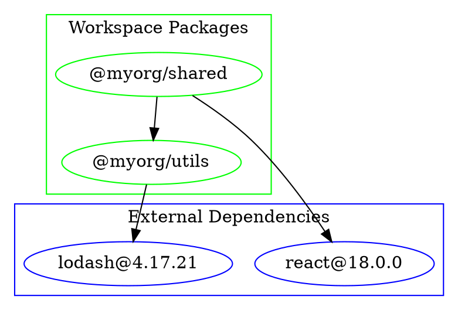

# Plano de Refatoração Enterprise - sublime_package_tools

## Sumário Executivo

### Objetivos Estratégicos
- **Transformar** o crate pkg de uma implementação over-engineered para uma solução enterprise-ready
- **Eliminar** violações arquiteturais críticas identificadas na análise
- **Integrar** completamente com os crates base (standard e git)
- **Implementar** suporte robusto para monorepos e single repositories
- **Estabelecer** fundação sólida para escalabilidade e manutenibilidade

### Escopo do Projeto
- **8 fases** de refatoração estruturada
- **46 tarefas** específicas com critérios de aceitação
- **Prazo estimado**: 12-16 semanas
- **Recursos**: 1-2 desenvolvedores sênior
- **Breaking changes**: Aceitáveis (produto em desenvolvimento)

### Principais Entregáveis
1. Arquitetura limpa com separação clara de responsabilidades
2. Integração completa com crates standard e git
3. Suporte robusto para monorepos com workspace awareness
4. Sistema de visualização avançado (hash tree)
5. Framework de error handling unificado
6. Performance otimizada e recursos enterprise

---

## FASE 1: Foundation & Critical Bug Fixes
**Duração**: 1-2 semanas | **Prioridade**: CRÍTICA | **Risco**: BAIXO

### Objetivos
- Corrigir bugs críticos que impedem compilação/funcionamento
- Estabelecer base sólida para refatoração posterior
- Implementar ferramentas de validação contínua

### Tarefas

#### Task 1.1: Corrigir Bug de Recursão Infinita
**Arquivo**: `src/errors/registry.rs`
**Estimativa**: 2 horas

**Passos**:
1. Identificar todas as variants de `RegistryError`
2. Implementar Clone explícito para cada variant
3. Remover `_ => self.clone()` problemático
4. Adicionar testes unitários para Clone

**Critérios de Aceitação**:
- [ ] Clone funciona sem recursão infinita
- [ ] Todos os testes de erro passam
- [ ] Coverage de 100% nas variants de error

**Código Exemplo**:
```rust
impl Clone for RegistryError {
    fn clone(&self) -> Self {
        match self {
            RegistryError::NpmRcFailure { path, error } => {
                RegistryError::NpmRcFailure {
                    path: path.clone(),
                    error: io::Error::new(error.kind(), error.to_string()),
                }
            }
            RegistryError::UrlNotSupported(url) => {
                RegistryError::UrlNotSupported(url.clone())
            }
            RegistryError::UrlNotFound(url) => {
                RegistryError::UrlNotFound(url.clone())
            }
        }
    }
}
```

#### Task 1.2: Implementar AsRef<str> para Error Principal
**Arquivo**: `src/errors/mod.rs`
**Estimativa**: 1 hora

**Passos**:
1. Adicionar implementation AsRef<str> para enum Error
2. Mapear cada variant para string identifier
3. Garantir consistência com padrão dos sub-errors

**Critérios de Aceitação**:
- [ ] Error principal implementa AsRef<str>
- [ ] Strings são consistentes e informativas
- [ ] Testes unitários cobrem todas as variants

#### Task 1.3: Audit de Thread Safety
**Arquivos**: Todos os módulos
**Estimativa**: 4 horas

**Passos**:
1. Identificar todos os usos de `Rc<RefCell<>>`
2. Mapear dependências thread-unsafe
3. Criar lista de substituições necessárias
4. Implementar marcadores Send/Sync onde apropriado

**Critérios de Aceitação**:
- [ ] Lista completa de thread safety issues
- [ ] Plano detalhado de substituições
- [ ] Testes básicos de Send/Sync onde aplicável

#### Task 1.4: Setup de Ferramentas de Validação
**Arquivos**: `.github/workflows/`, `Cargo.toml`
**Estimativa**: 3 horas

**Passos**:
1. Configurar clippy com rules mandatórias do CLAUDE.md
2. Setup de testes automáticos
3. Configurar coverage reporting
4. Implementar pre-commit hooks

**Critérios de Aceitação**:
- [ ] `cargo clippy -- -D warnings` passa sem erros
- [ ] `cargo test` executa toda test suite
- [ ] Coverage reporting configurado
- [ ] CI/CD pipeline validando qualidade

---

## FASE 2: Core Structural Refactoring (SRP)
**Duração**: 3-4 semanas | **Prioridade**: CRÍTICA | **Risco**: MÉDIO

### Objetivos
- Separar responsabilidades violando Single Responsibility Principle
- Estabelecer arquitetura limpa com camadas bem definidas
- Manter compatibilidade de API durante transição

### Tarefas

#### Task 2.1: Refatorar Package Struct
**Arquivo**: `src/package/package.rs`
**Estimativa**: 12 horas

**Passos**:
1. **Separar Package em 3 tipos distintos**:
   ```rust
   // Pure data - Domain layer
   pub struct Package {
       pub name: String,
       pub version: Version,
       pub dependencies: Vec<Dependency>,
   }
   
   // Repository pattern - Infrastructure layer
   pub trait PackageRepository {
       fn find_by_name(&self, name: &str) -> Option<Package>;
       fn save(&mut self, package: Package) -> Result<()>;
       fn add_dependency(&mut self, pkg_name: &str, dep: Dependency) -> Result<()>;
   }
   
   // Business logic - Application layer
   pub struct DependencyAnalyzer {
       repository: Box<dyn PackageRepository>,
   }
   ```

2. **Migrar funcionalidades existentes**:
   - Data access → PackageRepository
   - Business logic → DependencyAnalyzer
   - Graph operations → DependencyGraphService (Task 2.3)

3. **Manter compatibilidade temporária**:
   - Criar facade/adapter para API existente
   - Deprecar métodos antigos com warnings

**Critérios de Aceitação**:
- [ ] Package é pure data struct
- [ ] PackageRepository trait implementado
- [ ] DependencyAnalyzer funcional
- [ ] Testes existentes ainda passam
- [ ] Zero uso de `Rc<RefCell<>>`

#### Task 2.2: Refatorar Registry System  
**Arquivo**: `src/dependency/registry.rs`
**Estimativa**: 10 horas

**Passos**:
1. **Separar Registry em 3 serviços**:
   ```rust
   // Storage - Pure data persistence
   pub struct DependencyStorage {
       dependencies: HashMap<String, Dependency>,
   }
   
   // Network - External service communication  
   pub struct PackageRegistryClient {
       client: reqwest::Client,
       base_urls: Vec<Url>,
   }
   
   // Business Logic - Conflict resolution
   pub struct ConflictResolver {
       storage: DependencyStorage,
       registry_client: PackageRegistryClient,
   }
   ```

2. **Eliminar singleton pattern**:
   - Remover static/global state
   - Usar dependency injection
   - Configuração via constructor

**Critérios de Aceitação**:
- [ ] Registry separado em 3 responsabilidades
- [ ] Sem singleton pattern
- [ ] Dependency injection funcionando
- [ ] Network operations isoladas

#### Task 2.3: Refatorar Graph Module
**Arquivo**: `src/graph/builder.rs`
**Estimativa**: 14 horas

**Passos**:
1. **Separar Graph em serviços especializados**:
   ```rust
   // Core data structure
   pub struct DependencyGraph<T> {
       nodes: HashMap<String, T>,
       edges: HashMap<String, Vec<String>>,
   }
   
   // Validation service
   pub struct GraphValidator {
       validation_rules: Vec<Box<dyn ValidationRule>>,
   }
   
   // Visualization service  
   pub struct GraphVisualizer {
       renderers: HashMap<String, Box<dyn GraphRenderer>>,
   }
   
   // Analysis service
   pub struct GraphAnalyzer {
       algorithms: Vec<Box<dyn GraphAlgorithm>>,
   }
   ```

2. **Implementar plugin architecture**:
   - ValidationRule trait para regras customizáveis
   - GraphRenderer trait para múltiplos formatos
   - GraphAlgorithm trait para análises

**Critérios de Aceitação**:
- [ ] Graph é pure data structure
- [ ] Serviços separados e especializados
- [ ] Plugin architecture funcional
- [ ] Existing functionality mantida

#### Task 2.4: Refatorar Info/DTO Classes
**Arquivo**: `src/package/info.rs`
**Estimativa**: 6 horas

**Passos**:
1. **Separar dados de comportamento**:
   ```rust
   // Pure data transfer object
   pub struct PackageInfo {
       pub package: Package,
       pub package_json: PackageJson, // Use structured type
   }
   
   // Business logic service
   pub struct PackageAnalyzer {
       monorepo_detector: MonorepoDetector,
   }
   
   impl PackageAnalyzer {
       pub fn is_workspace_package(&self, info: &PackageInfo) -> bool { ... }
       pub fn get_workspace_deps(&self, info: &PackageInfo) -> Vec<String> { ... }
   }
   ```

2. **Eliminar Rc<RefCell<>>**:
   - Usar ownership claro
   - Arc<Mutex<>> apenas quando necessário para multi-threading

**Critérios de Aceitação**:
- [ ] Info é pure DTO
- [ ] Business logic em analyzer separado  
- [ ] Zero Rc<RefCell<>>
- [ ] Thread-safe design

---

## FASE 3: Standard Crate Integration
**Duração**: 2-3 semanas | **Prioridade**: ALTA | **Risco**: MÉDIO

### Objetivos
- Integrar completamente com sublime_standard_tools
- Eliminar hardcoding usando configuração dinâmica
- Aproveitar funcionalidades existentes (AsyncFileSystem, ProjectDetector)

### Tarefas

#### Task 3.1: Configuração Dinâmica via StandardConfig
**Arquivo**: `src/config/mod.rs` (novo)
**Estimativa**: 8 horas

**Passos**:
1. **Estender StandardConfig**:
   ```rust
   #[derive(Debug, Clone, Serialize, Deserialize)]
   pub struct PackageToolsConfig {
       pub registries: Vec<RegistryConfig>,
       pub network: NetworkConfig,
       pub cache: CacheConfig,
       pub resolution: ResolutionConfig,
       pub visualization: VisualizationConfig,
   }
   
   impl Configurable for PackageToolsConfig {
       fn validate(&self) -> ConfigResult<()> { ... }
       fn merge_with(&mut self, other: Self) -> ConfigResult<()> { ... }
   }
   ```

2. **Substituir hardcoded values**:
   - URLs de registry → `config.registries`
   - Timeouts → `config.network.timeout`
   - Retry policies → `config.network.retry`
   - Cache settings → `config.cache`

3. **Environment overrides**:
   - `SUBLIME_PKG_REGISTRY_URL`
   - `SUBLIME_PKG_TIMEOUT`
   - `SUBLIME_PKG_MAX_RETRIES`

**Critérios de Aceitação**:
- [ ] PackageToolsConfig integrado com StandardConfig
- [ ] Zero hardcoded values
- [ ] Environment variables funcionando
- [ ] Validation rules implementadas

#### Task 3.2: AsyncFileSystem Integration
**Arquivos**: `src/package/reader.rs` (novo)
**Estimativa**: 6 horas

**Passos**:
1. **Criar PackageJsonReader**:
   ```rust
   pub struct PackageJsonReader<F: AsyncFileSystem> {
       filesystem: F,
   }
   
   impl<F: AsyncFileSystem> PackageJsonReader<F> {
       pub async fn read(&self, path: &Path) -> Result<PackageJson> {
           let content = self.filesystem.read_file_string(path).await?;
           self.parse_package_json(&content)
       }
   }
   ```

2. **Substituir file I/O síncronos**:
   - Identificar todos os `fs::read_to_string`
   - Migrar para AsyncFileSystem
   - Manter compatibility layer temporário

**Critérios de Aceitação**:
- [ ] Todas file operations são async
- [ ] AsyncFileSystem usado consistentemente
- [ ] Performance melhorada em I/O

#### Task 3.3: ProjectDetector Integration
**Arquivo**: `src/detector/mod.rs` (novo)
**Estimativa**: 10 horas

**Passos**:
1. **Criar PackageProjectDetector**:
   ```rust
   pub struct PackageProjectDetector<F: AsyncFileSystem> {
       project_detector: ProjectDetector<F>,
       package_analyzer: PackageAnalyzer,
   }
   
   impl<F: AsyncFileSystem> PackageProjectDetector<F> {
       pub async fn analyze_project(&self, path: &Path) -> Result<ProjectPackageInfo> {
           let project = self.project_detector.detect(path, None).await?;
           self.analyze_packages(&project).await
       }
   }
   ```

2. **Context-aware dependency resolution**:
   - Detectar project type automaticamente
   - Adaptar resolução baseada no contexto
   - Integrar com monorepo detection

**Critérios de Aceitação**:
- [ ] ProjectDetector integrado
- [ ] Context-aware resolution funcionando
- [ ] Auto-detection de project types

#### Task 3.4: CommandExecutor Integration
**Arquivo**: `src/executor/mod.rs` (novo)  
**Estimativa**: 8 horas

**Passos**:
1. **Criar PackageManagerExecutor**:
   ```rust
   pub struct PackageManagerExecutor<E: Executor> {
       executor: E,
       config: PackageManagerConfig,
   }
   
   impl<E: Executor> PackageManagerExecutor<E> {
       pub async fn install(&self, workspace: &Path) -> Result<()> {
           let pm = PackageManager::detect_with_config(workspace, &self.config)?;
           let cmd = CommandBuilder::new(pm.command())
               .arg("install")
               .current_dir(workspace)
               .build();
           self.executor.execute(cmd).await?;
       }
       
       pub async fn add_dependency(&self, workspace: &Path, dep: &str) -> Result<()> { ... }
       pub async fn remove_dependency(&self, workspace: &Path, dep: &str) -> Result<()> { ... }
   }
   ```

**Critérios de Aceitação**:
- [ ] CommandExecutor integrado
- [ ] Package manager operations async
- [ ] Error handling robusto

---

## FASE 4: Monorepo Support Implementation
**Duração**: 3-4 semanas | **Prioridade**: ALTA | **Risco**: MÉDIO-ALTO

### Objetivos
- Implementar workspace awareness completa
- Distinguir entre dependências internas e externas
- Integrar com MonorepoDetector do standard crate

### Tarefas

#### Task 4.1: Workspace Protocol Parser
**Arquivo**: `src/workspace/protocol.rs` (novo)
**Estimativa**: 12 horas

**Passos**:
1. **Implementar WorkspaceProtocolParser**:
   ```rust
   pub enum DependencyLocation {
       External(VersionSpec),      // "^1.2.3", "~2.0.0"
       Workspace(WorkspaceSpec),   // "workspace:*", "workspace:^1.0.0"
       File(PathBuf),             // "file:../shared-lib"
       Link(PathBuf),             // "link:../local-package"
       Git(GitSpec),              // "github:user/repo"
   }
   
   pub struct WorkspaceProtocolParser;
   
   impl WorkspaceProtocolParser {
       pub fn parse(&self, spec: &str) -> Result<DependencyLocation> {
           match spec {
               s if s.starts_with("workspace:") => self.parse_workspace(s),
               s if s.starts_with("file:") => self.parse_file(s),
               s if s.starts_with("link:") => self.parse_link(s),
               s if s.contains("github.com") => self.parse_git(s),
               s => self.parse_semver(s),
           }
       }
   }
   ```

2. **Integrar em Dependency**:
   ```rust
   pub struct Dependency {
       pub name: String,
       pub location: DependencyLocation,
       pub dep_type: DependencyType,
   }
   ```

**Critérios de Aceitação**:
- [ ] Todos os workspace protocols suportados
- [ ] Parser robusto com error handling
- [ ] Testes cobrindo edge cases

#### Task 4.2: MonorepoDetector Integration
**Arquivo**: `src/monorepo/detector.rs` (novo)
**Estimativa**: 10 horas

**Passos**:
1. **Criar WorkspaceAwareDependencyResolver**:
   ```rust
   pub struct WorkspaceAwareDependencyResolver<F: AsyncFileSystem> {
       monorepo_detector: MonorepoDetector<F>,
       project_detector: ProjectDetector<F>,
       protocol_parser: WorkspaceProtocolParser,
   }
   
   impl<F: AsyncFileSystem> WorkspaceAwareDependencyResolver<F> {
       pub async fn resolve(&self, path: &Path, dep: &Dependency) -> Result<ResolvedDependency> {
           let project = self.project_detector.detect(path, None).await?;
           
           match project {
               ProjectDescriptor::NodeJs(proj) if proj.is_monorepo() => {
                   self.resolve_monorepo_dependency(&proj, dep).await
               }
               _ => self.resolve_external_dependency(dep).await,
           }
       }
   }
   ```

2. **Implementar workspace package discovery**:
   - Usar MonorepoDescriptor do standard
   - Mapear workspace packages
   - Resolver dependencies internas

**Critérios de Aceitação**:
- [ ] MonorepoDetector integrado
- [ ] Workspace packages descobertos automaticamente
- [ ] Internal vs external dependency resolution

#### Task 4.3: Dependency Classification
**Arquivo**: `src/dependency/classifier.rs` (novo)
**Estimativa**: 8 horas

**Passos**:
1. **Criar DependencyClassifier**:
   ```rust
   pub enum DependencyClass {
       External {
           registry: String,
           version: Version,
       },
       Internal {
           workspace_package: String,
           location: PathBuf,
       },
       Local {
           path: PathBuf,
       },
   }
   
   pub struct DependencyClassifier;
   
   impl DependencyClassifier {
       pub fn classify(&self, dep: &Dependency, workspace: &MonorepoDescriptor) -> DependencyClass {
           match &dep.location {
               DependencyLocation::Workspace(_) => self.classify_workspace(dep, workspace),
               DependencyLocation::File(path) => DependencyClass::Local { path: path.clone() },
               DependencyLocation::External(spec) => self.classify_external(dep, spec),
               // ...
           }
       }
   }
   ```

**Critérios de Aceitação**:
- [ ] Classification precisa de todas dependencies
- [ ] Integration com workspace discovery
- [ ] Performance otimizada

#### Task 4.4: Graph Construction para Monorepos
**Arquivo**: `src/graph/monorepo.rs` (novo)
**Estimativa**: 14 hours

**Passos**:
1. **Criar MonorepoGraphBuilder**:
   ```rust
   pub struct MonorepoGraphBuilder<F: AsyncFileSystem> {
       resolver: WorkspaceAwareDependencyResolver<F>,
       classifier: DependencyClassifier,
   }
   
   impl<F: AsyncFileSystem> MonorepoGraphBuilder<F> {
       pub async fn build_graph(&self, monorepo: &MonorepoDescriptor) -> Result<DependencyGraph> {
           let mut graph = DependencyGraph::new();
           
           for workspace_pkg in monorepo.packages() {
               self.add_workspace_package(&mut graph, workspace_pkg).await?;
           }
           
           self.resolve_cross_dependencies(&mut graph, monorepo).await?;
           Ok(graph)
       }
   }
   ```

**Critérios de Aceitação**:
- [ ] Graph construction para monorepos
- [ ] Cross-dependency resolution
- [ ] Performance em monorepos grandes (>100 packages)

---

## FASE 5: Graph Visualization Enhancements  
**Duração**: 2-3 semanas | **Prioridade**: MÉDIA | **Risco**: BAIXO

### Objetivos
- Implementar hash tree visualization
- Separar visualização externa vs interna
- Adicionar dependency relationship mapping

### Tarefas

#### Task 5.1: Hash Tree Data Structure
**Arquivo**: `src/graph/hash_tree.rs` (novo)
**Estimativa**: 10 horas

**Passos**:
1. **Implementar DependencyHashTree**:
   ```rust
   pub struct DependencyHashTree {
       pub root: String,
       pub external_deps: HashMap<String, HashTreeNode>,
       pub internal_deps: HashMap<String, HashTreeNode>,
       pub conflicts: Vec<VersionConflict>,
   }
   
   pub struct HashTreeNode {
       pub name: String,
       pub version: Version,
       pub dep_type: DependencyType,
       pub children: Vec<HashTreeNode>,
       pub depends_on: Vec<String>,
       pub dependency_of: Vec<String>,
   }
   
   impl DependencyHashTree {
       pub fn from_graph(graph: &DependencyGraph, workspace: Option<&MonorepoDescriptor>) -> Self { ... }
       pub fn get_node_by_name(&self, name: &str) -> Option<&HashTreeNode> { ... }
       pub fn find_circular_dependencies(&self) -> Vec<Vec<String>> { ... }
   }
   ```

**Critérios de Aceitação**:
- [ ] Hash tree structure completa
- [ ] External/internal separation
- [ ] Dependency relationships mapeadas

#### Task 5.2: ASCII Tree Renderer
**Arquivo**: `src/graph/renderers/ascii_tree.rs` (novo)
**Estimativa**: 8 horas

**Passos**:
1. **Implementar AsciiTreeRenderer**:
   ```rust
   pub struct AsciiTreeRenderer {
       config: AsciiRenderConfig,
   }
   
   impl GraphRenderer for AsciiTreeRenderer {
       fn render(&self, tree: &DependencyHashTree) -> Result<String> {
           let mut output = String::new();
           
           output.push_str("📦 Dependencies Tree\n");
           output.push_str("├── external/\n");
           for (name, node) in &tree.external_deps {
               self.render_node(&mut output, node, "│   ", false)?;
           }
           
           output.push_str("└── internal/\n");
           for (name, node) in &tree.internal_deps {
               self.render_node(&mut output, node, "    ", true)?;
           }
           
           Ok(output)
       }
   }
   ```

**Expected Output**:
```
📦 Dependencies Tree
├── external/
│   ├── lodash@4.17.21
│   │   └── (no dependencies)
│   └── react@18.0.0
│       ├── loose-envify@1.4.0
│       └── js-tokens@4.0.0
└── internal/
    ├── @myorg/utils@workspace:*
    │   └── depends on: lodash
    └── @myorg/shared@workspace:*
        └── depends on: @myorg/utils, react
```

**Critérios de Aceitação**:
- [ ] ASCII tree visualization funcional
- [ ] External/internal distinction clara
- [ ] Dependency relationships visíveis

#### Task 5.3: Enhanced DOT Renderer
**Arquivo**: `src/graph/renderers/dot_enhanced.rs` (novo)
**Estimativa**: 6 horas

**Passos**:
1. **Melhorar existing DOT renderer**:
   - Adicionar cores para external vs internal
   - Mostrar version information
   - Highlight conflicts
   - Grouping por workspace packages

**DOT Output Example**:


**Critérios de Aceitação**:
- [ ] Enhanced DOT output
- [ ] Color coding implementado
- [ ] Conflict highlighting

#### Task 5.4: Dependency Relationship Analysis
**Arquivo**: `src/graph/analyzer/relationships.rs` (novo)
**Estimativa**: 8 horas

**Passos**:
1. **Implementar RelationshipAnalyzer**:
   ```rust
   pub struct RelationshipAnalyzer;
   
   impl RelationshipAnalyzer {
       pub fn analyze_depends_on(&self, tree: &DependencyHashTree, package: &str) -> Vec<String> {
           // Return packages that `package` depends on
       }
       
       pub fn analyze_dependency_of(&self, tree: &DependencyHashTree, package: &str) -> Vec<String> {
           // Return packages that depend on `package`
       }
       
       pub fn find_unused_dependencies(&self, tree: &DependencyHashTree) -> Vec<String> {
           // Find dependencies that are declared but not used
       }
       
       pub fn find_missing_dependencies(&self, tree: &DependencyHashTree, workspace: &Path) -> Vec<String> {
           // Find dependencies that are used but not declared
       }
   }
   ```

**Critérios de Aceitação**:
- [ ] Relationship analysis completa
- [ ] Unused dependency detection
- [ ] Missing dependency detection

---

## FASE 6: Error Handling Unification
**Duração**: 1-2 semanas | **Prioridade**: MÉDIA | **Risco**: BAIXO

### Objetivos
- Implementar ErrorContext pattern do standard crate
- Unificar error handling patterns
- Melhorar debugging e observability

### Tarefas

#### Task 6.1: ErrorContext Implementation
**Arquivo**: `src/error_context/mod.rs` (novo)
**Estimativa**: 6 horas

**Passos**:
1. **Implementar PackageErrorContext**:
   ```rust
   pub struct PackageErrorContext {
       pub operation: String,
       pub package_name: Option<String>,
       pub registry_url: Option<String>,
       pub workspace_root: Option<PathBuf>,
       pub dependency_chain: Vec<String>,
   }
   
   pub trait ErrorContext<T> {
       fn with_package_context(self, ctx: PackageErrorContext) -> Result<T>;
       fn context(self, msg: impl Into<String>) -> Result<T>;
   }
   
   impl<T, E> ErrorContext<T> for Result<T, E>
   where
       E: std::error::Error + Send + Sync + 'static,
   {
       fn with_package_context(self, ctx: PackageErrorContext) -> Result<T> {
           self.map_err(|e| Error::WithContext {
               source: Box::new(e),
               context: ctx,
           })
       }
   }
   ```

**Usage Example**:
```rust
registry.get_package_info("lodash")
    .await
    .with_package_context(PackageErrorContext {
        operation: "dependency_resolution".to_string(),
        package_name: Some("lodash".to_string()),
        registry_url: Some("https://registry.npmjs.org".to_string()),
        workspace_root: Some(workspace_path.to_path_buf()),
        dependency_chain: vec!["my-app".to_string(), "utils".to_string()],
    })?;
```

**Critérios de Aceitação**:
- [ ] ErrorContext trait implementado
- [ ] Context information rica
- [ ] Usage ergonômico

#### Task 6.2: Error Type Consolidation
**Arquivos**: Todos os error modules
**Estimativa**: 8 horas

**Passos**:
1. **Unificar error patterns**:
   - Consistência nos error messages
   - AsRef<str> em todos os types
   - Clone implementations corretas

2. **Add structured error information**:
   ```rust
   #[derive(Error, Debug)]
   pub enum Error {
       #[error("Package resolution failed")]
       PackageResolution {
           #[source]
           source: PackageResolutionError,
           context: PackageErrorContext,
       },
       
       #[error("Network operation failed")]
       Network {
           #[source]
           source: NetworkError,
           context: NetworkContext,
       },
   }
   ```

**Critérios de Aceitação**:
- [ ] Error patterns unificados
- [ ] Structured error information
- [ ] Debugging melhorado

---

## FASE 7: Performance & Enterprise Features
**Duração**: 2-3 semanas | **Prioridade**: MÉDIA | **Risco**: MÉDIO

### Objetivos
- Otimizar performance para monorepos grandes
- Implementar features enterprise (caching, retry, observability)
- Preparar para produção

### Tarefas

#### Task 7.1: Bounded Caching System
**Arquivo**: `src/cache/bounded.rs` (novo)
**Estimativa**: 10 horas

**Passos**:
1. **Implementar BoundedCache**:
   ```rust
   pub struct BoundedCache<K, V> {
       cache: Arc<Mutex<LruCache<K, CacheEntry<V>>>>,
       max_size: usize,
       ttl: Duration,
       metrics: CacheMetrics,
   }
   
   pub struct CacheEntry<V> {
       value: V,
       created_at: Instant,
       access_count: u64,
   }
   
   impl<K, V> BoundedCache<K, V> 
   where
       K: Hash + Eq + Clone,
       V: Clone,
   {
       pub async fn get_or_insert<F, Fut>(&self, key: K, f: F) -> Result<V>
       where
           F: FnOnce(K) -> Fut,
           Fut: Future<Output = Result<V>>,
       {
           // Check cache first
           if let Some(entry) = self.get(&key) {
               return Ok(entry);
           }
           
           // Execute expensive operation
           let value = f(key.clone()).await?;
           self.insert(key, value.clone());
           Ok(value)
       }
   }
   ```

**Critérios de Aceitação**:
- [ ] LRU eviction strategy
- [ ] TTL support
- [ ] Thread-safe operations
- [ ] Metrics collection

#### Task 7.2: Resilient Network Operations
**Arquivo**: `src/network/resilient.rs` (novo)
**Estimativa**: 12 horas

**Passos**:
1. **Implementar ResilientRegistryClient**:
   ```rust
   pub struct ResilientRegistryClient<R: PackageRegistry> {
       inner: R,
       retry_policy: RetryPolicy,
       circuit_breaker: CircuitBreaker,
       rate_limiter: RateLimiter,
       timeout: Duration,
   }
   
   impl<R: PackageRegistry> ResilientRegistryClient<R> {
       pub async fn get_with_resilience(&self, package: &str) -> Result<PackageInfo> {
           let operation = || async {
               timeout(self.timeout, 
                   self.rate_limiter.acquire().await?;
                   self.circuit_breaker
                       .call(self.inner.get_package_info(package))
                       .await
               ).await?
           };
           
           self.retry_policy
               .retry_async(operation)
               .await
       }
   }
   ```

2. **Configuração via config**:
   ```rust
   #[derive(Debug, Clone)]
   pub struct NetworkConfig {
       pub timeout: Duration,
       pub retry: RetryConfig,
       pub circuit_breaker: CircuitBreakerConfig,
       pub rate_limit: RateLimitConfig,
   }
   ```

**Critérios de Aceitação**:
- [ ] Retry com exponential backoff
- [ ] Circuit breaker pattern
- [ ] Rate limiting
- [ ] Timeout handling

#### Task 7.3: Parallel Processing
**Arquivo**: `src/parallel/processor.rs` (novo)
**Estimativa**: 8 horas

**Passos**:
1. **Implementar ParallelDependencyResolver**:
   ```rust
   pub struct ParallelDependencyResolver<R: PackageRegistry + Clone> {
       registry: R,
       max_concurrent: usize,
   }
   
   impl<R: PackageRegistry + Clone> ParallelDependencyResolver<R> {
       pub async fn resolve_batch(&self, packages: &[String]) -> Vec<Result<PackageInfo>> {
           futures::stream::iter(packages)
               .map(|pkg| {
                   let registry = self.registry.clone();
                   async move {
                       registry.get_package_info(pkg).await
                   }
               })
               .buffer_unordered(self.max_concurrent)
               .collect()
               .await
       }
   }
   ```

**Critérios de Aceitação**:
- [ ] Concurrent dependency resolution
- [ ] Configurável concurrency limits
- [ ] Backpressure handling

#### Task 7.4: Observability (Metrics & Tracing)
**Arquivo**: `src/observability/mod.rs` (novo)
**Estimativa**: 10 horas

**Passos**:
1. **Integrar tracing**:
   ```rust
   use tracing::{info, warn, error, instrument};
   
   impl PackageRegistry for NpmRegistry {
       #[instrument(skip(self), fields(package = %package_name))]
       async fn get_package_info(&self, package_name: &str) -> Result<PackageInfo> {
           info!("Fetching package info for {}", package_name);
           
           let start = Instant::now();
           let result = self.fetch_package_info(package_name).await;
           let duration = start.elapsed();
           
           match &result {
               Ok(_) => {
                   info!(duration_ms = duration.as_millis(), "Package fetch successful");
                   PACKAGE_FETCH_SUCCESS.inc();
               }
               Err(e) => {
                   warn!(error = %e, duration_ms = duration.as_millis(), "Package fetch failed");
                   PACKAGE_FETCH_ERRORS.inc();
               }
           }
           
           result
       }
   }
   ```

2. **Metrics collection**:
   ```rust
   lazy_static! {
       static ref PACKAGE_FETCH_SUCCESS: Counter = Counter::new("package_fetch_success_total", "Successful package fetches").unwrap();
       static ref PACKAGE_FETCH_ERRORS: Counter = Counter::new("package_fetch_errors_total", "Failed package fetches").unwrap();
       static ref DEPENDENCY_RESOLUTION_TIME: Histogram = Histogram::new("dependency_resolution_seconds", "Time spent resolving dependencies").unwrap();
   }
   ```

**Critérios de Aceitação**:
- [ ] Structured logging com tracing
- [ ] Metrics collection
- [ ] Performance monitoring

---

## FASE 8: Testing & Documentation
**Duração**: 2 semanas | **Prioridade**: ALTA | **Risco**: BAIXO

### Objetivos
- Garantir qualidade através de testes abrangentes
- Documentar APIs e arquitetura
- Preparar para release

### Tarefas

#### Task 8.1: Comprehensive Test Suite
**Arquivos**: `tests/`
**Estimativa**: 16 horas

**Passos**:
1. **Unit tests para todos os módulos**:
   - Coverage > 90%
   - Edge cases cobertos
   - Error scenarios testados

2. **Integration tests**:
   ```rust
   #[tokio::test]
   async fn test_monorepo_dependency_resolution() {
       let temp_dir = TempDir::new().unwrap();
       create_test_monorepo(&temp_dir).await;
       
       let detector = WorkspaceAwareDependencyResolver::new(
           FileSystemManager::new(),
           StandardConfig::default(),
       );
       
       let graph = detector.build_dependency_graph(&temp_dir.path()).await.unwrap();
       
       assert_eq!(graph.external_dependencies().len(), 5);
       assert_eq!(graph.internal_dependencies().len(), 3);
       assert!(graph.has_dependency("@myorg/utils", "lodash"));
   }
   ```

3. **Performance benchmarks**:
   ```rust
   #[bench]
   fn bench_large_monorepo_resolution(b: &mut Bencher) {
       let monorepo = create_large_test_monorepo(100); // 100 packages
       b.iter(|| {
           let graph = build_dependency_graph(&monorepo);
           black_box(graph);
       });
   }
   ```

**Critérios de Aceitação**:
- [ ] >90% code coverage
- [ ] All edge cases covered
- [ ] Performance benchmarks

#### Task 8.2: API Documentation
**Arquivos**: `src/lib.rs`, `README.md`
**Estimativa**: 12 horas

**Passos**:
1. **Rustdoc documentation**:
   - Todos os public APIs documentados
   - Examples funcionais
   - Usage patterns

2. **Architecture documentation**:
   - System design overview
   - Integration patterns
   - Configuration guide

3. **Migration guide**:
   - Breaking changes documented
   - Migration steps
   - Examples de before/after

**Critérios de Aceitação**:
- [ ] 100% public API documented
- [ ] Architecture guide completo
- [ ] Migration guide funcional

#### Task 8.3: Example Applications
**Arquivos**: `examples/`
**Estimativa**: 8 horas

**Passos**:
1. **Criar examples funcionais**:
   - Simple dependency resolution
   - Monorepo analysis
   - Graph visualization
   - Configuration examples

**Example Structure**:
```
examples/
├── simple_resolution.rs    # Basic usage
├── monorepo_analysis.rs    # Monorepo workflows
├── custom_visualization.rs # Graph rendering
└── configuration.rs        # Config examples
```

**Critérios de Aceitação**:
- [ ] Examples funcionais
- [ ] Covering major use cases
- [ ] Well documented

---

## Risk Assessment & Mitigation

### HIGH RISK

#### Risk: Breaking API Changes
**Impact**: Consumers do crate podem quebrar  
**Probability**: High  
**Mitigation**: 
- Implementar compatibility layer durante transição
- Versioning semântico correto  
- Deprecation warnings

#### Risk: Performance Regression
**Impact**: Slow dependency resolution em monorepos grandes
**Probability**: Medium  
**Mitigation**:
- Benchmarks em cada phase
- Performance testing contínuo
- Profiling regular

### MEDIUM RISK

#### Risk: Complex Integration Dependencies
**Impact**: Dificuldade em integrar com standard crate
**Probability**: Medium  
**Mitigation**:
- Close collaboration com standard team
- Incremental integration
- Fallback mechanisms

#### Risk: Monorepo Edge Cases
**Impact**: Falha em cenários específicos de monorepo
**Probability**: Medium
**Mitigation**:
- Extensive testing com diferentes monorepo layouts
- Community feedback
- Gradual rollout

### LOW RISK

#### Risk: Visualization Complexity  
**Impact**: Hash tree rendering com bugs
**Probability**: Low
**Mitigation**:
- Comprehensive test cases
- Manual testing com diferentes scenarios

---

## Success Metrics

### Phase Success Criteria

#### Phase 1-2: Foundation (Weeks 1-6)
- [ ] Zero critical bugs
- [ ] All tests passing
- [ ] Clean architecture established
- [ ] SRP violations eliminated

#### Phase 3-4: Integration (Weeks 7-13)
- [ ] Full standard crate integration
- [ ] Monorepo support functional
- [ ] Performance benchmarks green
- [ ] Zero hardcoded values

#### Phase 5-6: Enhancement (Weeks 14-17)
- [ ] Hash tree visualization working
- [ ] Error handling unified
- [ ] Observability implemented

#### Phase 7-8: Production Ready (Weeks 18-20)
- [ ] Enterprise features complete
- [ ] >90% test coverage
- [ ] Documentation complete
- [ ] Performance optimized

### Overall Success Metrics

#### Quantitative
- **Performance**: <1s dependency resolution for monorepos com <100 packages
- **Quality**: >90% test coverage, zero clippy warnings
- **Integration**: 100% standard crate features utilized
- **Compatibility**: Zero breaking changes sem migration path

#### Qualitative  
- **Architecture**: Clean separation of responsibilities
- **Maintainability**: Clear module boundaries
- **Extensibility**: Plugin architecture functional
- **Enterprise Ready**: Production-grade resilience and observability

---

## Resource Requirements

### Team Structure
- **1 Senior Architect** (full-time): Architecture decisions, code review
- **1-2 Senior Developers** (full-time): Implementation, testing  
- **Part-time Standard Crate Expert**: Integration consultation

### Timeline
- **Total Duration**: 16-20 weeks
- **Critical Path**: Phases 1-4 (foundation + integration)
- **Parallel Work**: Phase 5-6 can overlap with 7-8

### Dependencies
- **Standard Crate Stability**: Assume standard crate APIs são stable
- **Breaking Changes Approval**: Product owner approval para breaking changes
- **Testing Infrastructure**: CI/CD pipeline deve suportar advanced testing

---

## Conclusion

Este plano de refatoração transforma o `sublime_package_tools` de uma implementação over-engineered para uma solução enterprise-ready que serve como exemplo de arquitetura limpa em Rust. A abordagem faseada minimiza riscos enquanto estabelece fundações sólidas para crescimento futuro.

**Key Success Factors**:
1. **Disciplined execution** da arquitetura SRP
2. **Deep integration** com standard crate capabilities  
3. **Comprehensive testing** em cada phase
4. **Performance focus** desde o início
5. **Enterprise mindset** em resilience e observability

Com este plano, o pkg crate estará posicionado como uma referência em dependency management para projetos Node.js em Rust, demonstrando como construir software robusto, maintível e performante.