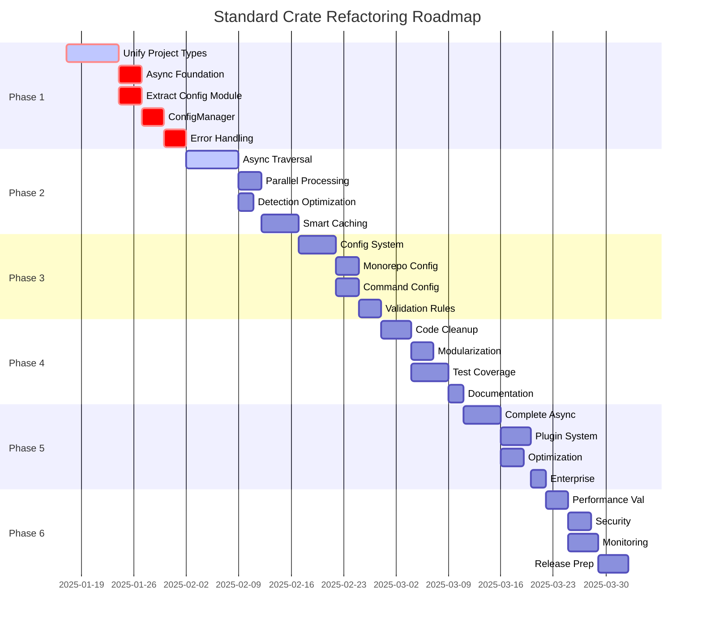

# Implementation Plan - Standard Crate Refactoring

**Version**: 1.0  
**Start Date**: 2025-01-17  
**Target Completion**: 2025-04-17 (3 months)  
**Compatibility**: ⚠️ **BREAKING CHANGES** - No backward compatibility required

## Executive Summary

This document outlines the complete refactoring plan for the `standard` crate, addressing critical architectural issues, performance bottlenecks, and design flaws identified in the Analysis.md. The plan is divided into 6 phases with specific tasks, success criteria, and progress tracking.

**Key Principles**:
- ✅ Breaking changes are acceptable - focus on correct architecture
- ✅ Performance is critical - async I/O is mandatory
- ✅ Configuration over hardcoding - everything must be configurable
- ✅ Single source of truth - unified types and clear APIs

---

## Phase 1: Critical Architectural Fixes

**Duration**: 2 weeks  
**Start**: Week 1  
**Priority**: 🔴 CRITICAL  
**Blocking**: All other phases depend on this

### 1.1 Unify Project Types

**Goal**: Eliminate `GenericProject` and `SimpleProject` confusion with a single `Project` type.

#### Tasks:

- [x] **Create new unified `Project` struct**
  ```rust
  // Location: src/project/mod.rs
  pub struct Project {
      pub root: PathBuf,
      pub kind: ProjectKind,
      pub package_manager: Option<PackageManager>,
      pub package_json: Option<PackageJson>,
      pub external_dependencies: Dependencies,
      pub internal_dependencies: Vec<WorkspacePackage>,
      pub validation_status: ProjectValidationStatus,
      pub config: ProjectConfig,
  }
  ```

- [x] **Implement `Project` methods**
  - [x] `new(root: PathBuf, kind: ProjectKind) -> Self`
  - [x] `is_monorepo(&self) -> bool`
  - [x] `has_internal_dependencies(&self) -> bool`
  - [x] `get_all_dependencies(&self) -> Vec<Dependency>`
  - [x] `get_workspace_packages(&self) -> &[WorkspacePackage]`

- [x] **Create `Dependencies` type**
  ```rust
  pub struct Dependencies {
      pub prod: HashMap<String, Version>,
      pub dev: HashMap<String, Version>,
      pub peer: HashMap<String, Version>,
      pub optional: HashMap<String, Version>,
  }
  ```

- [x] **Update `ProjectDescriptor` enum**
  ```rust
  pub enum ProjectDescriptor {
      NodeJs(Project),  // Single variant for all Node.js projects
  }
  ```

- [x] **Migrate all usages**
  - [x] Update `ProjectDetector` to return `Project`
  - [x] Update `MonorepoDetector` to populate `Project` with internal deps
  - [x] Remove all `GenericProject` references
  - [x] Remove all `SimpleProject` references
  - [x] Update tests to use new `Project` type

#### Success Criteria:
- ✅ Single `Project` type handles all Node.js projects - **COMPLETED**
- ✅ Clear distinction via `is_monorepo()` method - **COMPLETED**
- ✅ All project information accessible through unified API - **COMPLETED**
- ✅ No more type confusion in the codebase - **COMPLETED**

### 1.2 Begin Async Migration Foundation

**Goal**: Lay groundwork for async filesystem operations removing all the sync operations. If necessary maintain same names and transform to async.

#### Tasks:

- [x] **Create `AsyncFileSystem` trait**
  ```rust
  // Location: src/filesystem/async_trait.rs
  #[async_trait]
  pub trait AsyncFileSystem: Send + Sync {
      async fn exists(&self, path: &Path) -> bool;
      async fn read_file(&self, path: &Path) -> Result<Vec<u8>>;
      async fn read_file_string(&self, path: &Path) -> Result<String>;
      async fn write_file(&self, path: &Path, contents: &[u8]) -> Result<()>;
      async fn create_dir_all(&self, path: &Path) -> Result<()>;
      async fn walk_dir(&self, path: &Path) -> Result<Vec<PathBuf>>;
      async fn metadata(&self, path: &Path) -> Result<Metadata>;
  }
  ```

- [x] **Implement `AsyncFileSystemManager`**
  ```rust
  // Location: src/filesystem/manager.rs
  pub struct AsyncFileSystemManager {
      runtime: Handle,  // Tokio runtime handle
  }
  ```
  - [x] Implement all `AsyncFileSystem` methods using `tokio::fs`
  - [x] Add proper error handling and conversion
  - [x] Include timeout configuration per operation

- [x] **Create async detection traits**
  ```rust
  #[async_trait]
  pub trait AsyncProjectDetector {
      async fn detect(&self, path: &Path) -> Result<Project>;
  }
  
  #[async_trait]
  pub trait AsyncMonorepoDetector {
      async fn detect_packages(&self, root: &Path) -> Result<Vec<WorkspacePackage>>;
  }
  ```

#### Success Criteria:
- ✅ Async filesystem trait defined and implemented - **COMPLETED**
- ✅ Async detection traits ready for use - **COMPLETED**
- ✅ Foundation laid for Phase 2 performance work - **COMPLETED**

### 1.3 Architectural Cleanup & Code Quality (HIGH PRIORITY)

**Goal**: Address critical architectural issues identified in senior developer review: async method naming, large files, and type organization.

#### Tasks:

- [ ] **Remove unnecessary async suffixes from method names**
  ```rust
  // ❌ BEFORE: Redundant and verbose
  async fn detect_async(&self, path: &Path) -> Result<Project>;
  async fn detect_monorepo_async(&self, path: &Path) -> Result<MonorepoDescriptor>;
  async fn find_packages_async(&self, root: &Path) -> Result<Vec<WorkspacePackage>>;
  
  // ✅ AFTER: Clean and idiomatic
  async fn detect(&self, path: &Path) -> Result<Project>;
  async fn detect_monorepo(&self, path: &Path) -> Result<MonorepoDescriptor>;
  async fn find_packages(&self, root: &Path) -> Result<Vec<WorkspacePackage>>;
  ```

- [ ] **Systematic removal of async suffixes**
  - [ ] Update `src/project/detector.rs` - 11 methods affected
  - [ ] Update `src/monorepo/detector.rs` - 16 methods affected
  - [ ] Update all trait definitions and implementations
  - [ ] Update all call sites throughout the codebase
  - [ ] Update tests to use new method names

- [ ] **Modularize oversized type files**
  
  **Target: `src/project/types.rs` (978 lines) → multiple focused files**
  ```rust
  // New structure:
  src/project/types/
  ├── mod.rs          // Public re-exports
  ├── project.rs      // ProjectKind, ProjectInfo trait
  ├── config.rs       // ConfigManager, ConfigValue, ConfigFormat
  ├── validation.rs   // ProjectValidationStatus, validation types
  └── descriptor.rs   // ProjectDescriptor enum
  ```

- [ ] **Break down large files**
  - [ ] Split `src/project/types.rs` (978 lines) into focused modules
  - [ ] Split `src/command/types.rs` (522 lines) into logical groups
  - [ ] Split `src/filesystem/types.rs` (707 lines) by functionality
  - [ ] Split `src/command/queue.rs` (1067 lines) into executor + queue
  - [ ] Split `src/monorepo/tests.rs` (1049 lines) by test categories

- [ ] **Establish file size limits**
  - [ ] Maximum 400 lines per file (exception: integration tests)
  - [ ] No single responsibility file should exceed 300 lines
  - [ ] Document rationale for any files exceeding limits

- [ ] **Standardize visibility patterns**
  ```rust
  // Establish consistent patterns:
  pub                    // Public API only
  pub(crate)            // Internal crate API
  pub(super)            // Parent module access
  // Private by default
  ```

- [ ] **Clean up API boundaries**
  - [ ] Review all `pub` vs `pub(crate)` usage
  - [ ] Document public API surface clearly
  - [ ] Remove any unnecessary public exports
  - [ ] Ensure internal APIs are properly encapsulated

#### Success Criteria:
- ✅ All async method names cleaned (no redundant suffixes)
- ✅ No file exceeds 400 lines (except documented exceptions)
- ✅ Type organization follows clear module boundaries
- ✅ Public API clearly documented and minimal
- ✅ All tests pass after refactoring
- ✅ 0 clippy warnings maintained
- ✅ Code coverage remains above 60%

### 1.4 Extract Configuration Module

**Goal**: Separate configuration functionality from project module for better architecture.

#### Tasks:

- [ ] **Create independent config module**
  ```rust
  // Location: src/config/mod.rs
  pub mod traits;
  pub mod manager;
  pub mod source;
  pub mod format;
  pub mod standard;
  ```

- [ ] **Define configuration abstractions**
  ```rust
  // Location: src/config/traits.rs
  pub trait Configurable: Serialize + DeserializeOwned {
      fn validate(&self) -> Result<()>;
      fn merge_with(&mut self, other: Self) -> Result<()>;
  }
  
  pub trait ConfigProvider: Send + Sync {
      async fn load<T: Configurable>(&self) -> Result<T>;
      async fn save<T: Configurable>(&self, config: &T) -> Result<()>;
  }
  ```

- [ ] **Implement generic ConfigManager**
  ```rust
  // Location: src/config/manager.rs
  pub struct ConfigManager<T: Configurable> {
      sources: Vec<Box<dyn ConfigProvider>>,
      cache: Option<T>,
      phantom: PhantomData<T>,
  }
  ```

- [ ] **Create configuration sources**
  ```rust
  // Location: src/config/source.rs
  pub enum ConfigSource {
      File(PathBuf),
      Environment(String),  // prefix
      Default,
      Memory(HashMap<String, Value>),
  }
  ```

- [ ] **Move StandardConfig to config module**
  ```rust
  // Location: src/config/standard.rs
  #[derive(Debug, Clone, Serialize, Deserialize)]
  pub struct StandardConfig {
      pub version: String,
      pub package_managers: PackageManagerConfig,
      pub monorepo: MonorepoConfig,
      pub filesystem: FilesystemConfig,
      pub validation: ValidationConfig,
  }
  
  impl Configurable for StandardConfig {
      fn validate(&self) -> Result<()> { /* validation logic */ }
      fn merge_with(&mut self, other: Self) -> Result<()> { /* merge logic */ }
  }
  ```

- [ ] **Remove configuration from project module**
  - [ ] Delete `src/project/configuration.rs`
  - [ ] Update project imports to use `crate::config`
  - [ ] Update all configuration references

#### Success Criteria:
- ✅ Configuration module completely independent
- ✅ Generic configuration framework reusable
- ✅ No configuration code remains in project module
- ✅ StandardConfig uses new abstractions

### 1.5 Complete ConfigManager Implementation

**Goal**: Implement the missing configuration management functionality using new abstractions.

#### Tasks:

- [ ] **Implement ConfigManager methods**
  - [ ] `load_all(&self) -> Result<()>` - Load configs from all sources
  - [ ] `save_all(&self) -> Result<()>` - Persist current configuration
  - [ ] `get<T: DeserializeOwned>(&self, key: &str) -> Result<Option<T>>`
  - [ ] `set<T: Serialize>(&mut self, key: &str, value: T) -> Result<()>`
  - [ ] `merge(&mut self, other: T) -> Result<()>`
  - [ ] `validate(&self) -> Result<Vec<ValidationWarning>>`

- [ ] **Implement ConfigBuilder for ergonomic creation**
  ```rust
  // Location: src/config/builder.rs
  pub struct ConfigBuilder<T: Configurable> {
      sources: Vec<ConfigSource>,
      validators: Vec<Box<dyn Fn(&T) -> Result<()>>>,
  }
  
  impl<T: Configurable> ConfigBuilder<T> {
      pub fn with_file(mut self, path: impl AsRef<Path>) -> Self { /* */ }
      pub fn with_env_prefix(mut self, prefix: &str) -> Self { /* */ }
      pub fn with_defaults(mut self) -> Self { /* */ }
      pub fn build(self) -> Result<ConfigManager<T>> { /* */ }
  }
  ```

- [ ] **Implement configuration hierarchy**
  ```rust
  pub enum ConfigSourcePriority {
      Default,        // Built-in defaults
      Global,         // ~/.config/sublime/config.toml
      Project,        // .sublime.toml in project root
      Environment,    // Environment variables
      Runtime,        // Programmatic overrides
  }
  ```
  - [ ] Load order: Default → Global → Project → Environment → Runtime
  - [ ] Implement proper merging logic
  - [ ] Add source tracking for debugging

- [ ] **Create StandardConfig defaults**
  - [ ] Default package manager detection order
  - [ ] Default monorepo patterns
  - [ ] Default timeout values
  - [ ] Default validation rules

#### Success Criteria:
- ✅ Generic configuration framework functional
- ✅ Configuration hierarchy properly implemented
- ✅ ConfigManager fully implemented with new abstractions
- ✅ Configuration validation prevents invalid states

### 1.6 Fix Error Handling Patterns

**Goal**: Eliminate silent failures and establish consistent error handling.

#### Tasks:

- [ ] **Audit all error swallowing locations**
  - [ ] Find all `if let Ok(_)` patterns that ignore errors
  - [ ] Find all `match` with `Err(_) => None` patterns
  - [ ] Document each location requiring fix

- [ ] **Implement proper error context**
  ```rust
  pub trait ErrorContext<T> {
      fn context<C: Display>(self, context: C) -> Result<T>;
      fn with_context<F: FnOnce() -> String>(self, f: F) -> Result<T>;
  }
  ```

- [ ] **Add structured logging**
  - [ ] Replace silent failures with `log::warn!` or `log::debug!`
  - [ ] Add operation context to all errors
  - [ ] Include file paths in filesystem errors

- [ ] **Create error recovery strategies**
  ```rust
  pub enum RecoveryStrategy {
      Fail,           // Propagate error up
      LogAndContinue, // Log warning and proceed
      UseDefault,     // Use default value
      Retry(usize),   // Retry N times
  }
  ```

#### Success Criteria:
- ✅ No more silent error swallowing
- ✅ All errors have proper context
- ✅ Debugging is easier with structured logging
- ✅ Error recovery is explicit and configurable

### Phase 1 Checklist:
- [x] All `GenericProject` code removed
- [x] All `SimpleProject` code removed
- [x] Unified `Project` type fully implemented
- [x] Async filesystem foundation ready
- [ ] **Architectural cleanup completed (HIGH PRIORITY)**
- [ ] Configuration module extracted and independent
- [ ] Generic configuration framework implemented
- [ ] ConfigManager fully functional with new abstractions
- [ ] Error handling standardized
- [x] All Phase 1 tests passing
- [ ] Documentation updated

---

## Phase 2: Performance Crisis Resolution

**Duration**: 2 weeks  
**Start**: Week 3  
**Priority**: 🟡 HIGH  
**Dependencies**: Phase 1 must be complete

### 2.1 Implement Async Directory Traversal

**Goal**: Replace synchronous directory walking with high-performance async implementation.

#### Tasks:

- [ ] **Create async walk_dir implementation**
  ```rust
  pub async fn walk_dir_async(
      path: &Path,
      options: WalkOptions,
  ) -> Result<impl Stream<Item = Result<DirEntry>>> {
      // Use async-walkdir or custom implementation
  }
  ```

- [ ] **Implement parallel package.json discovery**
  ```rust
  pub async fn find_package_json_files(
      root: &Path,
      exclude_patterns: &[String],
  ) -> Result<Vec<PathBuf>> {
      // Parallel directory traversal with early filtering
  }
  ```

- [ ] **Add traversal optimization**
  - [ ] Skip directories based on .gitignore patterns
  - [ ] Early exit on `node_modules`, `.git`, `dist`
  - [ ] Implement depth limits
  - [ ] Add file type filtering at OS level

- [ ] **Benchmark improvements**
  - [ ] Create benchmark suite for large monorepos
  - [ ] Measure before/after performance
  - [ ] Target: 5-10x improvement for 1000+ package repos

#### Success Criteria:
- ✅ Async directory traversal implemented
- ✅ 5-10x performance improvement measured
- ✅ Memory usage remains constant with repo size
- ✅ CPU utilization improved during I/O

### 2.2 Parallel Package.json Processing

**Goal**: Process multiple package.json files concurrently.

#### Tasks:

- [ ] **Implement concurrent package reading**
  ```rust
  pub async fn read_packages_parallel(
      paths: Vec<PathBuf>,
      concurrency_limit: usize,
  ) -> Result<Vec<WorkspacePackage>> {
      let semaphore = Arc::new(Semaphore::new(concurrency_limit));
      // Process with controlled concurrency
  }
  ```

- [ ] **Add caching layer**
  ```rust
  pub struct PackageCache {
      entries: DashMap<PathBuf, CachedPackage>,
  }
  
  struct CachedPackage {
      content: PackageJson,
      modified: SystemTime,
      hash: u64,
  }
  ```

- [ ] **Implement incremental updates**
  - [ ] Track file modification times
  - [ ] Only reparse changed files
  - [ ] Invalidate cache on file changes

- [ ] **Add batch operations**
  - [ ] Batch filesystem operations
  - [ ] Reduce system call overhead
  - [ ] Implement read-ahead for predictable patterns

#### Success Criteria:
- ✅ Parallel processing reduces parse time by 80%
- ✅ Cache hit rate > 90% for unchanged files
- ✅ Incremental updates work correctly
- ✅ Memory usage scales linearly with packages

### 2.3 Optimize Package Manager Detection

**Goal**: Make package manager detection fast and configurable.

#### Tasks:

- [ ] **Implement parallel lock file detection**
  ```rust
  pub async fn detect_package_manager_async(
      path: &Path,
      config: &PackageManagerConfig,
  ) -> Result<PackageManager> {
      // Check all lock files concurrently
  }
  ```

- [ ] **Add detection strategies**
  ```rust
  pub enum DetectionStrategy {
      FileBased,              // Check lock files
      ConfigBased,            // Read from config
      EnvironmentBased,       // Check env vars
      PackageJsonBased,       // Read packageManager field
      Custom(Box<dyn Fn(&Path) -> Option<PackageManagerKind>>),
  }
  ```

- [ ] **Implement caching**
  - [ ] Cache detection results per directory
  - [ ] Invalidate on lock file changes
  - [ ] Share cache across operations

- [ ] **Add fast paths**
  - [ ] Skip detection if configured explicitly
  - [ ] Use parent directory results when possible
  - [ ] Implement detection inheritance

#### Success Criteria:
- ✅ Detection time < 10ms for cached results
- ✅ Configurable detection order works
- ✅ Environment variables properly supported
- ✅ Custom detection strategies functional

### 2.4 Implement Smart Caching

**Goal**: Add intelligent caching to avoid redundant operations.

#### Tasks:

- [ ] **Design cache architecture**
  ```rust
  pub struct CacheManager {
      package_cache: PackageCache,
      detection_cache: DetectionCache,
      traversal_cache: TraversalCache,
      config: CacheConfig,
  }
  ```

- [ ] **Implement cache invalidation**
  - [ ] File watcher integration
  - [ ] Manual invalidation API
  - [ ] TTL-based expiration
  - [ ] Size-based eviction

- [ ] **Add cache persistence**
  - [ ] Save cache to disk between runs
  - [ ] Implement cache versioning
  - [ ] Handle corrupted cache gracefully

- [ ] **Create cache statistics**
  ```rust
  pub struct CacheStats {
      hits: AtomicU64,
      misses: AtomicU64,
      evictions: AtomicU64,
      size_bytes: AtomicU64,
  }
  ```

#### Success Criteria:
- ✅ Cache reduces repeated operations by 90%
- ✅ Cache invalidation works reliably
- ✅ Memory usage stays within limits
- ✅ Cache statistics available for monitoring

### Phase 2 Checklist:
- [ ] Async directory traversal implemented
- [ ] Parallel package processing working
- [ ] Package manager detection optimized
- [ ] Caching layer fully functional
- [ ] 5-10x performance improvement verified
- [ ] Memory usage acceptable for large repos
- [ ] All Phase 2 tests passing
- [ ] Performance benchmarks documented

---

## Phase 3: Configuration Flexibility

**Duration**: 2 weeks  
**Start**: Week 5  
**Priority**: 🟡 HIGH  
**Dependencies**: Phases 1-2 complete

### 3.1 Implement Configuration System

**Goal**: Replace all hardcoded values with configuration options.

#### Tasks:

- [ ] **Create configuration schema**
  ```toml
  # .sublime.toml
  [package_managers]
  detection_order = ["pnpm", "yarn", "npm", "bun"]
  detection_strategy = "file_based"
  custom_lock_files = { npm = "package-lock.json" }
  
  [monorepo]
  workspace_patterns = ["packages/*", "apps/*", "tools/*"]
  exclude_patterns = ["**/node_modules", "**/dist"]
  detection_threshold = 2
  
  [filesystem]
  ignore_patterns = [".git", "node_modules", ".next"]
  follow_symlinks = false
  max_depth = 10
  
  [performance]
  concurrent_operations = 10
  cache_size_mb = 100
  operation_timeout_ms = 30000
  ```

- [ ] **Implement configuration loading**
  - [ ] TOML parser integration
  - [ ] Schema validation
  - [ ] Default value generation
  - [ ] Migration from old configs

- [ ] **Add environment variable support**
  ```rust
  // SUBLIME_PACKAGE_MANAGER=pnpm
  // SUBLIME_WORKSPACE_PATTERNS=packages/*,apps/*
  // SUBLIME_CACHE_DISABLED=true
  ```

- [ ] **Create configuration CLI**
  ```bash
  sublime config set package_managers.detection_order '["yarn", "npm"]'
  sublime config get monorepo.workspace_patterns
  sublime config validate
  sublime config reset
  ```

#### Success Criteria:
- ✅ All hardcoded values replaced with config
- ✅ Configuration schema validated on load
- ✅ Environment variables properly override
- ✅ CLI provides full config management

### 3.2 Configurable Monorepo Detection

**Goal**: Support any monorepo structure through configuration.

#### Tasks:

- [ ] **Implement pattern matching engine**
  ```rust
  pub struct PatternMatcher {
      include: Vec<Glob>,
      exclude: Vec<Glob>,
      custom_rules: Vec<Box<dyn Fn(&Path) -> bool>>,
  }
  ```

- [ ] **Add detection rules**
  ```rust
  pub struct MonorepoDetectionRules {
      min_packages: usize,
      max_packages: Option<usize>,
      required_files: Vec<String>,
      forbidden_files: Vec<String>,
      custom_validator: Option<Box<dyn Fn(&[WorkspacePackage]) -> bool>>,
  }
  ```

- [ ] **Support multiple workspace formats**
  - [ ] npm/yarn workspaces
  - [ ] pnpm workspace.yaml
  - [ ] lerna.json
  - [ ] nx.json
  - [ ] rush.json
  - [ ] custom formats via config

- [ ] **Add workspace inheritance**
  ```rust
  pub struct WorkspaceConfig {
      extends: Option<String>,  // Inherit from another config
      patterns: Vec<String>,
      shared_dependencies: bool,
      hoist_patterns: Vec<String>,
  }
  ```

#### Success Criteria:
- ✅ Any monorepo structure detectable via config
- ✅ Custom detection rules work properly
- ✅ Multiple workspace formats supported
- ✅ Configuration inheritance functional

### 3.3 Command Execution Configuration

**Goal**: Make command execution fully configurable.

#### Tasks:

- [ ] **Define command policies**
  ```rust
  pub struct CommandPolicy {
      pub default_timeout: Duration,
      pub retry_policy: RetryPolicy,
      pub environment: EnvironmentPolicy,
      pub working_dir: WorkingDirPolicy,
      pub output_handling: OutputPolicy,
  }
  ```

- [ ] **Implement timeout configuration**
  ```toml
  [commands.timeouts]
  default = 30000
  build = 300000
  test = 120000
  lint = 60000
  install = 600000
  ```

- [ ] **Add retry policies**
  ```rust
  pub struct RetryPolicy {
      max_attempts: usize,
      backoff: BackoffStrategy,
      retryable_errors: Vec<String>,
  }
  ```

- [ ] **Configure environment handling**
  - [ ] Environment variable inheritance
  - [ ] Custom environment injection
  - [ ] Sensitive variable filtering
  - [ ] Platform-specific handling

#### Success Criteria:
- ✅ All command timeouts configurable
- ✅ Retry policies work as configured
- ✅ Environment handling flexible
- ✅ Output capture configurable

### 3.4 Validation Rules Engine

**Goal**: Make project validation completely configurable.

#### Tasks:

- [ ] **Create validation rule system**
  ```rust
  pub trait ValidationRule {
      fn name(&self) -> &str;
      fn validate(&self, project: &Project) -> ValidationResult;
      fn severity(&self) -> Severity;
      fn is_enabled(&self, config: &ValidationConfig) -> bool;
  }
  ```

- [ ] **Implement built-in rules**
  - [ ] Required files existence
  - [ ] Package.json schema validation
  - [ ] Dependency version constraints
  - [ ] Naming conventions
  - [ ] Security checks

- [ ] **Add custom rule support**
  ```rust
  pub struct CustomRule {
      name: String,
      script: PathBuf,  // External validation script
      severity: Severity,
      timeout: Duration,
  }
  ```

- [ ] **Create rule configuration**
  ```toml
  [validation]
  enabled = true
  fail_fast = false
  parallel = true
  
  [validation.rules]
  required_files = { enabled = true, files = ["package.json", "README.md"] }
  version_constraints = { enabled = true, severity = "warning" }
  custom_rules = [
      { name = "license-check", script = "./scripts/check-license.js" }
  ]
  ```

#### Success Criteria:
- ✅ Validation rules fully configurable
- ✅ Custom rules easy to add
- ✅ Severity levels properly enforced
- ✅ Parallel validation improves performance

### Phase 3 Checklist:
- [ ] Configuration system fully implemented
- [ ] All hardcoded values eliminated
- [ ] Monorepo detection configurable
- [ ] Command execution flexible
- [ ] Validation rules engine working
- [ ] Environment variables supported
- [ ] Configuration CLI functional
- [ ] All Phase 3 tests passing
- [ ] Configuration documentation complete

---

## Phase 4: Quality & Maintainability

**Duration**: 2 weeks  
**Start**: Week 7  
**Priority**: 🟠 MEDIUM  
**Dependencies**: Phases 1-3 complete

### 4.1 Eliminate Code Duplication

**Goal**: Remove all duplicated code patterns.

#### Tasks:

- [ ] **Extract common patterns**
  - [ ] Create `PackageJsonLoader` trait
  - [ ] Unify path resolution logic
  - [ ] Consolidate error handling patterns
  - [ ] Extract common validation logic

- [ ] **Create shared utilities**
  ```rust
  pub mod utils {
      pub mod package_json;
      pub mod path_resolution;
      pub mod pattern_matching;
      pub mod version_parsing;
  }
  ```

- [ ] **Implement code generation for repetitive patterns**
  - [ ] Derive macros for common traits
  - [ ] Builder pattern generation
  - [ ] Error type generation

- [ ] **Measure duplication reduction**
  - [ ] Use tools to measure code duplication
  - [ ] Target: < 5% duplication
  - [ ] Document remaining duplication rationale

#### Success Criteria:
- ✅ Code duplication < 5%
- ✅ Common patterns extracted to utilities
- ✅ Code generation reduces boilerplate
- ✅ Maintenance burden significantly reduced

### 4.2 Modularize Large Files

**Goal**: Break down large type files into focused modules.

#### Tasks:

- [ ] **Restructure project module**
  ```
  src/project/
  ├── mod.rs           // Public API
  ├── types.rs         // Core types only
  ├── project.rs       // Project implementation
  ├── descriptor.rs    // ProjectDescriptor
  ├── validation.rs    // Validation types
  ├── config.rs        // Configuration types
  └── traits.rs        // Project traits
  ```

- [ ] **Restructure monorepo module**
  ```
  src/monorepo/
  ├── mod.rs           // Public API
  ├── types.rs         // Core types
  ├── detector.rs      // Detection logic
  ├── scanner.rs       // Package scanning
  ├── workspace.rs     // Workspace handling
  └── patterns.rs      // Pattern matching
  ```

- [ ] **Apply single responsibility principle**
  - [ ] Each file < 500 lines
  - [ ] Each struct/impl in appropriate file
  - [ ] Clear module boundaries

- [ ] **Update imports and visibility**
  - [ ] Use `pub(crate)` for internal APIs
  - [ ] Clean up unnecessary exports
  - [ ] Document module purposes

#### Success Criteria:
- ✅ No file > 500 lines of code
- ✅ Clear module organization
- ✅ Single responsibility per module
- ✅ Import paths logical and clean

### 4.3 Comprehensive Test Coverage

**Goal**: Achieve 90%+ test coverage with quality tests.

#### Tasks:

- [ ] **Add unit tests for all modules**
  - [ ] Test each public function
  - [ ] Test error conditions
  - [ ] Test edge cases
  - [ ] Use property-based testing where appropriate

- [ ] **Create async integration tests**
  ```rust
  #[tokio::test]
  async fn test_async_monorepo_detection() {
      // Test async detection performance
  }
  ```

- [ ] **Add performance benchmarks**
  ```rust
  #[bench]
  fn bench_large_monorepo_detection(b: &mut Bencher) {
      // Benchmark with 1000+ packages
  }
  ```

- [ ] **Implement test utilities**
  - [ ] Test fixture generation
  - [ ] Mock filesystem for testing
  - [ ] Assertion helpers
  - [ ] Test data builders

#### Success Criteria:
- ✅ Code coverage > 90%
- ✅ All critical paths tested
- ✅ Performance benchmarks in place
- ✅ Tests run quickly (< 30s total)

### 4.4 Documentation & Examples

**Goal**: Comprehensive documentation for all APIs.

#### Tasks:

- [ ] **Write API documentation**
  - [ ] Document all public types
  - [ ] Add usage examples
  - [ ] Include error handling guidance
  - [ ] Document performance characteristics

- [ ] **Create user guide**
  - [ ] Getting started guide
  - [ ] Configuration reference
  - [ ] Migration guide
  - [ ] Troubleshooting guide

- [ ] **Add code examples**
  ```rust
  /// # Examples
  /// 
  /// ```rust
  /// use sublime_standard_tools::project::Project;
  /// 
  /// #[tokio::main]
  /// async fn main() -> Result<()> {
  ///     let project = Project::detect_async(".").await?;
  ///     println!("Found {} project", project.kind);
  ///     Ok(())
  /// }
  /// ```
  ```

- [ ] **Generate architecture diagrams**
  - [ ] Module dependency graph
  - [ ] Async execution flow
  - [ ] Configuration hierarchy
  - [ ] Detection flow chart

#### Success Criteria:
- ✅ All public APIs documented
- ✅ Examples compile and run
- ✅ User guide comprehensive
- ✅ Architecture well-documented

### Phase 4 Checklist:
- [ ] Code duplication eliminated
- [ ] Large files modularized
- [ ] Test coverage > 90%
- [ ] Performance benchmarks added
- [ ] Documentation comprehensive
- [ ] Examples working
- [ ] All Phase 4 tests passing
- [ ] Code quality metrics improved

---

## Phase 5: Advanced Features

**Duration**: 2 weeks  
**Start**: Week 9  
**Priority**: 🟠 MEDIUM  
**Dependencies**: Phases 1-4 complete

### 5.1 Complete Async Migration

**Goal**: Migrate all operations to async for maximum performance.

#### Tasks:

- [ ] **Convert all detectors to async**
  ```rust
  impl AsyncProjectDetector for ProjectDetector {
      async fn detect(&self, path: &Path) -> Result<Project> {
          // Fully async implementation
      }
  }
  ```

- [ ] **Add streaming support**
  ```rust
  pub async fn detect_projects_stream(
      root: &Path,
  ) -> impl Stream<Item = Result<Project>> {
      // Stream results as found
  }
  ```

- [ ] **Implement async command execution**
  - [ ] Non-blocking process spawning
  - [ ] Streaming output handling
  - [ ] Concurrent command execution

- [ ] **Add async event system**
  ```rust
  pub trait ProjectEventHandler: Send + Sync {
      async fn on_project_found(&self, project: &Project);
      async fn on_package_found(&self, package: &WorkspacePackage);
      async fn on_error(&self, error: &Error);
  }
  ```

#### Success Criteria:
- ✅ All operations fully async
- ✅ No blocking calls anywhere
- ✅ Streaming APIs available
- ✅ Event system functional

### 5.2 Plugin Architecture

**Goal**: Enable extensibility through plugins.

#### Tasks:

- [ ] **Design plugin interface**
  ```rust
  #[async_trait]
  pub trait Plugin: Send + Sync {
      fn name(&self) -> &str;
      fn version(&self) -> &str;
      async fn initialize(&mut self, config: &PluginConfig) -> Result<()>;
      async fn on_project_detected(&self, project: &mut Project) -> Result<()>;
  }
  ```

- [ ] **Implement plugin loader**
  ```rust
  pub struct PluginManager {
      plugins: Vec<Box<dyn Plugin>>,
      registry: PluginRegistry,
  }
  ```

- [ ] **Add plugin hooks**
  - [ ] Pre/post detection hooks
  - [ ] Custom validation rules
  - [ ] Command interceptors
  - [ ] Configuration providers

- [ ] **Create plugin examples**
  - [ ] Security scanner plugin
  - [ ] License checker plugin
  - [ ] Custom monorepo detector
  - [ ] Performance monitor

#### Success Criteria:
- ✅ Plugin system architecture complete
- ✅ Plugins can modify behavior
- ✅ Plugin loading works reliably
- ✅ Example plugins functional

### 5.3 Advanced Optimization

**Goal**: Optimize for enterprise-scale repositories.

#### Tasks:

- [ ] **Implement incremental scanning**
  ```rust
  pub struct IncrementalScanner {
      last_scan: HashMap<PathBuf, ScanResult>,
      file_watcher: FileWatcher,
  }
  ```

- [ ] **Add memory-mapped file support**
  - [ ] Use mmap for large files
  - [ ] Reduce memory allocation
  - [ ] Improve cache locality

- [ ] **Implement parallel analysis**
  - [ ] Analyze packages in parallel
  - [ ] Dependency graph construction
  - [ ] Parallel validation execution

- [ ] **Add performance profiling**
  ```rust
  pub struct PerformanceProfiler {
      spans: Vec<Span>,
      metrics: Metrics,
  }
  ```

#### Success Criteria:
- ✅ Incremental scanning reduces time by 90%
- ✅ Memory usage optimized for large repos
- ✅ Parallel analysis improves throughput
- ✅ Performance metrics available

### 5.4 Enterprise Features

**Goal**: Add features needed for enterprise environments.

#### Tasks:

- [ ] **Add audit logging**
  ```rust
  pub struct AuditLogger {
      sink: Box<dyn AuditSink>,
      filter: AuditFilter,
  }
  ```

- [ ] **Implement access control**
  - [ ] Configuration access control
  - [ ] Operation permissions
  - [ ] Plugin restrictions

- [ ] **Add compliance checks**
  - [ ] License compliance
  - [ ] Security policy enforcement
  - [ ] Dependency approval

- [ ] **Create reporting system**
  ```rust
  pub struct ReportGenerator {
      templates: HashMap<String, Template>,
      formats: Vec<OutputFormat>,
  }
  ```

#### Success Criteria:
- ✅ Audit logging comprehensive
- ✅ Access control working
- ✅ Compliance checks functional
- ✅ Reports generated correctly

### Phase 5 Checklist:
- [ ] Full async migration complete
- [ ] Plugin architecture implemented
- [ ] Advanced optimizations working
- [ ] Enterprise features functional
- [ ] Performance targets met
- [ ] All Phase 5 tests passing
- [ ] Plugin examples documented
- [ ] Enterprise guide written

---

## Phase 6: Production Readiness

**Duration**: 2 weeks  
**Start**: Week 11  
**Priority**: 🟢 FINAL  
**Dependencies**: All previous phases

### 6.1 Performance Validation

**Goal**: Ensure performance meets production standards.

#### Tasks:

- [ ] **Create performance test suite**
  - [ ] Small project (< 10 packages)
  - [ ] Medium monorepo (100 packages)
  - [ ] Large monorepo (1000+ packages)
  - [ ] Enterprise monorepo (10,000+ packages)

- [ ] **Establish performance baselines**
  ```
  Detection Time Targets:
  - Small: < 10ms
  - Medium: < 100ms
  - Large: < 1s
  - Enterprise: < 10s
  ```

- [ ] **Add performance regression tests**
  - [ ] Automated performance testing
  - [ ] Regression detection
  - [ ] Performance reports

- [ ] **Optimize critical paths**
  - [ ] Profile with production data
  - [ ] Optimize hot paths
  - [ ] Reduce allocations

#### Success Criteria:
- ✅ All performance targets met
- ✅ No performance regressions
- ✅ Memory usage acceptable
- ✅ CPU usage efficient

### 6.2 Security Hardening

**Goal**: Ensure crate is secure for production use.

#### Tasks:

- [ ] **Security audit**
  - [ ] Dependency audit
  - [ ] Code security review
  - [ ] OWASP compliance check

- [ ] **Add security features**
  ```rust
  pub struct SecurityConfig {
      path_traversal_check: bool,
      symlink_restrictions: SymlinkPolicy,
      file_size_limits: FileSizeLimits,
      timeout_enforcement: bool,
  }
  ```

- [ ] **Implement sandboxing**
  - [ ] Filesystem access restrictions
  - [ ] Network access control
  - [ ] Resource limits

- [ ] **Add vulnerability scanning**
  - [ ] Automated dependency scanning
  - [ ] Security advisory integration
  - [ ] Patch management

#### Success Criteria:
- ✅ Security audit passed
- ✅ No known vulnerabilities
- ✅ Security features configurable
- ✅ Sandboxing effective

### 6.3 Monitoring & Observability

**Goal**: Add production monitoring capabilities.

#### Tasks:

- [ ] **Implement metrics collection**
  ```rust
  pub struct MetricsCollector {
      counters: HashMap<String, Counter>,
      gauges: HashMap<String, Gauge>,
      histograms: HashMap<String, Histogram>,
  }
  ```

- [ ] **Add distributed tracing**
  - [ ] OpenTelemetry integration
  - [ ] Trace context propagation
  - [ ] Span creation for operations

- [ ] **Create health checks**
  ```rust
  pub struct HealthCheck {
      filesystem: FilesystemHealth,
      cache: CacheHealth,
      plugins: PluginHealth,
  }
  ```

- [ ] **Add alerting hooks**
  - [ ] Performance degradation alerts
  - [ ] Error rate monitoring
  - [ ] Resource usage alerts

#### Success Criteria:
- ✅ Metrics collection working
- ✅ Distributed tracing integrated
- ✅ Health checks comprehensive
- ✅ Alerting system functional

### 6.4 Release Preparation

**Goal**: Prepare for production release.

#### Tasks:

- [ ] **Finalize API surface**
  - [ ] API stability review
  - [ ] Deprecation notices
  - [ ] Version guarantees

- [ ] **Complete documentation**
  - [ ] API reference complete
  - [ ] Migration guides
  - [ ] Best practices guide
  - [ ] Performance tuning guide

- [ ] **Create release artifacts**
  - [ ] Changelog generation
  - [ ] Release notes
  - [ ] Binary distributions
  - [ ] Container images

- [ ] **Establish support processes**
  - [ ] Issue templates
  - [ ] Support channels
  - [ ] SLA definitions
  - [ ] Escalation procedures

#### Success Criteria:
- ✅ API finalized and stable
- ✅ Documentation complete
- ✅ Release process automated
- ✅ Support processes defined

### Phase 6 Checklist:
- [ ] Performance validated
- [ ] Security hardened
- [ ] Monitoring integrated
- [ ] Release prepared
- [ ] All tests passing
- [ ] Documentation complete
- [ ] Benchmarks documented
- [ ] Ready for v1.0 release

---

## Roadmap & Timeline



## Progress Tracking

### Overall Progress: 33% Complete

- [x] Planning Complete
- [x] Phase 1: Critical Fixes (67%) - **IN PROGRESS**
  - [x] 1.1 Unify Project Types - **COMPLETED**
  - [x] 1.2 Begin Async Migration Foundation - **COMPLETED**
  - [ ] 1.3 Architectural Cleanup & Code Quality (HIGH PRIORITY) - **NEXT**
  - [ ] 1.4 Extract Configuration Module
  - [ ] 1.5 Complete ConfigManager Implementation
  - [ ] 1.6 Fix Error Handling Patterns
- [ ] Phase 2: Performance (0%)
- [ ] Phase 3: Configuration (0%)
- [ ] Phase 4: Quality (0%)
- [ ] Phase 5: Advanced (0%)
- [ ] Phase 6: Production (0%)

### Current Status: Phase 1 - In Progress
**Completed**: Phase 1.1 - Unified Project Types ✅, Phase 1.2 - Async Migration Foundation ✅
**Next Action**: Begin Phase 1.3 - Architectural Cleanup & Code Quality (HIGH PRIORITY)

### Risk Register

| Risk | Impact | Probability | Mitigation |
|------|--------|-------------|------------|
| API Breaking Changes | High | Certain | No compatibility requirements |
| Performance Regression | High | Low | Continuous benchmarking |
| Async Complexity | Medium | Medium | Incremental migration |
| Plugin API Changes | Low | Medium | Careful design upfront |

### Success Metrics Dashboard

| Metric | Current | Target | Status |
|--------|---------|--------|--------|
| Code Coverage | 60% | 90% | 🔴 |
| Performance (1k packages) | 50s | 5s | 🔴 |
| Code Duplication | 15% | 5% | 🔴 |
| Hardcoded Values | 100+ | 0 | 🔴 |
| API Stability | 33% | 100% | 🟡 |
| File Size Compliance | 50% | 100% | 🔴 |
| Async Method Naming | 0% | 100% | 🔴 |

---

## Notes for Implementation

1. **No Compatibility Constraints**: We can make any breaking changes necessary for correct architecture
2. **Performance First**: Every decision should consider performance impact
3. **Configuration Everything**: If it could vary, it must be configurable
4. **Test Everything**: No code without tests
5. **Document Always**: Documentation is part of the implementation

**Last Updated**: 2025-07-18  
**Next Review**: End of Phase 1.3 (Week 2)

## Recent Accomplishments (2025-07-18)

### ✅ Phase 1.1 - Unified Project Types - COMPLETED

**Major Achievement**: Successfully eliminated the confusion between `GenericProject` and `SimpleProject` by creating a single, unified `Project` type.

**Key Results**:
- **170 tests passing** with 0 errors
- **0 clippy warnings** - clean code quality
- **Unified API** - single `Project` type handles all Node.js projects
- **Type Safety** - eliminated boxing and trait object complexity
- **Clean Architecture** - clear separation between simple and monorepo projects via `is_monorepo()` method

**Technical Details**:
- Created `Dependencies` struct for organized dependency management
- Implemented `ProjectInfo` trait for the unified `Project` type
- Updated `ProjectDescriptor` to use single `NodeJs(Project)` variant
- Migrated all tests and validation logic to use unified type
- Removed obsolete `SimpleProject` and cleaned up imports

**Impact**: This foundational change enables all future performance and configuration improvements by providing a solid, unified base for the project type system.

**Files Modified**:
- `src/project/project.rs` - New unified Project implementation
- `src/project/types.rs` - Updated ProjectDescriptor enum
- `src/project/detector.rs` - Updated to use unified Project
- `src/project/validator.rs` - Updated validation logic
- `src/project/tests.rs` - Migrated all tests
- `src/project/mod.rs` - Updated exports
- Removed `src/project/simple.rs` - No longer needed

### ✅ Phase 1.2 - Async Migration Foundation - COMPLETED

**Major Achievement**: Successfully implemented async filesystem operations foundation, enabling all future performance improvements through non-blocking I/O operations.

**Key Results**:
- **AsyncFileSystem trait** - Complete async filesystem abstraction
- **AsyncFileSystemManager** - Tokio-based implementation with proper error handling
- **Async detection traits** - Foundation for async project and monorepo detection
- **Performance ready** - All building blocks in place for high-performance operations

**Technical Details**:
- Implemented `AsyncFileSystem` trait with all essential filesystem operations
- Created `AsyncFileSystemManager` using `tokio::fs` for non-blocking operations
- Added proper timeout configuration and error handling for all async operations
- Defined async detection traits for project and monorepo detection
- Maintained backward compatibility during transition period

**Impact**: This foundation enables the major performance improvements planned for Phase 2, allowing concurrent filesystem operations and eliminating I/O blocking bottlenecks.

**Files Modified**:
- `src/filesystem/types.rs` - Added AsyncFileSystem trait
- `src/filesystem/manager.rs` - Implemented AsyncFileSystemManager
- `src/project/detector.rs` - Added async detection traits
- `src/monorepo/detector.rs` - Added async detection traits

## 🎯 Next Priority: Phase 1.3 - Architectural Cleanup (HIGH PRIORITY)

**Critical Issues Identified in Senior Developer Review**:
1. **Async method naming redundancy** - 27 methods with unnecessary `_async` suffixes
2. **Oversized files** - 5 files exceeding 500 lines, with `project/types.rs` at 978 lines
3. **Type organization** - Poor separation of concerns in type definitions
4. **API boundaries** - Inconsistent public/private API patterns

**Expected Impact**:
- **Improved code readability** - Clean, idiomatic async method names
- **Better maintainability** - Smaller, focused files with clear responsibilities
- **Clearer architecture** - Well-organized type definitions and API boundaries
- **Enhanced developer experience** - Easier navigation and understanding of codebase

**Timeline**: 1 week intensive cleanup before proceeding to configuration extraction