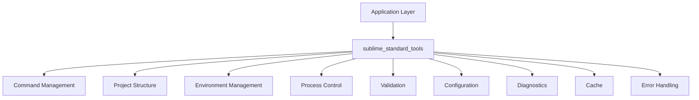
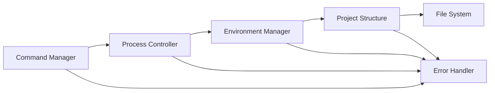
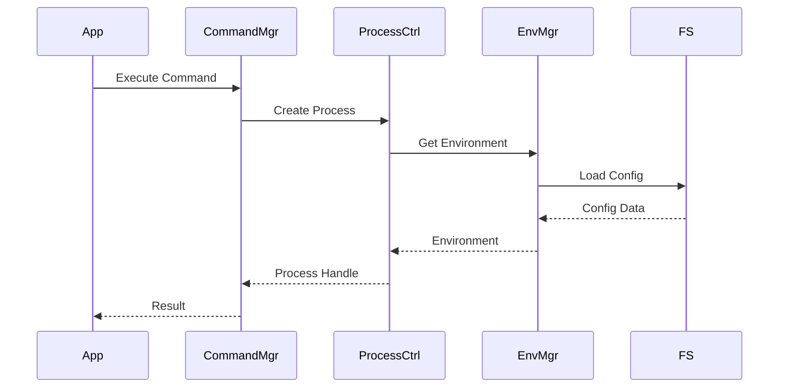

# sublime_standard_tools Specification

## 1. Overview and Purpose

`sublime_standard_tools` is a foundational crate that provides core utilities and abstractions for working with Node.js projects in Rust. It serves as the base layer for the broader Workspace Node Tools ecosystem, providing essential functionality that other tools build upon.

### Primary Goals

- Provide robust, performant utilities for Node.js project interactions
- Establish reliable foundations for higher-level tools
- Enable seamless integration between Rust and Node.js ecosystems
- Deliver consistent error handling and logging patterns
- Support cross-platform operations reliably

### Target Users

- Rust developers building Node.js tooling
- Monorepo management tools
- Build system implementations
- Development workflow automation tools

## 2. Core Concepts

### 2.1 Command Management

Robust execution and management of shell commands with:
- Structured input/output handling
- Error management and recovery
- Cross-platform compatibility
- Environment isolation
- Performance optimization

### 2.2 Project Structure

Unified approach to Node.js project structure handling:
- Root directory detection
- Package manager identification
- Project file management
- Path resolution and manipulation

### 2.3 Environment Management

Comprehensive environment handling:
- Environment variable management
- Platform-specific adaptations
- Configuration management
- Workspace context awareness

### 2.4 Process Control

Advanced process management capabilities:
- Process lifecycle management
- Resource monitoring
- Signal handling
- Cleanup procedures

## 3. Architecture Diagrams

### 3.1 High-Level Architecture



### 3.2 Component Interaction



### 3.3 Data Flow



## 4. Feature Set

### 4.1 Current Features

- Command execution with error handling
- Package manager detection
- Project root discovery
- Basic string manipulation utilities
- Cross-platform path handling (including symbolic links)
- Basic error types and handling

### 4.2 Planned Features

#### 4.2.1 Enhanced Command Management
- Streaming output handling
- Command queuing and batching
- Progress reporting
- Resource usage tracking
- Timeout management
- Retry mechanisms

#### 4.2.2 Advanced Project Structure
- Virtual filesystem abstractions
- Workspace awareness
- Multiple root support
- Symlink handling
- Lock file management
- Dependency graph creation

#### 4.2.3 Environment Management
- Environment isolation
- Configuration profiles
- Secret management
- Platform-specific adaptations
- Environment validation
- Hot reload support

#### 4.2.4 Process Control
- Process pools
- Resource limits
- Signal handling
- Graceful shutdown
- Health monitoring
- Performance metrics

#### 4.2.5 Error Handling and Logging
- Structured logging
- Error categorization
- Error recovery strategies
- Diagnostic information
- Trace context
- Audit logging

#### 4.2.6 Testing and Validation
- Mock interfaces
- Test helpers
- Snapshot testing
- Performance benchmarks
- Cross-platform testing

## 5. Detailed Improvement Plan

### Phase 1: Foundation Enhancement (2 weeks)

1. Command Management Improvements
   - Implement streaming output
   - Add command queuing
   - Add resource tracking
   - Implement timeout handling

2. Error Handling Upgrade
   - Implement structured logging
   - Add error categorization
   - Create recovery strategies
   - Add diagnostic collection

3. Core Infrastructure
   - Add performance metrics
   - Implement basic caching
   - Add configuration management
   - Create validation framework

### Phase 2: Advanced Features (3 weeks)

1. Process Control System
   - Implement process pools
   - Add resource limiting
   - Create signal handlers
   - Add health monitoring

2. Environment Management
   - Create isolation system
   - Add configuration profiles
   - Implement secret management
   - Add hot reload support

3. Project Structure Enhancements
   - Add virtual filesystem
   - Implement workspace awareness
   - Add dependency graphing
   - Create lock file handling

### Phase 3: Integration & Testing (2 weeks)

1. Testing Infrastructure
   - Create mock interfaces
   - Add test helpers
   - Implement snapshot testing
   - Add performance benchmarks

2. Integration Features
   - Add plugin system
   - Create event system
   - Add extension points
   - Implement hooks

3. Documentation & Examples
   - Create API documentation
   - Add usage examples
   - Create tutorials
   - Add architecture guides

## 6. API Specifications

### 6.1 Command Management

```rust
pub trait CommandExecutor {
    fn execute<T>(&self, command: Command) -> Result<T, CommandError>;
    fn execute_with_timeout<T>(&self, command: Command, timeout: Duration) -> Result<T, CommandError>;
    fn execute_stream<T>(&self, command: Command) -> impl Stream<Item = Result<T, CommandError>>;
}

pub struct Command {
    pub program: String,
    pub args: Vec<String>,
    pub env: HashMap<String, String>,
    pub cwd: PathBuf,
    pub timeout: Option<Duration>,
    pub resource_limits: Option<ResourceLimits>,
}

pub struct ResourceLimits {
    pub memory_mb: Option<u64>,
    pub cpu_percent: Option<u8>,
    pub file_descriptors: Option<u32>,
}
```

### 6.2 Process Management

```rust
pub trait ProcessController {
    fn spawn(&self, config: ProcessConfig) -> Result<ProcessHandle, ProcessError>;
    fn kill(&self, handle: &ProcessHandle) -> Result<(), ProcessError>;
    fn wait(&self, handle: &ProcessHandle) -> Result<ExitStatus, ProcessError>;
    fn is_running(&self, handle: &ProcessHandle) -> bool;
}

pub struct ProcessPool {
    pub max_processes: usize,
    pub idle_timeout: Duration,
    pub spawn_delay: Duration,
}

pub trait ProcessMonitor {
    fn get_memory_usage(&self) -> Result<u64, MonitorError>;
    fn get_cpu_usage(&self) -> Result<f64, MonitorError>;
    fn get_uptime(&self) -> Result<Duration, MonitorError>;
}
```

### 6.3 Environment Management

```rust
pub trait EnvironmentManager {
    fn get_env(&self) -> &Environment;
    fn set_env(&mut self, env: Environment) -> Result<(), EnvError>;
    fn load_profile(&mut self, profile: &str) -> Result<(), EnvError>;
    fn validate(&self) -> Result<ValidationReport, EnvError>;
}

pub struct Environment {
    pub variables: HashMap<String, String>,
    pub working_directory: PathBuf,
    pub platform: Platform,
    pub profile: String,
}

pub trait ConfigurationManager {
    fn load(&self) -> Result<Config, ConfigError>;
    fn save(&self, config: &Config) -> Result<(), ConfigError>;
    fn watch(&self, callback: Box<dyn Fn(Config)>) -> Result<(), ConfigError>;
}
```

### 6.4 Project Structure

```rust
pub trait ProjectManager {
    fn get_root(&self) -> Result<PathBuf, ProjectError>;
    fn get_package_manager(&self) -> Result<PackageManager, ProjectError>;
    fn get_workspace_info(&self) -> Result<WorkspaceInfo, ProjectError>;
}

pub trait FileSystemManager {
    fn read_file(&self, path: &Path) -> Result<Vec<u8>, FsError>;
    fn write_file(&self, path: &Path, content: &[u8]) -> Result<(), FsError>;
    fn create_dir(&self, path: &Path) -> Result<(), FsError>;
    fn remove(&self, path: &Path) -> Result<(), FsError>;
    fn walk(&self, path: &Path) -> impl Iterator<Item = Result<PathBuf, FsError>>;
}
```

## 7. Project Structure

```
sublime_standard_tools/
├── Cargo.toml
├── README.md
├── SPEC.md
├── examples/
│   ├── command_execution.rs
│   ├── environment_management.rs
│   ├── process_control.rs
│   └── project_structure.rs
├── src/
│   ├── lib.rs
│   ├── command/
│   │   ├── mod.rs
│   │   ├── executor.rs
│   │   ├── stream.rs
│   │   └── types.rs
│   ├── process/
│   │   ├── mod.rs
│   │   ├── controller.rs
│   │   ├── pool.rs
│   │   └── monitor.rs
│   ├── environment/
│   │   ├── mod.rs
│   │   ├── manager.rs
│   │   ├── config.rs
│   │   └── platform.rs
│   ├── project/
│   │   ├── mod.rs
│   │   ├── manager.rs
│   │   ├── workspace.rs
│   │   └── filesystem.rs
│   ├── error/
│   │   ├── mod.rs
│   │   └── types.rs
│   └── utils/
│       ├── mod.rs
│       └── helpers.rs
├── tests/
│   ├── command_tests.rs
│   ├── process_tests.rs
│   ├── environment_tests.rs
│   └── project_tests.rs
└── benches/
    ├── command_bench.rs
    ├── process_bench.rs
    ├── environment_bench.rs
    └── project_bench.rs
```

## 8. Implementation Timeline

### Week 1-2: Foundation Enhancement
- Implement core command management improvements
- Develop new error handling system
- Create basic infrastructure components
- Set up testing framework

### Week 3-5: Advanced Features
- Build process control system
- Implement environment management
- Enhance project structure handling
- Add caching mechanisms

### Week 6-7: Integration & Polish
- Develop testing infrastructure
- Create integration features
- Write documentation
- Implement examples
- Add benchmarks

### Week 8: Review & Release
- Performance optimization
- Cross-platform testing
- Documentation review
- Final testing
- Release preparation

## 9. Success Criteria

### Performance Metrics
- Command execution overhead < 10ms
- Process spawn time < 50ms
- Memory usage < 10MB baseline
- CPU usage < 5% idle

### Quality Metrics
- Test coverage > 90%
- Zero known security vulnerabilities
- Documentation coverage 100%
- Cross-platform compatibility verified

### Integration Metrics
- Zero breaking changes for existing users
- Backward compatibility maintained
- Clear upgrade path documented
- Migration guides provided

